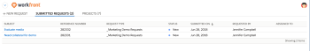

# 提交來自[!DNL Salesforce]物件的[!DNL Adobe Workfront]個請求

安裝[!DNL Adobe Workfront for Salesforce]之後，您可以提交來自[!DNL Salesforce]商機與帳戶的[!DNL Workfront]要求。 此功能同時存在於[!DNL Classic]和[!DNL Lightning Experience]架構中。

## 存取需求

您必須具有下列存取權才能使用本文所述的功能：

<table style="table-layout:auto"> 
 <col> 
 <col> 
 <tbody> 
  <tr> 
   <td role="rowheader">
[!DNL Adobe Workfront] 計畫*
</td> 
   <td> 
[！UICONTROL Pro]或更高版本
 </td> 
  </tr> 
  <tr> 
   <td role="rowheader">
[!DNL Adobe Workfront] 授權*
</td> 
   <td> 
[！UICONTROL計畫]
 </td> 
  </tr> 
 </tbody> 
</table>

&#42;若要瞭解您擁有的計畫、授權型別或存取權，請連絡您的[!DNL Workfront]管理員。

## 先決條件

若要提交來自[!DNL Salesforce]機會或帳戶的[!DNL Workfront]請求，請確定您的環境中有下列專案：

* 您的[!DNL Workfront]系統管理員已安裝[!DNL Workfront for Salesforce]。\
   如需有關安裝[!DNL Workfront for Salesforce]的詳細資訊，請參閱[安裝 [!DNL Adobe Workfront for Salesforce]](../../workfront-integrations-and-apps/using-workfront-with-salesforce/install-workfront-for-salesforce.md)

* 您的[!DNL Workfront]管理員已將[!DNL Workfront]區段新增至您的[!UICONTROL 機會]和[!UICONTROL 帳戶]頁面配置。\
   如需有關將[!DNL Workfront]區段新增至版面配置的詳細資訊，請參閱[為 [!DNL Salesforce] 使用者設定 [!DNL Adobe Workfront] 區段](../../workfront-integrations-and-apps/using-workfront-with-salesforce/configure-wf-section-for-salesforce-users.md)。

* 您有[!DNL Workfront]帳戶，而且您可以從您的機會或帳戶內的[!DNL Workfront]區段登入該帳戶。\
   登入後，您會看到[!UICONTROL 新要求]索引標籤，您可以在其中開始輸入要求。

## 提交來自[!DNL Salesforce]的[!DNL Workfront]個請求

1. 前往Salesforce中的機會或帳戶。
1. 移至[!DNL Workfront]區段。
1. 在&#x200B;**[!UICONTROL 新要求]**&#x200B;索引標籤中，於&#x200B;**[!UICONTROL 選取要求型別]**&#x200B;下拉式功能表中選取要求型別。

   您可以看到在Workfront中有權檢視的相同請求佇列。

1. 開始填寫您請求的可用欄位。

   從[!DNL Salesforce]提交要求與在[!DNL Workfront]網頁應用程式中提交要求相同。

   >[!NOTE]
   >
   >在[!DNL Salesforce]中使用[!DNL Workfront]外掛程式上傳檔案暫時無法使用。

   繼續遵循[建立及提交 [!DNL Adobe Workfront] 要求](../../manage-work/requests/create-requests/create-submit-requests.md)中所述的步驟。

1. 按一下&#x200B;**[!UICONTROL 提交]**。

## 檢視[!DNL Workfront]個請求

1. 移至[!DNL Salesforce]中的商機或帳戶。
1. 移至&#x200B;**[!DNL Workfront]**&#x200B;區段。

   >[!NOTE]
   >
   >根據您的[!DNL Workfront]管理員設定此區段的方式，它可能有不同的名稱。

1. 選取&#x200B;**[!UICONTROL 已提交的請求]**&#x200B;索引標籤。

   您可以在此標籤中檢視您或其他人從此商機或帳戶提交的所有要求。在Web應用程式中提交至此要求佇列的要求不會顯示在[!DNL Salesforce]的清單中。

   >[!NOTE]
   >
   >在Web應用程式中提交至此請求佇列的請求，不會顯示在Salesforce的此清單中。

   

   您可以檢視下列有關已提交請求的資訊：

   * 要求名稱（在[!UICONTROL 主旨]欄中）
   * 參考號碼
   * 請求類型
   * 狀態
   * 提交日期
   * 依名稱請求
   * 指派至名稱\

     在[!DNL Workfront]中更新此資訊時，也會在此清單中更新。

1. （選擇性）按一下要求的名稱，以在[!DNL Workfront]中開啟。

1. （選擇性）按一下&#x200B;**[!UICONTROL 移至[!DNL Salesforce]]**&#x200B;以存取此問題源自於Workfront下列領域的機會或帳戶：

   * 在問題的[!UICONTROL 詳細資料]區段中
   * 在清單中選取問題時，在「摘要」面板中，按一下清單工具列中的[!UICONTROL 開啟摘要] 。
   * 在問題標題中，當[!UICONTROL 整合]欄位可供使用時。 您的系統或群組管理員必須將[!UICONTROL 整合]欄位新增到您的版面配置範本，才能檢視問題標題中的Go to Salesforce連結。 如需詳細資訊，請參閱[使用配置範本自訂物件標頭](../../administration-and-setup/customize-workfront/use-layout-templates/customize-object-headers.md)。

   >[!NOTE]
   >
   >所有[!DNL Workfront]個可檢視此問題的使用者皆可看到[!UICONTROL 移至Salesforce]連結。 您必須擁有[!DNL Salesforce]帳戶才能移至記錄問題的[!DNL Salesforce]商機或帳戶。
