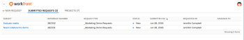

# 提交來自[!DNL Adobe Workfront]物件的[!DNL Salesforce]個請求

>[!IMPORTANT]
>
>為了提供更穩定且更可擴充的整合，我們已改用使用Workfront自動化與整合(Fusion)的現代、彈性整合方法。 在此轉換過程中，Salesforce整合&#x200B;**的Workfront已不再可用**。
>
>為了滿足貴組織與Salesforce的整合需求，我們建議您使用Workfront自動化和整合。
>
>如需Workfront自動化與整合的概觀，請參閱[Adobe Workfront Fusion概觀](https://experienceleague.adobe.com/zh-hant/docs/workfront-fusion/using/get-started-with-fusion/understand-workfront-fusion/workfront-fusion-overview)。
>
>如需Salesforce之Workfront自動化與整合模組的特定功能相關資訊，請參閱[Salesforce模組](https://experienceleague.adobe.com/zh-hant/docs/workfront-fusion/using/references/apps-and-their-modules/third-party-app-connectors/salesforce-modules)。

<!--

After installing [!DNL Adobe Workfront for Salesforce], you can submit [!DNL Workfront] requests from [!DNL Salesforce] Opportunities and Accounts. This functionality exists in both the [!DNL Classic] and [!DNL Lightning Experience] frameworks.

## Access requirements

+++ Expand to view access requirements for the functionality in this article.

<table style="table-layout:auto"> 
 <col> 
 <col> 
 <tbody> 
  <tr> 
   <td role="rowheader">Adobe Workfront package</td> 
   <td> 
Any
 </td> 
  </tr> 
  <tr> 
   <td role="rowheader">Adobe Workfront license</td> 
   <td> 
Standard

   
Plan
 </td> 
  </tr> 
 </tbody> 
</table>

For information, see [Access requirements in Workfront documentation](/help/quicksilver/administration-and-setup/add-users/access-levels-and-object-permissions/access-level-requirements-in-documentation.md). 

+++

## Prerequisites

To submit a [!DNL Workfront] request from a [!DNL Salesforce] Opportunity or Account ensure that you have the following in your environment:

* Your [!DNL Workfront] administrator has installed [!DNL Workfront for Salesforce].\
   For more information about installing [!DNL Workfront for Salesforce], see [Install [!DNL Adobe Workfront for Salesforce]](../../workfront-integrations-and-apps/using-workfront-with-salesforce/install-workfront-for-salesforce.md)

* Your [!DNL Workfront] administrator has added the [!DNL Workfront] section to your [!UICONTROL Opportunity] and [!UICONTROL Account] page layouts.\
   For more information about adding the [!DNL Workfront] section to a page layout, see [Configure the [!DNL Adobe Workfront] section for [!DNL Salesforce] users](../../workfront-integrations-and-apps/using-workfront-with-salesforce/configure-wf-section-for-salesforce-users.md).

* You have a [!DNL Workfront] account and you can log in to it from the [!DNL Workfront] section inside your Opportunity or Account.\
   Once you log in, you can see the [!UICONTROL New Requests] tab where you can start entering requests.

## Submit [!DNL Workfront] requests from [!DNL Salesforce]

1. Go to an Opportunity or Account in Salesforce.
1. Go to the [!DNL Workfront] section.
1. In the **[!UICONTROL New Requests]** tab, select a request type in the **[!UICONTROL Select a Request Type]** drop-down menu.

   You can see the same request queues that you have access to see in Workfront. 

1. Start filling out the available fields for your request.

   Submitting a request from [!DNL Salesforce] is identical to submitting a request in the [!DNL Workfront] web application.

   >[!NOTE]
   >
   >Uploading a document using the [!DNL Workfront] plugin in [!DNL Salesforce] is temporarily unavailable.

   Continue to follow the steps described in [Create and submit [!DNL Adobe Workfront] requests](../../manage-work/requests/create-requests/create-submit-requests.md).

1. Click **[!UICONTROL Submit]**.

## View [!DNL Workfront] requests

1. Go to an Opportunity or Account in [!DNL Salesforce].
1. Go to the **[!DNL Workfront]** section.

   >[!NOTE]
   >
   >Depending on how your [!DNL Workfront] administrator configured this section, it might have a different name.

1. Select the **[!UICONTROL Submitted Requests]** tab.

   You can view all the requests that you or others have submitted from this Opportunity or Account in this tab.Requests that are submitted to this request queue in the web application do not display in this list in [!DNL Salesforce].

   >[!NOTE]
   >
   >Requests that are submitted to this request queue in the web application do not display in this list in Salesforce.

   

   You can view the following information about the submitted requests:

   * Requests Name (in the [!UICONTROL Subject] column)
   * Reference Number
   * Request Type
   * Status
   * Submitted on Date
   * Requested by Name
   * Assigned to Name\

      When this information is updated in [!DNL Workfront], it is also updated in this list.

1. (Optional) Click the name of the request to open it in [!DNL Workfront].

1. (Optional) Click **[!UICONTROL Go to [!DNL Salesforce]]** to access the Opportunity or Account where the issue originated from the following areas of Workfront:

   * In the [!UICONTROL Details] section of the issue
   * In the Summary panel  when selecting the issue in a list, after clicking [!UICONTROL Open Summary]  in the list's toolbar.
   * In the issue header, when the [!UICONTROL Integrations] field is available. Your system or group administrator must add the [!UICONTROL Integrations] field to your Layout Template to view the Go to Salesforce link in the issue header. For more information, see [Customize object headers using a layout template](../../administration-and-setup/customize-workfront/use-layout-templates/customize-object-headers.md).

   >[!NOTE]
   >
   >The [!UICONTROL Go to Salesforce] link is visible to all [!DNL Workfront] users who can view the issue. You must have a [!DNL Salesforce] account to be able to go to the [!DNL Salesforce] Opportunity or Account where the issue was logged.

   -->
