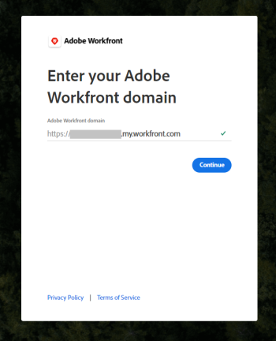

# 設定 [!DNL Adobe Workfront for Slack]

整合 [!DNL Adobe Workfront] with [!DNL Slack] 可讓您執行下列動作：

* 存取 [!DNL Workfront] 工作項，批准，收藏夾，最近的項來自 [!DNL Slack].
* 訂閱、核准、指派工作 [!DNL Slack].
* 從建立任務和問題 [!DNL Slack].
* 接收部分 [!DNL Workfront] 通知 [!DNL Slack].

視您的 [!DNL Slack] 環境設定後，您可以安裝及設定 [!DNL Workfront for Slack] 你自己，或你 [!DNL Workfront] 管理員必須先安裝並配置它，您才能自行配置。

當您整合 [!DNL Slack] 例項 [!DNL Workfront] 使用者 [!DNL Workfront] 同時 [!DNL Slack] 管道。 整合可透過任何 [!DNL Slack] 環境，包括 [!DNL Slack] 行動應用程式。

## 存取需求

您必須具備下列條件：

<table style="table-layout:auto"> 
 <col> 
 </col> 
 <col> 
 </col> 
 <tbody> 
  <tr> 
   <td role="rowheader"><a href="https://www.workfront.com/plans" target="_blank">[!DNL [!DNL Adobe Workfront] 計劃]</a>*</td> 
   <td> 
[!UICONTROL Pro]或更高版本
 </td> 
  </tr> 
 </tbody> 
</table>

&#42;若要了解您擁有的計畫、授權類型或存取權，請聯絡您的 [!DNL Workfront] 管理員。

## 使用的必要條件 [!DNL Workfront] with [!DNL Slack]

* 您必須有 [!DNL Slack] 例項。
* 您的 [!DNL Slack] 系統管理員必須允許所有 [!DNL Slack] 安裝使用者 [!DNL Workfront for Slack].
* 您必須有 [!DNL Workfront] 許可證，以便使用 [!DNL Workfront].

   >[!NOTE]
   >
   >具有 [!DNL Workfront] 許可證類型可以訪問 [!DNL Workfront] 從 [!DNL Slack]. 您可從執行的動作 [!DNL Slack] 僅限於 [!DNL Workfront] 授權和權限層級。

如需有關在 [!DNL Slack]，請參閱 [管理您工作區的應用程式。](https://get.slack.help/hc/en-us/articles/222386767-Manage-apps-for-your-workspace)

## 安裝 [!DNL Workfront for Slack]

每個 [!DNL Slack] 使用者必須安裝 [!DNL Workfront] 應用程式本身，以便使用 [!DNL Workfront] 從 [!DNL Slack].

您可以透過下列方式安裝應用程式：

* [安裝 [!DNL Workfront] 應用程式外部 [!DNL Slack]](#install-the-workfront-app-outside-slack-install-the-workfront-app-outside-slack)
* [安裝 [!DNL Workfront] 應用程式內 [!DNL Slack]](#install-the-workfront-app-within-slack-install-the-workfront-app-within-slack)

### 安裝 [!DNL Workfront] 應用程式外部 [!DNL Slack] {#install-the-workfront-app-outside-slack}

請依照下列步驟執行安裝程式並授權 [!DNL Workfront for Slack] 在 [!DNL Slack] 例項。

>[!IMPORTANT]
>
>若 [!DNL Workfront] 若已發行Slack，您必須重新授權應用程式才能繼續使用。

1. 找出 [!DNL Adobe Workfront] 中的附加元件 [[!DNL Slack] 商店](https://workfront.slack.com/apps/A7CLAMVNW-adobe-workfront?tab=more_info).

1. 按一下 **[!UICONTROL 在中開啟[!DNL Slack]]**.

1. 指定 [!DNL Slack] URL和點按 **[!UICONTROL 繼續]**.\
   

1. 檢查 [!DNL Slack] 請求。 如果您同意此存取權，請按一下 **[!UICONTROL 允許存取]** 授權 [!DNL Workfront] 應用程式。

   

您現在可以存取 [!DNL Workfront] 從 [!DNL Slack]，如 [存取 [!DNL Workfront] 從 [!DNL Slack]](../../workfront-integrations-and-apps/using-workfront-with-slack/access-workfront-from-slack.md#viewing-all-available-commands) section in [Access [!DNL Adobe Workfront] 從 [!DNL Slack]](../../workfront-integrations-and-apps/using-workfront-with-slack/access-workfront-from-slack.md).

### 安裝 [!DNL Workfront] 應用程式內 [!DNL Slack] {#install-the-workfront-app-within-slack}

您可以安裝 [!DNL Workfront] 直接從應用程式 [!DNL Slack] 應用程式：

1. 導覽至 [!DNL Slack] URL。

   例如： *`<YourTeamName>`.slack.com/apps*.

   或

   按一下 **[!UICONTROL 新增應用程式]** 圖示 [!DNL Slack] 例項。

   

1. 開始鍵入 *[!DNL Workfront]* 在搜尋欄位中。
1. 按Enter鍵。
1. 選取 **[!DNL Workfront]** 應用程式。
1. 按一下 **[!UICONTROL 設定]**.

   此時將顯示「應用程式目錄」頁。

1. 按一下 **[!UICONTROL 造訪應用程式網站]**.
1. 按一下 **[!UICONTROL 添加到[!DNL Slack]]**.
1. 請依照步驟完成安裝。
1. 安裝完成後，您可以存取 [!DNL Workfront] 從 [!DNL Slack]，如 [[!UICONTROL訪問 [!DNL Workfront] 從 [!DNL Slack]]](../../workfront-integrations-and-apps/using-workfront-with-slack/access-workfront-from-slack.md#viewing-all-available-commands) section in [Access [!DNL Adobe Workfront] 從 [!DNL Slack]](../../workfront-integrations-and-apps/using-workfront-with-slack/access-workfront-from-slack.md).
