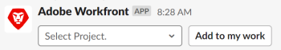

# 從建立任務和問題 [!DNL Slack]

安裝並配置完成後 [!DNL Adobe Workfront for Slack]，您可以從 [!DNL Slack] 將它們與 [!DNL Workfront].

如需有關設定的詳細資訊 [!DNL Workfront] with [!DNL Slack]，請參閱 [設定 [!DNL Adobe Workfront for Slack]](../../workfront-integrations-and-apps/using-workfront-with-slack/configure-workfront-for-slack.md).

您必須擁有在存取層級中建立任務和問題的存取權，而且您必須擁有 [!UICONTROL Contribute] 您要關聯之專案的權限。

有關訪問級別的詳細資訊，請參見 [存取層級概觀](../../administration-and-setup/add-users/access-levels-and-object-permissions/access-levels-overview.md). 如需物件權限的詳細資訊，請參閱 [對象共用權限概述](../../workfront-basics/grant-and-request-access-to-objects/sharing-permissions-on-objects-overview.md).

## 存取需求

您必須具備下列條件：

<table style="table-layout:auto"> 
 <col> 
 </col> 
 <col> 
 </col> 
 <tbody> 
  <tr> 
   <td role="rowheader"><a href="https://www.workfront.com/plans" target="_blank">[!DNL [!DNL Adobe Workfront] 計劃]</a>*</td> 
   <td> 
[!UICONTROL Pro]或更高版本
 </td> 
  </tr> 
 </tbody> 
</table>

&#42;若要了解您擁有的計畫、授權類型或存取權，請聯絡您的 [!DNL Workfront] 管理員。

## 必要條件

建立任務和問題之前，請先從 [!DNL Slack]，您必須

* 設定 [!DNL Workfront] Slack\
   配置說明 [!DNL Workfront for Slack]，請參閱 [設定 [!DNL Adobe Workfront for Slack]](../../workfront-integrations-and-apps/using-workfront-with-slack/configure-workfront-for-slack.md).

## 從建立任務 [!DNL Slack]

1. 登入 [!DNL Slack] 執行個體和登入 [!DNL Workfront] 從 [!DNL Slack].\
   如需登入Workfront的詳細資訊，請參閱 [!DNL Slack]，請參閱「登入」 [!DNL Workfront] 從 [!DNL Slack]「 」部分 [存取 [!DNL Adobe Workfront] 從 [!DNL Slack]](../../workfront-integrations-and-apps/using-workfront-with-slack/access-workfront-from-slack.md).

1. 從任何通道，開始在消息欄位中鍵入以下命令：

   `/workfront add task <Task Name>`

   >[!NOTE]
   >
   >命令區分大小寫。 您可以使用 `/wf` 而非 `/workfront`.
   >  
   >必須輸入任務名稱，該名稱將顯示在 [!DNL Workfront] 介面，不含括弧或雙引號。\
   >

1. （可選）開始鍵入要與新任務關聯的項目名稱，並在新任務出現在清單中時將其選中。\
   您會收到確認訊息，指出工作已新增至選取的專案。
1. （可選）按一下確認訊息中的任務名稱，以在中開啟 [!DNL Workfront]，即可在新的瀏覽器標籤中取得。

## 建立問題來源 [!DNL Slack]

1. 登入 [!DNL Slack] 執行個體和登入 [!DNL Workfront] 從 [!DNL Slack].\
   如需登入的詳細資訊，請參閱 [!DNL Workfront] 從 [!DNL Slack]，請參閱「登入」 [!DNL Workfront] 從 [!DNL Slack]「 」部分 [存取 [!DNL Adobe Workfront] 從 [!DNL Slack]](../../workfront-integrations-and-apps/using-workfront-with-slack/access-workfront-from-slack.md).

1. 從任何通道，開始在消息欄位中鍵入以下命令：

   `/workfront add issue <Issue Name>`

   >[!NOTE]
   >
   >命令區分大小寫。 可以使用「/wf」（而不是「/workfront」）啟動命令。 \
   >必須輸入「問題名稱」，因為它將顯示在 [!DNL Workfront] 介面，不含括弧或雙引號。\
   >

1. （可選）開始鍵入要與新問題關聯的項目名稱，並在新問題出現在清單中時將其選中。\
   您會收到確認訊息，指出問題已新增至選取的專案。
1. （選用）按一下確認訊息中的問題名稱，以在中開啟 [!DNL Workfront]，即可在新的瀏覽器標籤中取得。
