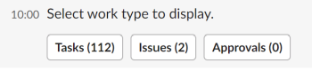

# 管理您的工作和批准 [!DNL Slack]

安裝後 [!DNL Adobe Workfront for Slack]，您可以執行下列動作：

* 您的 [!UICONTROL 首頁] 項目自 [!DNL Slack]
* 審核並接受以處理 [!DNL Slack]
* 審核並決定 [!DNL Slack]

如需有關設定的詳細資訊 [!DNL Workfront] with [!DNL Slack]，請參閱 [設定 [!DNL Adobe Workfront for Slack]](../../workfront-integrations-and-apps/using-workfront-with-slack/configure-workfront-for-slack.md).

## 存取需求

您必須具備下列條件：

<table style="table-layout:auto"> 
 <col> 
 <col> 
 <tbody> 
  <tr> 
   <td role="rowheader"><a href="https://www.workfront.com/plans" target="_blank">[!DNL Adobe Workfront] 計劃</a>*</td> 
   <td> 
[!UICONTROL Pro]或更高版本
 </td> 
  </tr> 
 </tbody> 
</table>

&#42;若要了解您擁有的計畫、授權類型或存取權，請聯絡您的Workfront管理員。

## 必要條件

管理工作和批准之前，請 [!DNL Slack]，您必須

* 設定 [!DNL Workfront for Slack]\
   配置說明 [!DNL Workfront for Slack]，請參閱 [設定 [!DNL Adobe Workfront for Slack]](../../workfront-integrations-and-apps/using-workfront-with-slack/configure-workfront-for-slack.md).

## 從 [!DNL Slack]

1. 登入 [!DNL Slack] 執行個體和登入 [!DNL Workfront] 從 [!DNL Slack].\
   如需登入的詳細資訊，請參閱 [!DNL Workfront] 從 [!DNL Slack]，請參閱「登入」 [!DNL Workfront] 從 [!DNL Slack]「 」部分 [存取 [!DNL Adobe Workfront] 從 [!DNL Slack]](../../workfront-integrations-and-apps/using-workfront-with-slack/access-workfront-from-slack.md).

1. 從任何通道，開始在消息欄位中鍵入以下命令：

   `/workfront home`

   >[!NOTE]
   >
   >* 命令區分大小寫。
   >* 您可以使用 `/wf` 而非 `/workfront`.

   您可以從中存取任務、問題和核准清單的按鈕隨即顯示。 按一下其中一個按鈕，會顯示 [!DNL Slack].\
   

1. （選用）按一下 **[!UICONTROL 工作]** 顯示所有任務。

   有關在 [!DNL Slack]，請參閱 [從 [!DNL Slack]](#manage-your-tasks-from-slack-manage-your-tasks-from-slack).

1. （選用）按一下 **[!UICONTROL 問題]** 顯示所有問題。

   如需管理問題的詳細資訊，請參閱 [!DNL Slack]，請參閱 [從 [!DNL Slack]](#manage-your-issues-from-slack-manage-your-issues-from-slack).

1. （選用）按一下 **[!UICONTROL 核准]** 顯示等待您決定的所有批准。\
   如需管理核准的詳細資訊，請參閱 [!DNL Slack]，請參閱 [從 [!DNL Slack]](#manage-your-approvals-from-slack-manage-your-approvals-from-slack).

## 從 [!DNL Slack] {#manage-your-tasks-from-slack}

1. 登入 [!DNL Slack] 執行個體和登入 [!DNL Workfront] 從 [!DNL Slack].\
   如需登入的相關資訊，請參閱 [!DNL Workfront] 從 [!DNL Slack]，請參閱「登入」 [!DNL Workfront] 從 [!DNL Slack]「 」部分 [存取 [!DNL Adobe Workfront] 從 [!DNL Slack]](../../workfront-integrations-and-apps/using-workfront-with-slack/access-workfront-from-slack.md).

1. 從任何通道，開始在消息欄位中鍵入以下任一命令：

   `/workfront home`，然後按一下 **[!UICONTROL 工作]**

   或

   `/workfront tasks`

   >[!NOTE]
   >
   >* 命令區分大小寫。
   >* 您可以使用 `/wf` 而非 `/workfront`.

   清單上的前20個任務隨即顯示。\
   

1. 按一下 **[!UICONTROL +`<remaining number>` 更多]** 顯示其他任務。
1. 請考慮檢閱下列工作項目的相關資訊：

   * **[!UICONTROL 名稱]**
   * **[!UICONTROL 專案名稱]** 或 **[!DNL Parent Object Name]**

   * **[!DNL Planned Completion Date]** 工作項的。
   * **[!DNL Assigned By Name]**:這是指派任務給您的使用者名稱。
   * **[!UICONTROL 狀態]**

1. （選用）按一下項目名稱，在Workfront的個別瀏覽器分頁中開啟它。
1. （選用）在 **[!UICONTROL 狀態]** 欄位，選擇新狀態。
1. （選用）按一下 **[!UICONTROL 記錄時間]**，然後選取 **[!UICONTROL 小時類型]** 和一個小時來記錄項目的時間。

   >[!NOTE]
   >
   >* 您只能以整小時或半小時（最多12小時30分鐘）為單位登入小時。
   >* 您登入的小時數為今天的登入日期。 您無法記錄過去或未來日期的時間，從 [!DNL Slack].

   您會收到記錄時間的確認。

1. （選用）按一下 **[!UICONTROL 努力]** 接受工作。 此 [!UICONTROL 努力] 按鈕消失。

## 從 [!DNL Slack] {#manage-your-issues-from-slack}

1. 登入 [!DNL Slack] 執行個體和登入 [!DNL Workfront] 從 [!DNL Slack].\
   如需登入的詳細資訊，請參閱 [!DNL Workfront] 從 [!DNL Slack]，請參閱 [登入 [!DNL Workfront] 從 [!DNL Slack]](../../workfront-integrations-and-apps/using-workfront-with-slack/access-workfront-from-slack.md#logging-in-to-workfront) section in [Access [!DNL Adobe Workfront] 從 [!DNL Slack]](../../workfront-integrations-and-apps/using-workfront-with-slack/access-workfront-from-slack.md).

1. 從任何通道，開始在消息欄位中鍵入以下任一命令：

   `/workfront home`，然後按一下 **[!UICONTROL 問題]**

   或

   `/workfront issues`

   >[!NOTE]
   >
   >* 命令區分大小寫。
   >* 您可以使用 `/wf` 而非 `/workfront`.

   清單中的前20個問題隨即顯示。\
   

1. 按一下 **[!UICONTROL +剩餘 `<number>` 更多]** 以顯示其他項目。
1. 請考慮檢閱下列工作項目的相關資訊：

   * **[!UICONTROL 名稱]**
   * **[!UICONTROL 專案]** 名稱或父對象名稱
   * **[!UICONTROL 到期日]** 日期：這是工作項的計畫完成日期。
   * **[!DNL Requested by]** 名稱：這是主要聯繫人（針對問題）或進行分配的用戶（針對任務）。

1. （選用）按一下問題名稱，在Workfront的個別瀏覽器分頁中開啟它。
1. （選用）按一下 **[!DNL Work on it]** 要開始處理您尚未接受的問題。

   此 [!UICONTROL 努力] 按鈕消失。

## 從 [!DNL Slack] {#manage-your-approvals-from-slack}

1. 登入 [!DNL Slack] 執行個體和登入 [!DNL Workfront] 從 [!DNL Slack].\
   如需登入的詳細資訊，請參閱 [!DNL Workfront] 從 [!DNL Slack]，請參閱「登入」 [!DNL Workfront] 從 [!DNL Slack]「 」部分 [存取 [!DNL Adobe Workfront] 從 [!DNL Slack]](../../workfront-integrations-and-apps/using-workfront-with-slack/access-workfront-from-slack.md).

1. 從任何通道，開始在消息欄位中鍵入以下任一命令：

   `/workfront home`，然後按一下 **[!UICONTROL 核准]**

   或

   `/workfront approvals`

   >[!NOTE]
   >
   >* 命令區分大小寫。
   >* 您可以使用 `/wf` 而非 `/workfront`.

   您的 **[!UICONTROL 核准]** 清單。 項目的其他資訊也會顯示，例如請求項目的用戶名或項目所屬的項目名。

1. 按一下 **[!UICONTROL +剩餘 `<number>` 更多]** 以顯示其他項目。

   

   

   

1. 請考慮管理以下對象的批准：

   * **專案**

      按一下 **[!UICONTROL 核准]** 或 **[!UICONTROL 拒絕]** 接受或拒絕項目的狀態更改。

   * **任務**

      按一下 **[!UICONTROL 核准]** 或 **[!UICONTROL 拒絕]** 接受或拒絕任務的狀態更改。

   * **問題**

      按一下 **[!UICONTROL 核准]** 或 **[!DNL Reject]** 接受或拒絕問題的狀態更改。

   * **文件**

      按一下 **[!UICONTROL 核准]** 要批准文檔， **[!UICONTROL 拒絕]** 拒絕，或 **[!UICONTROL 變更]** 以指出您已核准，但檔案需要其他變更。\
      （可選）將滑鼠移至檔案縮圖上，按一下放大鏡並預覽檔案。

   * **校樣**&#x200B;按一下校樣名稱以在中開啟 [!DNL Workfront] 並管理核准。
   * **存取要求**

      按一下 **[!UICONTROL 授予存取權]** 為請求的對象提供增強權限，或 **[!UICONTROL 忽略]** 忽略請求以獲得更多訪問權限。

1. （選用）按一下提交以供核准的物件名稱，以在中開啟它 [!DNL Workfront] 中的任何值。
