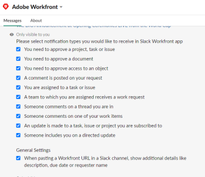
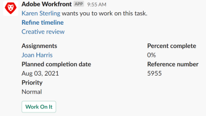

# 接收 [!DNL Adobe Workfront] 通知 [!DNL Slack]

<!--

(NOTE: Alina: *** Linked to Accessing Workfront from Slack.***Some of this information is duplicating in Accessing Workfront from Slack (also screen shots))

-->

安裝後 [!DNL Adobe Workfront for Slack]，您可以 [!DNL Workfront] 通知 [!DNL Slack].\
有關安裝的資訊 [!DNL Workfront for Slack]，請參閱 [設定 [!DNL Adobe Workfront for Slack]](../../workfront-integrations-and-apps/using-workfront-with-slack/configure-workfront-for-slack.md).

您可以啟用 [!UICONTROL 通知] 在通知泡泡中顯示的 [!DNL Workfront] 介面，也可在 [!DNL Slack].

電子郵件通知可獨立於 [!DNL Workfront] 介面通知。 您或您的 [!DNL Workfront] 管理員可以停用電子郵件通知，但介面通知無法在 [!DNL Workfront].\
但您可以停用 [!DNL Workfront] 您可能收到的通知 [!DNL Slack]，如果您只想在 [!DNL Workfront] 介面。

## 存取需求

您必須具備下列條件：

<table style="table-layout:auto"> 
 <col> 
 </col> 
 <col> 
 </col> 
 <tbody> 
  <tr> 
   <td role="rowheader"><a href="https://www.workfront.com/plans" target="_blank">[!DNL [!DNL Adobe Workfront] 計劃]</a>*</td> 
   <td> 
[!UICONTROL Pro]或更高版本
 </td> 
  </tr> 
 </tbody> 
</table>

&#42;若要了解您擁有的計畫、授權類型或存取權，請聯絡您的 [!DNL Workfront] 管理員。

## 必要條件

之前 [!DNL Workfront] 通知 [!DNL Slack]，您必須

* 設定 [!DNL Workfront for Slack]\
   配置說明 [!DNL Workfront for Slack]，請參閱 [設定 [!DNL Adobe Workfront for Slack]](../../workfront-integrations-and-apps/using-workfront-with-slack/configure-workfront-for-slack.md).

## 設定 [!DNL Workfront] 通知 [!DNL Slack] {#configure-workfront-notifications-for-slack}

1. （條件性）之後 [!DNL Workfront] 已新增至 [!DNL Slack] 例項，登入 [!DNL Workfront] 從 [!DNL Slack].\
   如需登入的相關資訊 [!DNL Workfront] 從 [!DNL Slack]，請參閱 [存取 [!DNL Adobe Workfront] 從 [!DNL Slack]](../../workfront-integrations-and-apps/using-workfront-with-slack/access-workfront-from-slack.md).

1. 從任何通道，開始在消息欄位中鍵入以下命令之一：

   `/workfront settings`

   或

   `/wf settings`

   

1. 預設會啟用所有通知。\
   停用下列任一通知：

   * [!UICONTROL 我被分配到新任務或問題]
   * [!UICONTROL 我的團隊被指派給新任務或問題]
   * [!UICONTROL 我收到新的批准或訪問請求]
   * [!UICONTROL 有人將我加入定向更新]
   * [!UICONTROL 有人對我所在的執行緒發表了註解]
   * [!UICONTROL 我所訂閱的任務、問題或專案已進行更新]
   * [!UICONTROL 有人對我其中一個工作項目發表評論]
   * [!UICONTROL 有人在我的幫助請求上留言]

   您對 [!UICONTROL 通知] 選項會立即生效。\
   您已啟用的通知會在 [!DNL Workfront] [!DNL Slack] 頻道。 若在此停用通知，則只會針對 [!DNL Slack]，而不是 [!DNL Workfront] 介面。 您會繼續在 [!DNL Workfront] 通知泡泡在介面的右上方。

## 管理 [!DNL Workfront] 通知 [!DNL Slack]

您可以接收並回應 [!DNL Workfront] 通知 [!DNL Slack].

您可以停用您在 [!DNL Slack]，以確保不會收到重複通知。\
如需設定電子郵件通知的詳細資訊，請參閱 [啟用或停用您自己的事件通知](../../workfront-basics/using-notifications/activate-or-deactivate-your-own-event-notifications.md).

啟用或停用 [!DNL Workfront] 通知 [!DNL Slack] 不會影響您在 [!DNL Workfront] 介面。\
通知 [!DNL Workfront] 無法禁用介面。

管理 [!DNL Workfront] 通知 [!DNL Slack]:

1. 登入 [!UICONTROL Slack].
1. 登入 [!DNL Workfront] 從 [!DNL Slack].\
   如需登入的相關資訊，請參閱 [!DNL Workfront] 從 [!DNL Slack]，請參閱「登入」 [!DNL Workfront] 從 [!DNL Slack]「 」部分 [存取 [!DNL Adobe Workfront] 從 [!DNL Slack]](../../workfront-integrations-and-apps/using-workfront-with-slack/access-workfront-from-slack.md).

1. 確保 [!DNL Workfront] 通知 [!DNL Slack] 的URL區段。\
   如需詳細資訊，請參閱 [!DNL Workfront] 通知可設定為也傳送至 [!DNL Slack]，請參閱 [設定 [!DNL Workfront] 通知 [!DNL Slack]](#configure-workfront-notifications-for-slack-configure-workfront-notifications-for-slack).

1. 前往 **[!DNL Workfront]** 頻道 [!DNL Workfront] 通知。
1. （條件式和選用式）執行下列任一操作：

   * 按一下 **[!UICONTROL 努力]** 接受工作。

      <!--   
        
     -->

   * （條件式和選用式）按一下 **[!UICONTROL 回覆[!DNL Workfront]]** 要回複評論，請鍵入您的回復，然後按一下 **[!UICONTROL 回覆]**.\

      

   * （條件式和選用式）按一下 **[!UICONTROL 核准]** 或 **[!UICONTROL 拒絕]** 批准或拒絕等待您批准的任務、問題或項目。\

      

   * （條件式和選用式）按一下 **[!UICONTROL 核准]**, **[!UICONTROL 變更]**，或 **[!UICONTROL 拒絕]**、批准、批准更改或拒絕文檔。\

      \
      您也可以將滑鼠移至檔案的縮圖上，然後在核准前按一下放大鏡圖示，即可檢視檔案的較大預覽。\
      僅核准Slack [檔案類型](https://api.slack.com/types/file) 可預覽。

   * （條件式和選用式）按一下 **[!UICONTROL 授予]** 或 **[!UICONTROL 忽略]** 授予或忽略其他使用者的更多存取權要求。

      \
      您會收到確認，確認您的動作已在 [!DNL Workfront]，針對您在通知中做出的每項決策。
