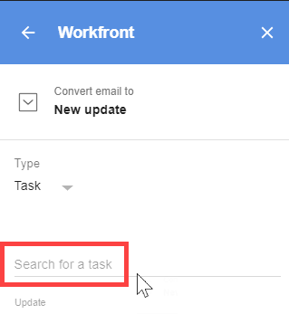

# 更新 [!DNL Adobe Workfront] 項目自 [!DNL G Suite] 使用電子郵件內容

您可以更新現有項目、任務或問題，並顯示來自非[!DNL Adobe Workfront] 電子郵件。

## 存取需求

您必須具備下列存取權，才能執行本文中的步驟：

<table style="table-layout:auto"> 
 <col> 
 <col> 
 <tbody> 
  <tr> 
   <td role="rowheader">[!DNL Adobe Workfront] 計劃*</td> 
   <td> 
任何
 </td> 
  </tr> 
  <tr> 
   <td role="rowheader">[!DNL Adobe Workfront] 授權*</td> 
   <td> 
[!UICONTROL工作], [!UICONTROL計畫]
 </td> 
  </tr> 
 </tbody> 
</table>

&#42;若要了解您擁有的計畫、授權類型或存取權，請聯絡您的 [!DNL Workfront] 管理員。

## 必要條件

更新之前 [!DNL Workfront] 使用電子郵件內容的項目 [!DNL G Suite]，您必須

* 安裝 [!DNL Workfront for G suite]\
   如需指示，請參閱 [安裝 [!DNL Adobe Workfront for G Suite]](../../workfront-integrations-and-apps/workfront-for-g-suite/install-workfront-for-gsuite.md).

## 更新 [!DNL Workfront] 使用電子郵件內容的項目 [!DNL G Suite]

1. 若 [!UICONTROL Workfront for G Suite] 面板未顯示，請按一下Workfront圖示  在 [!DNL G Suite] 頁面最右側的附加元件側欄。
1. 在中開啟電子郵件訊息 [!DNL G Suite]，按一下 **[!UICONTROL 以新更新形式發佈]** 在 [!DNL G Suite] 中。
1. 在 **[!UICONTROL 類型]**，按一下下拉箭頭，然後按一下您要新增更新的物件類型。
1. 按一下 **[!UICONTROL 搜尋]** 選項，開始鍵入要添加更新的對象的名稱，然後在下面的清單中顯示該項目時選擇該項目。

   

   此選項依您在步驟3中選取的項目而異。 可能是 **[!UICONTROL 搜尋專案]**, **[!UICONTROL 搜索任務]**，或 **[!UICONTROL 搜尋問題]**.

   >[!NOTE]
   >
   >鍵入任務名稱時，會從下面顯示的名稱清單中排除臨時個人任務。

1. 進行下列任一選用變更：

   <table style="table-layout:auto"> 
    <col> 
    <col> 
    <tbody> 
     <tr> 
      <td role="rowheader">[!UICONTROL更新]</td> 
      <td>編輯此文字的任何部分，該部分取自電子郵件的主旨行和內文。</td> 
     </tr> 
     <tr data-mc-conditions=""> 
      <td role="rowheader">[!UICONTROL包含電子郵件附件]</td> 
      <td>
（只有在電子郵件至少包含一個附件時才可用。） 按一下此選項可在任務或問題的[!UICONTROL Documents]頁簽中保存附件。 

如果不想保存附件，請按一下其名稱右側的X。 

如果電子郵件包含 [!DNL Google Drive]，則連結會儲存至您要建立之任務或問題的[!UICONTROL概述]標籤。 

重要： 為了讓這能發揮作用，您的[!DNL Workfront] 管理員 必須授權 [!DNL Google Drive] 與 [!DNL Workfront]

      
如果您啟用此選項，系統仍會對您轉換為工作、問題和更新的其他電子郵件啟用此選項。
</td> 
     </tr> 
     <tr data-mc-conditions=""> 
      <td role="rowheader">通知</td> 
      <td>按一下 <strong>[!UICONTROL Notify]</strong>，按一下 <strong>[!UICONTROL搜索用戶或組]</strong> 選項，然後開始鍵入人員或團隊的名稱，並在其下清單中出現時按一下。 對要添加的每個人員和團隊重複此操作，然後按一下 <strong>[!UICONTROL保存]</strong>.</td> 
     </tr> 
    </tbody> 
   </table>

1. 按一下 **[!UICONTROL 更新]**.

   重新整理瀏覽器時，會顯示位於 [!DNL Workfront for G Suite] 面板會確認您已將電子郵件轉換為更新：

   

   您可以按一下連結，前往 [!UICONTROL 更新] 標籤 [!DNL Workfront] 針對您在步驟4中指定的物件。

   您可以重複這些步驟，將相同的電子郵件轉換為更新、任務和問題(請參閱 [使用電子郵件內容在[!DNL G Suite]中建立Adobe Workfront問題](../../workfront-integrations-and-apps/workfront-for-g-suite/create-wf-issue-in-g-suite-using-email-content.md))。 當您重新整理瀏覽器或在其他時間返回電子郵件時，您為電子郵件建立的所有連結都會列在 [!UICONTROL Workfront for G Suite] 中。

1. （選用）繼續使用 [!DNL Workfront] 執行下列任一操作，即可新增附加元件面板：

   * 若要在 **[!UICONTROL 更新]** 按一下 **[!UICONTROL 開始新更新]** 並輸入資訊。

   * 回覆 **[!UICONTROL 更新]** 按一下 **[!UICONTROL 回覆]** 並輸入您的回復。

      對於上述兩個選項，您可以按一下 **[!UICONTROL 通知]** 在步驟5中指定回覆的收件者。 準備就緒後，按一下 **[!UICONTROL 貼文]** 添加更新或回復。

   * 按一下 **[!UICONTROL 詳細資料]** 頁簽，查看新項目、任務或問題的詳細資訊。
