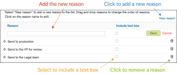

# 在[!DNL Workfront Proof]中設定核准決定選項

>[!IMPORTANT]
>
>本文提及獨立產品[!DNL Workfront Proof]中的功能。 有關[!DNL Adobe Workfront]內部校訂的資訊，請參閱[校訂](../../../review-and-approve-work/proofing/proofing.md)。

作為[!DNL Workfront Proof]管理員（使用Select或Premium版計畫），您可以透過下列方式為組織內[!DNL Workfront Proof]位使用者建立的所有校訂設定核准決定選項：

* 變更決定的名稱
* 變更校訂檢視器中顯示的決定順序
* 決定應該顯示哪些決定

本文會說明下列內容：

## 設定決定設定

1. 按一下&#x200B;**[!UICONTROL 帳戶設定]**。
1. 開啟&#x200B;**[!UICONTROL 決定]**&#x200B;標籤。
1. 進行下列任一變更：

   * 若要隱藏決定，請按一下您不需要的決定右邊的&#x200B;**[!UICONTROL 隱藏]**。
   * 若要重新命名決定，請按一下決定名稱、編輯決定，然後按一下方塊外部（或按Enter）。 [!DNL Workfront Proof]會更新系統中所有現有校訂上的決定名稱。

     >[!IMPORTANT]
     >
     >重新命名決定時，請保留決定的邏輯。 例如，預設決定「已拒絕」可變更為「需要新版本」，但不應變更為「傳送至印表機」)。

     如果要返回[!DNL Workfront Proof]預設值，可以按一下「還原預設決定」。

>[!NOTE]
>
>* 如果有多個不同層級的決策，則決策背後的邏輯將用於計算校訂工作流程的整體狀態。
>* 「已核准」和「已核准變更」決策會觸發自動工作流程的下一個階段。
>* 如果您重新命名決定，而且想要驗證邏輯，可以按一下左側導覽面板中的「**[!UICONTROL 活動]**」，然後檢查原始決定以方括弧顯示的活動記錄。
>
>  >

## 建立決定原因

決定原因是一種擷取有關證明的其他決定資訊的好方法。

1. 按一下&#x200B;**[!UICONTROL 設定]** > **[!UICONTROL 帳戶設定]**。

1. 開啟&#x200B;**[!UICONTROL 決定]**&#x200B;標籤。
依預設，校訂上的所有決策者都可以利用原因，但您可以將其限製為僅供主要決策者使用。
視您的需求而定，您可以允許選取多個原因，也可以將其設為單一選擇清單。 您也可以將原因設為強制性，這表示檢閱者必須先挑選原因，才能將其決定儲存於校樣中。
   

1. 在&#x200B;**[!UICONTROL 原因]**&#x200B;區段中，按一下&#x200B;**[!UICONTROL 新增原因]**。
   

1. 在&#x200B;**[!UICONTROL 原因]**&#x200B;下顯示的方塊中，輸入原因區段的標題。
1. 如果要包含文字方塊，請選取&#x200B;**[!UICONTROL 包含文字方塊]**。
1. 按一下「**[!UICONTROL 儲存]**」。
   
最重要的步驟是選取應顯示原因的決定。 如果您忘記這麼做，原因不會顯示在您的校樣上。

1. 勾選頁面頂端決定清單中&#x200B;**[!UICONTROL 顯示原因]**&#x200B;欄中的方塊。 基於您的理由，您可以選取一或多個決定。
   

## 建立Post決定訊息

您可以建立貼文決定訊息，以供檢閱者將其決定儲存到校樣後顯示。

1. 按一下&#x200B;**[!UICONTROL 設定]** > **[!UICONTROL 帳戶設定]**。

1. 開啟&#x200B;**[!UICONTROL 決定]**&#x200B;標籤。
1. 在&#x200B;**[!UICONTROL Post決定訊息]**&#x200B;區段中，按一下&#x200B;**[!UICONTROL 訊息]**&#x200B;列結尾的&#x200B;**[!UICONTROL 編輯]**。
您也可以決定是否要向所有決策者顯示訊息，或是否要將訊息限制在主要決策者。
   

1. 在&#x200B;**[!UICONTROL 顯示訊息]**&#x200B;欄中，指定此訊息應顯示的決策。
如果您未選取至少一個決定，則訊息不會顯示在您的校樣上。 請務必在該欄中勾選至少一個方塊。
   
