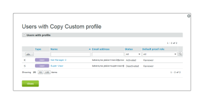

# 在 [!DNL Workfront Proof]

>[!IMPORTANT]
>
>本文說明獨立產品中的功能 [!DNL Workfront] 證明。 有關內部校對的資訊 [!DNL Adobe Workfront]，請參閱 [校對](../../../review-and-approve-work/proofing/proofing.md).

As a [!DNL Workfront Proof] 帳單管理員或 [!DNL Workfront Proof] 管理員，您可以為其他使用者設定自訂設定檔。

自訂設定檔可讓您指派精細的權限給帳戶中的使用者，並定義使用者對帳戶中的項目擁有的存取層級和權限。 如需自訂設定檔的詳細資訊，請參閱 [使用 [!DNL Workfront Proof]](../../../workfront-proof/wp-mnguserscontacts/users/create-and-manage-custom-profiles.md).

您可以調整頁面的版面，以僅檢視與您相關的資訊：

* 您可以調整顯示的項目數(1)
* 您可以篩選設定檔清單，以找出您要使用的設定檔(2)
* 您可以輕鬆檢查帳戶中擁有的設定檔數量(3)\
   

## 設定檔索引標籤

此 [!UICONTROL 設定檔] 標籤可讓您輕鬆新增和管理自訂設定檔。 您可在此執行下列動作：

* 新增設定檔(1)
* 對設定檔執行大量動作：
* 刪除多個配置檔案(2)
* 停用多個設定檔(3)
* 啟用多個配置檔案(4)
* 訪問配置檔案詳細資訊(5)
* 複製配置檔案(6)
* 禁用配置檔案(7)

如需如何自訂設定檔標籤的詳細資訊，請參閱 [使用 [!DNL Workfront Proof]](../../../workfront-proof/wp-mnguserscontacts/users/create-and-manage-custom-profiles.md).

## 設定檔詳細資料

「設定檔詳細資訊」頁面可讓您修改為自訂設定檔啟用的權限、複製設定檔、刪除設定檔，以及檢視指派設定檔的使用者清單。

有關可在此頁上執行的操作的詳細資訊，請參閱[使用 [!DNL Workfront Proof]](../../../workfront-proof/wp-mnguserscontacts/users/create-and-manage-custom-profiles.md).

* [存取「設定檔詳細資料」頁面](#accessing-the-profile-details-page)
* [查看已分配配置檔案的用戶清單](#viewing-the-list-of-users-with-a-profile-assigned)

### 存取「設定檔詳細資料」頁面 {#accessing-the-profile-details-page}

若要存取設定檔詳細資訊：

1. 按一下設定檔的名稱。
1. 

### 查看已分配配置檔案的用戶清單 {#viewing-the-list-of-users-with-a-profile-assigned}

要查看已分配特定配置檔案的用戶清單：

1. 按一下連結，顯示使用此設定檔(1)的作用中和停用中使用者人數。
1. 或者，此清單會顯示在「設定檔詳細資訊」頁面上。
1. 

1. 清單會顯示帳戶中已指派相關設定檔的作用中和停用中使用者。 如果您的清單太長，您可以方便地調整頁面的版面，以僅查看您正在查找的資訊。
1. 
