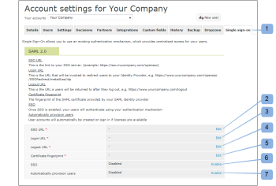

# 為配置單一登錄 [!DNL Workfront Proof] 使用者

>[!IMPORTANT]
>
>本文說明獨立產品中的功能 [!DNL Workfront Proof]. 有關內部校對的資訊 [!DNL Adobe Workfront]，請參閱 [校對](../../../review-and-approve-work/proofing/proofing.md).

如果您有「選擇」或「高級」計畫，則可以提供單一登入(SSO)功能，以便您使用現有組織的用戶名和密碼訪問您的 [!DNL Workfront Proof] 帳戶。

這表示您將針對您自己的登入系統進行驗證，而非針對 [!DNL Workfront Proof] 登入頁面。

>[!NOTE]
>
>您必須在 [!DNL Workfront Proof] 帳戶來啟用SAML。 自訂子網域可供自由設定。 請參閱 [品牌推廣](https://support.workfront.com/hc/en-us/sections/115000921208-Branding) 如需詳細資訊，請參閱 [品牌 [!DNL Workfront Proof] 網站 — 進階](../../../workfront-proof/wp-acct-admin/branding/brand-wp-site-advanced.md).

## 在內啟用SSO [!DNL Workfront Proof]

可在 [!UICONTROL 單一登入] 標籤 [!UICONTROL 帳戶設定]，此變數將套用至 [!DNL Workfront Proof] 帳戶。 請參閱 [帳戶設定](https://support.workfront.com/hc/en-us/sections/115000912147-Account-settings) 以取得更多資訊。

## 實體ID

我們身為服務提供者，已在此發佈實體ID:

[https://yoursubdomain.proofhq.com/saml/module.php/saml/sp/metadata.php/phq](https://yoursubdomain.proofhq.com/saml/module.php/saml/sp/metadata.php/phq) （其中「yoursubdomain」為您的帳戶的子網域）

[!DNL Workfront Proof] 需要使用者的電子郵件地址作為其唯一識別碼，可以以下列其中一個屬性傳遞：

* 回歸:mace:dr:attribute-def:emailAddress
* http://schemas.xmlsoap.org/ws/2005/05/identity/claims/emailaddress
* http://schemas.xmlsoap.org/claims/EmailAddress
* 回歸:oid:0.9.2342.19200300.100.1.3
* http://axschema.org/contact/email
* openid.sreg.email
* 郵件
* 電子郵件
* emailAddress

要配置SSO:

1. 開啟 **[!UICONTROL 單一登入]** 標籤(1)。
1. 輸入 **SSO URL** (2)。
這是SSO伺服器的連結(例如 **https://sso.mycompany.com/opensso**)。

1. 輸入 **登入URL** (3)。
這是將叫用以將使用者重新導向至身分提供者的URL。

1. 這不是您在瀏覽器中輸入的實際URL，而是端點，端點會處理我們傳送的資訊，以顯示「登入」畫面。

輸入 **註銷URL** (4)。
這是您登出後會傳回的URL，例如

**https://www.yourcompany.com/services/logout.asp**

1. 輸入 **證書指紋** (5)。
1. 您的SAML身分提供者所提供之SAML憑證的SHA1指紋。
1. 在身分提供者上設定此項，請務必加入金鑰資訊。
1. 交換機 **SSO** to **[!UICONTROL 已啟用]** (6)。
啟用SSO後，您和帳戶上的其他使用者將會使用您自己的驗證機制登入。 這表示當使用者存取 [!DNL Workfront Proof] 帳戶登入畫面(例如， **yourcompany.proofhq.com/login**)，則會以「轉移」視窗提示使用者至您自己的驗證登入頁面。

1. （可選）啟用 **自動布建用戶** (7)。
啟用此選項後，系統會自動為沒有使用者建立使用者帳戶 [!DNL Workfront Proof] 設定檔，但會 [!DNL Workfront Proof] 帳戶（使用其單一登入憑證）。 只有在您的帳戶尚未達到使用者限制時，才會採取此動作。

1. 依預設，新布建的使用者會指派管理員設定檔權限。 如果您需要更多資訊，請參閱 [校樣權限設定檔(位於 [!DNL Workfront Proof]](../../../workfront-proof/wp-acct-admin/account-settings/proof-perm-profiles-in-wp.md).

## 為衛星帳戶啟用SSO

如果您的中心帳戶連接了衛星帳戶，則可以從中心帳戶級別管理這些帳戶。

單一登入是Select和Premium功能，因此只能在Select和Premium計畫上的衛星上啟用單一登入。

1. 按一下 **[!UICONTROL 設定]** > **[!UICONTROL 帳戶設定]** (1)。

1. 按一下下拉式功能表(2)中的衛星帳戶。
1. 開啟 **[!UICONTROL 單一登入]** 標籤(3)。
1. 開始編輯SSO配置(4)。
1. 
在此，您有兩種配置方法(5):

1. **繼承：** SSO，搭配從您的中樞帳戶取得的設定。
如果使用者存取 [!DNL Workfront Proof] 通過 **預設登入頁面** ([https://www.proofhq.com/login](https://www.proofhq.com/login))將會 **兩級授權**:首先，系統會要求使用者使用 [!DNL Workfront Proof] 存取資料（電子郵件和密碼）;然後，通過SSO窗口將用戶轉移到SSO登錄頁。
因此，啟用SSO服務後，我們建議您透過自己的 [!DNL Workfront Proof] 子網域/網域。

   >[!NOTE]
   >
   >此時，當您的 [!DNL Workfront Proof] 帳戶，您將無法使用這些憑證登入iPhone應用程式。

   1. **手動** （預設）:具有不同配置的SSO（例如，指向另一個身份提供程式）。

      >[!NOTE]
      >
      >如果衛星帳戶繼承中樞帳戶的SSO設定，則登入畫面會是中樞帳戶的畫面。 衛星帳戶使用者在此頁面上輸入其SSO登入詳細資訊時，會將他們重新導向回衛星帳戶。

      

   1. 按一下 **[!UICONTROL 儲存]** (6)。

## 繼承自中心帳戶的SSO設定

當您選擇繼承中心帳戶的設定時，您會發現所有欄位都已填入中心帳戶(7)的資料，且單一登入如同主帳戶一樣自動啟用/停用(8)。 欄位中也不再有編輯連結，因為現在已從您的中樞帳戶設定和管理Satellite帳戶的整個SSO設定。

在您的中心帳戶(9)中， [!UICONTROL SSO使用] 欄位顯示此設定正由satellite帳戶(10)使用。\

## 手動配置SSO

如果已為衛星帳戶(1)選擇了手動SSO配置，則需要手動輸入單一登錄的資料。

1. 按一下 **[!UICONTROL 設定]** > **[!UICONTROL 帳戶設定]** (1)。

1. 開啟 **[!UICONTROL 單一登入]** 標籤。
1. 按一下 **[!UICONTROL 編輯],** 填入欄位，然後按一下 **[!UICONTROL 儲存]** (2)。

1. 在 **[!UICONTROL SSO]** 列，按一下 **[!UICONTROL 已啟用]** (3)。

## SSO登入

1. 按一下 **[!UICONTROL 設定]** > **[!UICONTROL 帳戶設定]** (1)。

1. 開啟 **[!UICONTROL 單一登入]** 標籤。
1. 請確定您的 [!DNL Workfront Proof] 域/子網域(1)已設定，且您的使用者可存取您的 [!DNL Workfront Proof] 帳戶。
   
啟用「單一登入」後，您的子網域登入URL(例如yourcompany.proofhq.com/login)會顯示傳輸畫面(2)，會直接帶您前往SSO登入頁面。
   

1. 如果使用者存取 [!DNL Workfront Proof] 通過 **預設登入頁面** ([https://www.proofhq.com/login](https://www.proofhq.com/login))將會 **兩級授權**. 首先，系統會要求使用者使用 [!DNL Workfront Proof] 存取資料（電子郵件和密碼）。 然後，通過SSO窗口(2)將用戶轉移到SSO登錄頁。\
   因此，啟用SSO服務後，我們建議您透過自己的 [!DNL Workfront Proof] 子網域/網域。

1. 目前，當您的Workfront Proof帳戶啟用單一登入時，將無法使用這些憑證登入iPhone應用程式。

## 關於新增使用者

當您的 [!DNL Workfront Proof] 帳戶時，新使用者將不會收到任何確認電子郵件，因為其帳戶會自動啟用並準備就緒。

從 [!DNL Workfront Proof] 登入頁面，按一下 [!UICONTROL 登入] 按鈕時，系統會將使用者帶入您的SSO登入頁面，並要求輸入您的單一登入登入登入憑證。

>[!IMPORTANT]
>
>在驗證程式期間，使用者是透過電子郵件地址識別，這表示用於SSO登入的電子郵件帳戶必須是在您帳戶中註冊之使用者的電子郵件地址。

## Active Directory聯合身份驗證服務(AD FS)

Active Directory聯合身份驗證服務(AD FS)是 [!DNL Microsoft] 可安裝在Windows Server作業系統上的軟體元件，為用戶提供跨組織界限的系統和應用程式的單一登錄訪問。 如需詳細資訊，請參閱Microsoft開發人員網路網站上的「Active Directory聯合身份驗證服務」。

此 [!DNL Workfront Proof] 系統支援SAML 2.0，且僅與AD FS 2.0或更新版本相容。

請參閱 [單一登入 [!DNL Workfront Proof]:AD FS配置](../../../workfront-proof/wp-acct-admin/account-settings/sso-in-wp-adfs-configuration.md) 以取得詳細指示。
