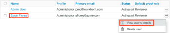

# 校樣權限設定檔(位於 [!DNL Workfront Proof]

>[!IMPORTANT]
>
>本文說明獨立產品中的功能 [!DNL Workfront Proof]. 有關內部校對的資訊 [!DNL Adobe Workfront]，請參閱 [校對](../../../review-and-approve-work/proofing/proofing.md).

As a [!DNL Workfront] 管理員或 [!DNL Workfront Proof] 管理員，您可以指派「校樣權限設定檔」給使用者，以指定使用者對系統中所有校樣所具備的校樣功能。 如需設定使用者的校樣權限設定檔的相關資訊，請參閱 [在 [!DNL Workfront Proof]](../../../workfront-proof/wp-acct-admin/account-settings/config-user-pref-in-wp.md).

>[!NOTE]
>
>您也可以執行下列動作：
>
>* 授予使用者個別校樣的特定角色。 如需校樣角色的詳細資訊，請參閱 [在中管理校樣角色 [!DNL Workfront Proof]](../../../workfront-proof/wp-work-proofsfiles/share-proofs-and-files/manage-proof-roles.md).
>* 為組織中的使用者建立自訂設定檔。 如需詳細資訊，請參閱 [在 [!DNL Workfront Proof]](../../../workfront-proof/wp-acct-admin/account-settings/configure-custom-profiles.md).
>

下表顯示每個校樣權限設定檔的可用權限。

| **擁有的項目** |  |  |  |  | **其他使用者的項目** |  |  | **管理員** | **帳單** |
|---|---|---|---|---|---|---|---|---|---|
|  | **新增** | **檢視** | **編輯** | **刪除** | **檢視** | **編輯** | **刪除** | **編輯和刪除** | **編輯** |
| 帳單管理員 |  |  |  |  |  |  |  |  |  |
| 管理員 |  |  |  |  |  |  |  |  |   |
| 主管 |  |  |  |  |  |  |  |   |   |
| 經理 |  |  |  |  |   |   |   |   |   |
| 觀察者 |   |  |   |   |   |   |   |   |   |
| 訪客 |   |  |   |   |   |   |   |   |   |

{style=&quot;table-layout:auto&quot;}

請考慮下列角色和權限：

* 指派的設定檔權限僅與您自己帳戶中的使用者和項目相關。 在衛星帳戶中，主（中心）帳戶的管理員和計費管理員可以從中心帳戶級別訪問和管理這些帳戶的帳戶設定和計費。
* 帳單管理員和管理員可以刪除使用者。 這只能在帳戶設定中完成。
* 帳單管理員和管理員檢視帳戶中其他使用者擁有的校樣時，會以審核者的角色檢視這些校樣。
* 使用唯讀角色，帳單管理員和管理員可以存取與他們共用的資料夾或他們建立的資料夾中的校樣。

以下小節將說明每個設定檔以及與標準設定檔相關聯的權限 [!DNL Workfront Proof] 設定：

* [帳單管理員](#billing-administrator)
* [管理員](#administrator)
* [主管](#supervisor)
* [經理](#manager)
* [觀察者](#observer)
* [訪客](#visitor)
* [來賓](#guest)

## 帳單管理員 {#billing-administrator}

帳單管理員可存取 [中的帳戶設定 [!DNL Workfront Proof]](../../../workfront-proof/wp-acct-admin/account-settings/account-settings.md) and [The [!DNL Workfront Proof] 帳單頁面](../../../workfront-proof/wp-billingsettings/manage-your-billing/wp-billing-page.md)，且具有下列權限：

可產生校樣、上傳檔案和建立資料夾。 如需詳細資訊，請參閱 [在中產生校樣 [!DNL Workfront Proof]](../../../workfront-proof/wp-work-proofsfiles/create-proofs-and-files/generate-proofs.md), [將檔案和網頁內容上傳至 [!DNL Workfront Proof]](../../../workfront-proof/wp-work-proofsfiles/create-proofs-and-files/upload-files-web-content.md)，和 [在中建立資料夾 [!DNL Workfront Proof]](../../../workfront-proof/wp-work-proofsfiles/organize-your-work/create-folders.md).

可以檢視、編輯和刪除自己建立的校樣和檔案。

可以檢視、編輯和刪除組織中所有使用者建立的校樣和檔案。

可以刪除其他使用者的公用資料夾。 如需詳細資訊，請參閱 [在中管理資料夾 [!DNL Workfront Proof]](../../../workfront-proof/wp-work-proofsfiles/organize-your-work/manage-folders.md).

對帳戶中建立的所有校樣具有編輯權限。

可設為Dropzone的擁有者。 如需詳細資訊，請參閱 [在 [!DNL Workfront Proof]](../../../workfront-proof/wp-acct-admin/account-settings/configure-dropzone-in-wp.md).

可以存取帳單頁面並編輯帳單詳細資訊。 如需詳細資訊，請參閱 [此 [!DNL Workfront Proof] 帳單頁面](../../../workfront-proof/wp-billingsettings/manage-your-billing/wp-billing-page.md).

可以存取「帳戶設定」頁面並編輯帳戶詳細資訊。 如需詳細資訊，請參閱 [中的帳戶設定 [!DNL Workfront Proof]](../../../workfront-proof/wp-acct-admin/account-settings/account-settings.md).

可以清空垃圾。 如需詳細資訊，請參閱 [還原並清空 [!DNL Workfront Proof]](../../../workfront-proof/wp-work-proofsfiles/manage-your-work/restore-and-empty-trash.md).

可以新增、編輯和刪除使用者。

可以建立組和添加新聯繫人。

可以刪除聯繫人。

如果校樣上沒有回覆，可以編輯校樣。

無法編輯校樣回覆。

無法刪除其他用戶的專用資料夾。 如需詳細資訊，請參閱 [在中管理資料夾 [!DNL Workfront Proof]](../../../workfront-proof/wp-work-proofsfiles/organize-your-work/manage-folders.md).

如需帳戶設定的詳細資訊，請參閱 [中的帳戶設定 [!DNL Workfront Proof]](../../../workfront-proof/wp-acct-admin/account-settings/account-settings.md).

有關帳單的資訊，請參閱 [此 [!DNL Workfront Proof] 帳單頁面](../../../workfront-proof/wp-billingsettings/manage-your-billing/wp-billing-page.md).

### 管理員 {#administrator}

管理員可存取 [帳戶設定](https://support.workfront.com/hc/en-us/sections/115000912147-Account-Settings)和具有下列權限：

可以建立校樣、上傳檔案和建立資料夾。 如需詳細資訊，請參閱 [在中產生校樣 [!DNL Workfront Proof]](../../../workfront-proof/wp-work-proofsfiles/create-proofs-and-files/generate-proofs.md), [將檔案和網頁內容上傳至 [!DNL Workfront Proof]](../../../workfront-proof/wp-work-proofsfiles/create-proofs-and-files/upload-files-web-content.md)，和 [在中建立資料夾 [!DNL Workfront Proof]](../../../workfront-proof/wp-work-proofsfiles/organize-your-work/create-folders.md).

可以檢視、編輯和刪除校樣及其建立的檔案。

可以檢視、編輯和刪除組織中所有使用者建立的校樣和檔案。

可以刪除其他用戶的公用資料夾。 如需詳細資訊，請參閱 [在中管理資料夾 [!DNL Workfront Proof]](../../../workfront-proof/wp-work-proofsfiles/organize-your-work/manage-folders.md).

對帳戶中建立的所有校樣具有編輯權限。

可設為Dropzone的擁有者。 如需詳細資訊，請參閱 [在 [!DNL Workfront Proof]](../../../workfront-proof/wp-acct-admin/account-settings/configure-dropzone-in-wp.md).

可以存取「帳戶設定」頁面並編輯帳戶詳細資訊。 如需詳細資訊，請參閱 [中的帳戶設定 [!DNL Workfront Proof]](../../../workfront-proof/wp-acct-admin/account-settings/account-settings.md).

可以清空垃圾。 如需詳細資訊，請參閱 [還原並清空 [!DNL Workfront Proof]](../../../workfront-proof/wp-work-proofsfiles/manage-your-work/restore-and-empty-trash.md).

可以新增、編輯和刪除使用者。

可以建立組和添加新聯繫人。

可以刪除聯繫人。

如果校樣上沒有回覆，可以編輯校樣。

無法編輯校樣回覆。

無法刪除其他用戶的專用資料夾。 如需詳細資訊，請參閱 [在中管理資料夾 [!DNL Workfront Proof]](../../../workfront-proof/wp-work-proofsfiles/organize-your-work/manage-folders.md).

無法訪問「帳單」頁或編輯帳單詳細資訊。 如需詳細資訊，請參閱 [此 [!DNL Workfront Proof] 帳單頁面](../../../workfront-proof/wp-billingsettings/manage-your-billing/wp-billing-page.md).

### 主管 {#supervisor}

主管具有下列權限：

可以建立校樣、上傳檔案和建立資料夾。 如需詳細資訊，請參閱 [在中產生校樣 [!DNL Workfront Proof]](../../../workfront-proof/wp-work-proofsfiles/create-proofs-and-files/generate-proofs.md), [將檔案和網頁內容上傳至 [!DNL Workfront Proof]](../../../workfront-proof/wp-work-proofsfiles/create-proofs-and-files/upload-files-web-content.md)，和 [在中建立資料夾 [!DNL Workfront Proof]](../../../workfront-proof/wp-work-proofsfiles/organize-your-work/create-folders.md).

可以檢視、編輯和刪除自己建立的校樣和檔案。

可以檢視、編輯和刪除組織中所有使用者建立的校樣和檔案。

可以刪除其他用戶的公用資料夾。 如需詳細資訊，請參閱 [在中管理資料夾 [!DNL Workfront Proof]](../../../workfront-proof/wp-work-proofsfiles/organize-your-work/manage-folders.md).

對帳戶中建立的所有校樣具有編輯權限。

可設為Dropzone的擁有者。 如需詳細資訊，請參閱 [在 [!DNL Workfront Proof]](../../../workfront-proof/wp-acct-admin/account-settings/configure-dropzone-in-wp.md).

可以建立組和添加新聯繫人。

可以刪除聯繫人。

如果校樣上沒有回覆，可以編輯校樣。

無法編輯校樣回覆。

無法刪除其他用戶的專用資料夾。 如需詳細資訊，請參閱 [資料夾 [!DNL Workfront Proof]](../../../workfront-proof/wp-work-proofsfiles/organize-your-work/folders.md).

無法訪問「帳單」頁或「帳戶」設定。 如需詳細資訊，請參閱 [此 [!DNL Workfront Proof] 帳單頁面](../../../workfront-proof/wp-billingsettings/manage-your-billing/wp-billing-page.md) 和 [中的帳戶設定 [!DNL Workfront Proof]](../../../workfront-proof/wp-acct-admin/account-settings/account-settings.md).

無法添加、編輯或刪除用戶。

無法清空垃圾。 如需詳細資訊，請參閱 [還原並清空 [!DNL Workfront Proof]](../../../workfront-proof/wp-work-proofsfiles/manage-your-work/restore-and-empty-trash.md).

### 經理 {#manager}

管理員具有下列權限：

可以建立校樣、上傳檔案和建立資料夾。 如需詳細資訊，請參閱 [在中產生校樣 [!DNL Workfront Proof]](../../../workfront-proof/wp-work-proofsfiles/create-proofs-and-files/generate-proofs.md), [將檔案和網頁內容上傳至 [!DNL Workfront Proof]](../../../workfront-proof/wp-work-proofsfiles/create-proofs-and-files/upload-files-web-content.md)，和 [在中建立資料夾 [!DNL Workfront Proof]](../../../workfront-proof/wp-work-proofsfiles/organize-your-work/create-folders.md).

可以檢視、編輯和刪除自己建立或擁有的校樣和檔案。

可以查看、檢閱及核准其他使用者明確與其共用的證明（共用資料夾中所有內容的唯讀權限）。 如需詳細資訊，請參閱 [在中管理校樣角色 [!DNL Workfront Proof]](../../../workfront-proof/wp-work-proofsfiles/share-proofs-and-files/manage-proof-roles.md).

可以建立組並添加新聯繫人。

無法查看、編輯或刪除組織中其他用戶建立的校樣和檔案。

無法編輯校樣或回覆。

無法刪除其他用戶的專用資料夾。 如需詳細資訊，請參閱 [在中管理資料夾 [!DNL Workfront Proof]](../../../workfront-proof/wp-work-proofsfiles/organize-your-work/manage-folders.md).

無法刪除其他用戶的公用資料夾。 如需詳細資訊，請參閱 [在中管理資料夾 [!DNL Workfront Proof]](../../../workfront-proof/wp-work-proofsfiles/organize-your-work/manage-folders.md).

無法訪問「帳單」頁或「帳戶」設定。 如需詳細資訊，請參閱 [此 [!DNL Workfront Proof] 帳單頁面](../../../workfront-proof/wp-billingsettings/manage-your-billing/wp-billing-page.md) 和 [中的帳戶設定 [!DNL Workfront Proof]](../../../workfront-proof/wp-acct-admin/account-settings/account-settings.md).

無法設定為Dropzone所有者。 如需詳細資訊，請參閱 [在 [!DNL Workfront Proof]](../../../workfront-proof/wp-acct-admin/account-settings/configure-dropzone-in-wp.md).

無法清空垃圾。 如需詳細資訊，請參閱 [還原並清空 [!DNL Workfront Proof]](../../../workfront-proof/wp-work-proofsfiles/manage-your-work/restore-and-empty-trash.md).

無法添加、編輯或刪除用戶。

無法刪除聯繫人。

### 觀察者 {#observer}

觀察者擁有下列權限：

可以查看、檢閱及核准其他使用者明確與其共用的證明（共用資料夾中所有內容的唯讀權限）。 如需詳細資訊，請參閱 [在中管理校樣角色 [!DNL Workfront Proof]](../../../workfront-proof/wp-work-proofsfiles/share-proofs-and-files/manage-proof-roles.md).

可以查看與它們顯式共用的檔案。

 可以查看聯繫人和組

無法建立校樣、上傳檔案和建立資料夾。 如需詳細資訊，請參閱 [將檔案和網頁內容上傳至 [!DNL Workfront Proof]](../../../workfront-proof/wp-work-proofsfiles/create-proofs-and-files/upload-files-web-content.md).

無法查看、編輯或刪除組織中其他用戶建立的校樣和檔案。

無法編輯校樣或回覆。

無法刪除組織中建立的任何項目。

無法訪問「帳單」頁或「帳戶」設定。 如需詳細資訊，請參閱 [此 [!DNL Workfront Proof] 帳單頁面](../../../workfront-proof/wp-billingsettings/manage-your-billing/wp-billing-page.md) 和 [中的帳戶設定 [!DNL Workfront Proof]](../../../workfront-proof/wp-acct-admin/account-settings/account-settings.md).

無法設定為Dropzone所有者。 如需詳細資訊，請參閱 [在 [!DNL Workfront Proof]](../../../workfront-proof/wp-acct-admin/account-settings/configure-dropzone-in-wp.md).

無法清空垃圾。 如需詳細資訊，請參閱 [還原並清空 [!DNL Workfront Proof]](../../../workfront-proof/wp-work-proofsfiles/manage-your-work/restore-and-empty-trash.md).

無法添加、編輯或刪除用戶。

無法建立組或添加新聯繫人。

無法刪除聯繫人。

>[!NOTE]
>
>觀察員可用的菜單和功能有限。
>
>* 觀察者在控制面板中看不到「標題」功能表或綠色的「新增」功能表
>* 觀察者在其設定中看不到下列連結：帳戶設定，帳單
>

### 訪客 {#visitor}

訪客具有下列權限：

可以查看、檢閱及核准其他使用者明確與其共用的證明（共用資料夾中所有內容的唯讀權限）。 如需詳細資訊，請參閱 [在中管理校樣角色 [!DNL Workfront Proof]](../../../workfront-proof/wp-work-proofsfiles/share-proofs-and-files/manage-proof-roles.md).

可以查看與它們顯式共用的檔案。

 無法查看聯繫人和組

無法建立校樣、上傳檔案和建立資料夾。 如需詳細資訊，請參閱 [將檔案和網頁內容上傳至 [!DNL Workfront Proof]](../../../workfront-proof/wp-work-proofsfiles/create-proofs-and-files/upload-files-web-content.md).

無法查看、編輯或刪除組織中其他用戶建立的校樣和檔案。

無法編輯校樣或回覆。

無法刪除組織中建立的任何項目。

無法訪問「帳單」頁或「帳戶」設定。 如需詳細資訊，請參閱 [此 [!DNL Workfront Proof] 帳單頁面](../../../workfront-proof/wp-billingsettings/manage-your-billing/wp-billing-page.md) 和 [中的帳戶設定 [!DNL Workfront Proof]](../../../workfront-proof/wp-acct-admin/account-settings/account-settings.md).

無法設定為Dropzone所有者。 如需詳細資訊，請參閱 [在 [!DNL Workfront Proof]](../../../workfront-proof/wp-acct-admin/account-settings/configure-dropzone-in-wp.md).

無法清空垃圾。 如需詳細資訊，請參閱 [還原並清空 [!DNL Workfront Proof]](../../../workfront-proof/wp-work-proofsfiles/manage-your-work/restore-and-empty-trash.md).

無法添加、編輯或刪除用戶。

無法建立組或添加新聯繫人。

無法刪除聯繫人。

>[!NOTE]
>
>「訪客」可用的功能和功能有限。
>
>* 訪客在控制面板中看不到「標題」功能表或綠色的「新增」功能表
>* 訪客在其設定中看不到下列連結：帳戶設定，帳單
>

### 來賓 {#guest}

Guest設定檔可供沒有自己Workfront Proof帳戶的審核者存取校樣。 客人可以直接透過個人電子郵件通知存取與他們共用的校樣。

可以檢視、檢閱及核准明確與其共用的校樣。

可以查看與它們顯式共用的檔案。

無法存取控制面板。

無法與其共用資料夾。 如需詳細資訊，請參閱 [在中管理資料夾 [!DNL Workfront Proof]](../../../workfront-proof/wp-work-proofsfiles/organize-your-work/manage-folders.md).

無法將新增為校樣的作者或協調者。 如需詳細資訊，請參閱 [在中管理校樣角色 [!DNL Workfront Proof]](../../../workfront-proof/wp-work-proofsfiles/share-proofs-and-files/manage-proof-roles.md).

>[!NOTE]
>
>來賓不是Workfront Proof使用者，因此無法在自己的控制面板中看到與他們共用的所有校樣。

## 編輯使用者的校樣權限設定檔

管理員和帳單管理員可以編輯帳戶中所有使用者的權限設定檔。

1. 若要尋找要編輯的使用者，請執行下列其中一項操作：

   * 導覽至 **[!UICONTROL 帳戶設定]**，然後按一下 **[!UICONTROL 使用者]** 標籤。

   * 前往 **[!UICONTROL 聯繫人]** 頁面。

1. 按一下您要編輯其權限的使用者名稱。 

1. 按一下 **[!UICONTROL 權限設定檔]** 下拉式功能表中選取新的權限設定檔。:

   

   權限配置檔案包括管理員、主管、經理和觀察者。

1. 按一下功能表外的任意位置以儲存。

>[!NOTE]
>
>管理員無法分配帳單管理員配置檔案。 您可以在下列記錄檔中找到設定檔變更清單：
>
>* 帳戶活動記錄
>* 使用者的設定檔記錄（僅該使用者可存取）
>

如需活動記錄的詳細資訊，請參閱 [了解 [!DNL Workfront Proof] 活動審核跟蹤](../../../workfront-proof/wp-work-proofsfiles/basic-features/activity-audit-trail.md).
