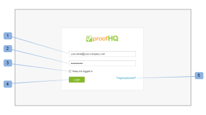

# 品牌化[!DNL Workfront Proof]網站 — 進階

>[!IMPORTANT]
>
>本文提及獨立產品[!DNL Workfront Proof]中的功能。 有關[!DNL Adobe Workfront]內部校訂的資訊，請參閱[校訂](../../../review-and-approve-work/proofing/proofing.md)。

進階品牌適用於Select與Premium計畫，並包含在計畫的成本中。

如需基本品牌化的相關資訊，包括登入頁面、電子郵件通知和校樣，請參閱[品牌化 [!DNL Workfront Proof] 網站](../../../workfront-proof/wp-acct-admin/branding/brand-wp-site.md)。

進階品牌選項包含下列區域的自訂：

* 頁首與文字色彩
* 網頁應用程式頁首
* 選單列和文字色彩
* 控制面板歡迎方塊和快速入門方塊
* 頁尾文字
* 法維孔
* 頁面標題
* 說明連結

以下小節更詳細地說明進階品牌：

## 進階品牌概觀

您會在[帳戶設定](https://support.workfront.com/hc/en-us/sections/115000912147-Account-Settings)頁面的標籤中找到[!UICONTROL 品牌組態]區段。 若要套用變更至您的帳戶，請確定品牌選項設定為[!UICONTROL 已啟用] (1)。

請參閱下節以取得如何設定「進階品牌選項」(2-14)的詳細資訊。

## 進階品牌設定

您可以為[!DNL Workfront Proof]的下列區域建立品牌：

* [網頁應用程式](#web-application)
* [標題](#header)
* [頁首連結](#header-links)
* [側欄](#sidebar)
* [歡迎方塊](#welcome-box)
* [區段標題](#section-headers)

### 網頁應用程式 {#web-application}

您可以在網頁應用程式標題(2)中選擇三個品牌選項：

* 頁首中的品牌化影像
* 您在標題中的帳戶名稱
* 如果您停用品牌化，[!DNL Workfront Proof]標誌將保留在網頁應用程式的標頭中

品牌影象 — 調整為最大尺寸550x90px。 您可以使用JPG、GIF或PNG，而且支援透明背景。

帳戶名稱 — 取自您的帳戶詳細資料，並以白字型顯示。 您的帳戶名稱最多可包含60個字元（包括空格和標點符號）。

### 標題 {#header}

在此欄位(3)中，您可以設定標頭的背景，也可以選擇純色或背景影像。

顏色 — 在這裡，如同在色彩配置設定的所有其他商標欄位中一樣，您可以輸入您所選擇的十六進位顏色值，或使用方便的檢色器（按一下文字欄位會開啟快顯視窗）。 預設的頁首背景顏色為#232d2e。

背景影像 — 可與品牌化影像結合。

* 您可以使用JPG、GIF或PNG — 對於具有透明度的檔案，以白色背景顏色顯示。
* 頁首的高度是96px，而且不會為[!UICONTROL 不重複]選項調整已上傳影像的大小。
* 背景影像位於左上方。

### 頁首連結 {#header-links}

在此欄位(4)中，您可以在帳戶右上角顯示的「標題」選單中，修改連結的使用者名稱色彩和色彩。

### 側欄 {#sidebar}

選擇選單列(5)和選單字型(6)的顏色來自訂您的側欄

>[!NOTE]
>
>游標停留顏色會透過將恆定的十六進位值新增至您選取的「選單」列顏色來自動調整。

無法自訂新校樣按鈕顏色。

### 歡迎方塊 {#welcome-box}

在此欄位(7)中，您可以設定顯示在「控制面板」頁面上的「歡迎」方塊顏色。

### 區段標題 {#section-headers}

這些欄位可讓您自訂[[!UICONTROL 帳戶設定]](https://support.workfront.com/hc/en-us/sections/115000912147-Account-Settings)頁面上區段標題的背景(8)和字型顏色(9)。

**頁尾**

在品牌設定的此欄位(10)中，您可以撰寫將顯示在所有帳戶頁面底部的頁尾。 您可以使用內建的WYSIWYG編輯器，或直接貼上您自己的設計。

>[!NOTE]
>
>您無法在頁尾文字編輯器中編輯HTML，但可以貼上複製的設計（包括所有連結和影像）。

**Favicon和頁面標題**

您可以設定您自己的Favicon影像（.ICO檔案） (11)和頁面標題(12)，自訂[!DNL Workfront Proof]頁面在瀏覽器中的顯示方式 — 這些將會顯示在所有帳戶頁面的瀏覽器索引標籤/視窗標題中。

>[!NOTE]
>
>您的Favicon也會顯示在帳戶上建立的所有校訂的[!DNL Workfront Proof]檢視器視窗的標頭中。

**說明連結**

您可以自訂自己的說明連結，將您的使用者和檢閱者指向您自己的內容。 若要啟用此功能，請將[!UICONTROL 說明連結]選項(13)設定為「已啟用」，並在下一個欄位(14)中新增您的連結。 您最多可以設定四個連結，且這些連結將可供使用：

* 在[!UICONTROL 說明]連結下的[!UICONTROL 標題]功能表中
  

* 在[!DNL Workfront Proof] [!UICONTROL 檢視器]側邊欄的[!UICONTROL 說明]面板中
  

若需額外付費，企業計畫客戶也可以選擇完全自訂下列專案：

* 完全自訂您的登入頁面（例如登入和登出頁面、忘記密碼頁面）
* 完全自訂您的網域

請透過sales.team@workfront.com聯絡我們，以進一步瞭解其他品牌選項。

<!--
<h2 data-mc-conditions="QuicksilverOrClassic.Draft mode">Custom Domains</h2>
-->

<!--

Our Select and Premium plans include the option to purchase a fully-branded domain. This means that you can customize your URL as well as all links included in notification emails.&nbsp;

-->

<!--

For more information, please see&nbsp;<a href="../../../workfront-proof/wp-acct-admin/branding/configure-branded-domain-in-wp.md" class="MCXref xref">Configure a branded domain in Workfront Proof</a>.

-->

<!--
<h2 data-mc-conditions="QuicksilverOrClassic.Draft mode">Custom Page Branding</h2>
-->

<!--

Custom branding of the Workfront Proof pages is a paid service and by default&nbsp;includes full customization of the following:

-->

<!--
  <li data-mc-conditions="QuicksilverOrClassic.Draft mode"><a href="https://app.proofhq.com/login">Log in/landing page</a> </li>
  -->

<!--
  <li data-mc-conditions="QuicksilverOrClassic.Draft mode"><a href="https://app.proofhq.com/logout">Logout page</a> </li>
  -->

<!--
  <li data-mc-conditions="QuicksilverOrClassic.Draft mode"><a href="https://app.proofhq.com/login/password">Forgot password page</a> </li>
  -->

<!--
<h3 data-mc-conditions="QuicksilverOrClassic.Draft mode">Design Elements</h3>
-->

<!--

Please create your design&nbsp;in&nbsp;a .PSD file with all the elements placed in the separate layers - this will allow us to prepare the scalable pages for you.

-->

<!--

There are no particular restrictions on the .PSD files, and the look and layout of the pages is completely up to you. However please make sure that the key elements are included in your design:

-->

<!--

<strong>Login Page</strong>    

-->

<!--

<strong>Logout page</strong>    

-->

<!--

<strong>Forgot password</strong>    

-->

<!--

<strong>Inactivity alert</strong>    

-->

<!--

<strong>Invalid email address</strong>    

-->

<!--

<strong>Inactivity and incorrect email address</strong>    

-->

<!--
<note type="note">
&nbsp;The separate designs for the alerts are not required. If you'd like us to leave the default style of the messages, as shown on the screencasts above, please let us know. The team will match the colors with your design.
</note>
-->

<!--

If you'd like to have placeholder text in the text fields, please include this in your designs.

-->

<!--
<note type="note">
The wording of the alerts cannot be changed as these are the system messages.
</note>
-->

<!--

<strong>2. Fonts</strong> 

-->

<!--

Please make sure that the text is not rasterized but kept as the text layers, unless you want the particular elements to be displayed as images on your landing pages.

-->

<!--

If you use custom fonts in your design, please make sure to include the following font files: EOT + .TTF + OTF + SVG + WOFF for support in all browsers.

-->

<!--
<note type="note">
&nbsp; You need to hold an appropriate license, which allows implementing your selected fonts on the web pages.
</note>
-->

<!--

If you use the standard and widely available fonts, the font files are not required. Please see the following lists for reference:

-->

<!--
  <li data-mc-conditions="QuicksilverOrClassic.Draft mode"><a href="http://www.w3schools.com/cssref/css_websafe_fonts.asp">Websafe fonts listed in the standard Font families</a> </li>
  -->

<!--
  <li data-mc-conditions="QuicksilverOrClassic.Draft mode"><a href="https://www.google.com/fonts">Open Source Google fonts</a> </li>
  -->

<!--

<strong>3. Screen resolution</strong> 

-->

<!--

We support 1024x768 screen resolution (1366x768 for wide screens) and upwards. However, for the landing pages designs we do recommend using higher resolution for the better results on the various screens. The best practice would be to determine what screen resolution is the most common on your users' machines and prepare a slightly bigger design.

-->

<!--

<strong>4. Browsers compatibility</strong> 

-->

<!--

The newer browsers generally don't require any custom code to display the pages properly. However, if your users have the older browser versions installed on their machines some code adjustments may be needed.

-->

<!--

By default we do prepare the pages compatible with the following browsers:

-->

<!--
  <li data-mc-conditions="QuicksilverOrClassic.Draft mode">Internet Explorer 9+</li>
  -->

<!--
  <li data-mc-conditions="QuicksilverOrClassic.Draft mode">Safari 6.x+</li>
  -->

<!--
  <li data-mc-conditions="QuicksilverOrClassic.Draft mode">Chrome 22+ *</li>
  -->

<!--
  <li data-mc-conditions="QuicksilverOrClassic.Draft mode">Firefox 15+ *</li>
  -->

<!--

* Preferred browsers 

-->

<!--
<note type="note"> Workfront Proof will not design your custom pages, the PSD files must be supplied by you, but if you have any questions, please contact our Support team.
</note>
-->
