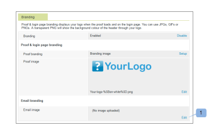

# 品牌化 [!DNL Workfront Proof] 網站

>[!IMPORTANT]
>
>本文提及獨立版產品中的功能 [!DNL Workfront] 證明。 有關內部校訂的資訊 [!DNL Adobe Workfront]，請參閱 [校訂](../../../review-and-approve-work/proofing/proofing.md).

作為 [!DNL Workfront Proof] 管理員，您可以為您的 [!DNL Workfront Proof] 帳戶，讓您和您的使用者獲得更自訂的體驗。

所有計畫均提供基本帳戶品牌化，不需額外付費。

如需有關進階品牌（包括品牌標頭、功能表列、控制面板等）的資訊，請參閱 [品牌化 [!DNL Workfront Proof] 網站 — 進階](../../../workfront-proof/wp-acct-admin/branding/brand-wp-site-advanced.md). 進階品牌僅適用於Select與Premium計畫

請參閱下列各節，以取得如何品牌化各方面的相關資訊 [!DNL Workfront] 校訂網站：

## 在上啟用品牌 [!DNL Workfront Proof] 登入頁面

若要在您的帳戶上啟用品牌化：

1. 登入 [!DNL Workfront Proof] 作為 [!DNL Workfront Proof] 管理員。
1. 按一下 **[!UICONTROL 帳戶設定]** 位於的右上角 [!DNL Workfront Proof] 介面。

   如需您可以設定的各種帳戶設定的詳細資訊，請參閱 [帳戶設定。](https://support.workfront.com/hc/en-us/sections/115000912147-Account-Settings)

1. 按一下 **[!UICONTROL 設定]** 標籤。
1. 在 **[!UICONTROL 品牌化]** 區段，按一下 **[!UICONTROL 啟用]**. (1)

   

   品牌影像現在會顯示在您的登入頁面上。

   >[!NOTE]
   >
   >如果您透過主要頁面存取，品牌推廣影像不會顯示在您的登入頁面上 [!DNL Workfront] 校訂登入URL。 例如， `https://www.proofhq.com/login`. 只有在您透過自訂子網域或全品牌網域存取登入頁面時，它才會顯示。 若要存取您的自訂登入頁面，只需在瀏覽器中輸入您的帳戶URL即可。 例如， `http://<yoursubdomain>.proofhq.com.`<!--For more information about fully branded domains, see "Fully Branded Domains" in the article [Configure a branded domain in [!DNL Workfront Proof]](../../../workfront-proof/wp-acct-admin/branding/configure-branded-domain-in-wp.md).-->

   

## 在校樣上啟用品牌化

若要將您自己的品牌影像新增至 [!UICONTROL 校訂載入中] 在您的帳戶中建立的每個校訂頁面：

1. 登入 [!DNL Workfront Proof] 作為 [!DNL Workfront Proof] 管理員。
1. 按一下 **[!UICONTROL 帳戶設定]** 位於的右上角 [!DNL Workfront Proof] 介面。

   如需您可以設定的各種帳戶設定的詳細資訊，請參閱 [帳戶設定。](https://support.workfront.com/hc/en-us/sections/115000912147-Account-Settings)

1. 按一下 **[!UICONTROL 設定]** 標籤。
1. 在 **[!UICONTROL 品牌化]** 區段，按一下 **[!UICONTROL 設定]** 旁邊 **[!UICONTROL 校訂品牌]**. (1)

   

1. 從下拉式功能表中選取 **[!UICONTROL 品牌影象]**.
如果您選取 **[!UICONTROL 停用]**，則 [!DNL Workfront Proof] 標誌出現在校訂載入頁面上

1. 按一下&#x200B;**[!UICONTROL 儲存]**。(3)

   

1. 按一下 **[!UICONTROL 編輯]** 以選取品牌影象(4)。

   您可以使用JPG、GIF或PNG。 支援透明度。 建議的影像大小為150x300px。 您登入和登出頁面上的影像大小將調整為這些尺寸。

   

1. 選取您要上傳的影像。 (5)
1. 按一下&#x200B;**[!UICONTROL 儲存]**。

   您的品牌影像現在顯示在帳戶中建立的所有校訂的校訂載入頁面上。

   

## 品牌化電子郵件通知

您可以設定品牌影像以包含在傳送給稽核者的電子郵件通知中。 此影像的大小已調整為最大90x550px。

若要設定電子郵件品牌：

1. 登入 [!DNL Workfront Proof] 作為 [!DNL Workfront Proof] 管理員。
1. 按一下 **[!UICONTROL 帳戶設定]** 位於的右上角 [!DNL Workfront Proof] 介面。

   如需您可以設定的各種帳戶設定的詳細資訊，請參閱 [帳戶設定。](https://support.workfront.com/hc/en-us/sections/115000912147-Account-Settings)

1. 按一下 **[!UICONTROL 設定]** 標籤。
1. 在 **[!UICONTROL 品牌化]** 區段，按一下 **[!UICONTROL 編輯]** 位於電子郵件應用程式影像(1)旁。
   

1. 選取您要用於標籤電子郵件的影像。 (2)

   如果您已設定電子郵件品牌，而且想要停用，請按一下 **[!UICONTROL 清除]**. (4)

   

1. 按一下&#x200B;**[!UICONTROL 儲存]**。

   該影像現在會出現在所有校訂通知電子郵件中。 (3)

   

<!--
<h2 data-mc-conditions="QuicksilverOrClassic.Draft mode">Custom Sub-Domains</h2>
-->

<!--

You can add your brand name to your Workfront Proof account URL. For example, your URL might look like this:

-->

<!--

<strong>http://yoursubdomain.proofhq.com</strong> 

-->

<!--

This customization is also included in all your proof links, as well as in the 'From' email address for your proof notifications.

-->

<!--

For more information on how to set up a branded sub-domain, see <a href="../../../workfront-proof/wp-acct-admin/branding/configure-branded-domain-in-wp.md" class="MCXref xref">Configure a branded domain in Workfront Proof</a>

-->

## 透過API隱藏按鈕和連結

如果您透過以下方式建立校樣 [!DNL Workfront Proof] api中，您可以隱藏按鈕和連結，並建立自己的自訂連結。

另請參閱 [[!DNL Workfront Proof] API](https://api.proofhq.com/) 以取得詳細資訊。
