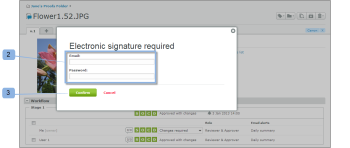

# 瞭解[!DNL Workfront Proof]中的電子簽章

>[!IMPORTANT]
>
>本文提及獨立產品[!DNL Workfront Proof]中的功能。 有關[!DNL Adobe Workfront]內部校訂的資訊，請參閱[校訂](../../../review-and-approve-work/proofing/proofing.md)。

電子簽章可讓您增強校樣的安全性，並符合ISO等業界標準。

此設定可在帳戶層級設為強制或非強制性。 如果預設為強制性，則會針對您帳戶中建立的所有校訂啟用它，且無法在校訂層級停用。 如果此設定預設為非強制性，您將能夠在校訂層級啟用/停用它。

如需詳細資訊，請參閱。

當在校樣上啟用電子簽章設定時，電子簽章方塊會提示任何對校樣做出決定的稽核者提供其電子郵件和密碼。

## [!UICONTROL 證明詳細資料]頁面上的電子簽章

如果檢閱者決定是在[!UICONTROL 校訂詳細資料]頁面上選取其決定(1)，則會出現[!UICONTROL 電子簽章]快顯方塊，要求他們輸入詳細資料(2)並確認其決定(3)。

快顯視窗會顯示預設訊息集（如果有的話），且稽核者必須輸入其電子郵件和密碼。

如果檢閱者決定從該層級做出決定，[!UICONTROL 電子簽章]快顯視窗將會顯示在校訂檢視器中，也會顯示在[!UICONTROL 校訂詳細資料]頁面上。

如果在校樣上啟用[!UICONTROL 單一登入]選項，則在做出決定時，電子郵件和密碼詳細資料不會顯示在[!UICONTROL 電子簽章]快顯視窗中。

相反地，按一下此快顯視窗上的[!UICONTROL 確認] (4)按鈕後，檢閱者將被重新導向至[!UICONTROL 單一登入]頁面。

在輸入其SSO認證後，檢閱者會自動被重新導向回[!UICONTROL 校訂詳細資料]頁面（如果從那裡進行決定，則返回[!UICONTROL 校訂檢視器]）。

>[!NOTE]
>
> 如果決定是以電子方式簽署，則&#x200B;**[!UICONTROL 簽章圖示]** (5)會出現在[!UICONTROL 證明詳細資料]頁面上的[!UICONTROL 工作流程]區段中的決定旁。 如果決定不是由檢閱者變更，而是由另一個對校樣具有編輯許可權的人變更，則不會要求該人以電子方式簽署決定，並且決定旁邊不會出現簽名圖示(6)。

如需單一登入的資訊，請參閱[Workfront Proof中的單一登入](../../../workfront-proof/wp-acct-admin/managing-security/single-sign-on-overview.md)。

如需有關校訂詳細資訊頁面的資訊，請參閱[在 [!DNL Workfront] 校訂](../../../workfront-proof/wp-work-proofsfiles/manage-your-work/manage-proof-details.md)中管理校訂詳細資訊。
