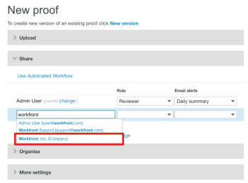
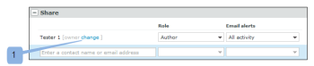
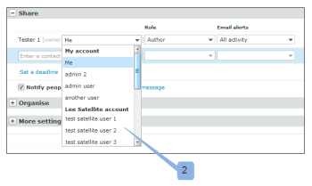

# 與[!DNL Workfront Proof]中的合作夥伴共用專案

>[!IMPORTANT]
>
>本文提及獨立產品[!DNL Workfront Proof]中的功能。 有關[!DNL Adobe Workfront]內部校訂的資訊，請參閱[校訂](../../../review-and-approve-work/proofing/proofing.md)。

如果您與其他組織（例如客戶或您公司的其他部門）有[!DNL Workfront Proof]個合作夥伴關係，您可以與合作夥伴共用校樣、檔案、資料夾和聯絡詳細資訊。 如需合作夥伴關係的詳細資訊，請參閱[管理Workfront Proof帳戶之間的合作夥伴關係](../../../workfront-proof/wp-acct-admin/partner-accounts/manage-partner-relationship-between-wp-accts.md)。

## 關於與合作夥伴共用專案

與合作夥伴共用專案時，請考量下列事項：

* 只有在您正在建立的新校訂時，您才能選擇合作夥伴帳戶中的使用者作為校訂的擁有者。 您無法針對現有校訂或新版本的校訂執行此動作。
* 當您與合作夥伴共用專案時，您會將校訂的編輯許可權傳遞給合作夥伴帳戶中的主管和管理員。 建立校訂的帳戶中的主管和管理員不再擁有對校訂的編輯許可權（包括校訂建立者）。 如需[!DNL Workfront]校訂中許可權的詳細資訊，請參閱 [!DNL Workfront] 校訂](../../../workfront-proof/wp-acct-admin/account-settings/proof-perm-profiles-in-wp.md)中的[校訂許可權設定檔。
* 校訂儲存在擁有校訂的帳戶中（而不是建立校訂的帳戶）。
* 校訂品牌從擁有校訂的帳戶（而不是建立校訂的帳戶）中取得。

## 與合作夥伴共用專案

當您與合作夥伴建立接受的關係後，您就可以輕鬆地與他們共用專案，例如資料夾、檔案和校樣。

1. 開始共用校訂或檔案。\
   如需共用的詳細資訊，請參閱[在 [!DNL Workfront Proof]](../../../workfront-proof/wp-work-proofsfiles/share-proofs-and-files/share-proof.md)共用校訂[在 [!DNL Workfront Proof]](../../../workfront-proof/wp-work-proofsfiles/share-proofs-and-files/share-files.md)共用檔案，以及[在 [!DNL Workfront Proof]](../../../workfront-proof/wp-work-proofsfiles/organize-your-work/share-folders.md)共用資料夾。

1. 在[!UICONTROL 新校訂]或[!UICONTROL 新檔案]頁面的&#x200B;**[!UICONTROL 共用]**&#x200B;區段中，當您開始在自動完成欄位中輸入名稱時，就會顯示您夥伴的名稱，就像您與系統中的其他使用者共用一樣。\
   

## 將合作夥伴帳戶中的使用者設為校訂所有者

如果您已與其他[!DNL Workfront Proof]帳戶設定合作夥伴關係，您可以從合作夥伴帳戶中選取一位使用者作為證明的擁有者。

>[!NOTE]
>
>只有在符合下列條件時，您才能從合作夥伴帳戶中選取使用者：
>
>* 沒有自訂欄位
>* 尚未選取任何資料夾
>* 尚未套用任何標籤
>

若要讓合作夥伴帳戶中的使用者成為校訂的擁有者：

1. 在[!UICONTROL 新校訂]頁面上，按一下&#x200B;**[!DNL Change]**&#x200B;連結。 (1)\
   

1. 從合作夥伴帳戶中選擇要擁有校訂的使用者。 (2)\
   
