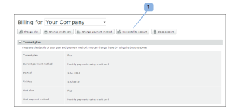

# 在 [!DNL Workfront Proof]

>[!IMPORTANT]
>
>本文說明獨立產品中的功能 [!DNL Workfront Proof]. 有關內部校對的資訊 [!DNL Adobe Workfront]，請參閱 [校對](../../../review-and-approve-work/proofing/proofing.md).

Satellite帳戶是您自行設定和管理的付費帳戶 [!DNL Workfront Proof] 帳戶。 如需詳細資訊，請參閱 [中的衛星帳戶 [!DNL Workfront] 校樣](../../../workfront-proof/wp-acct-admin/satellite-accounts/sat-accts-in-wp.md).

任何帳單管理員都可以建立Satellite帳戶。 如需帳單管理員的相關資訊，請參閱 [[!UICONTROL 校樣權限設定檔] in [!DNL Workfront Proof]](../../../workfront-proof/wp-acct-admin/account-settings/proof-perm-profiles-in-wp.md).

>[!NOTE]
>
> 衛星賬戶必須設定在我們 [!UICONTROL 標準] 或更高的計畫。

## 建立Satellite帳戶 {#creating-a-satellite-account}

要建立Satellite帳戶，請執行以下操作：

1. 前往 [!UICONTROL 帳單] 頁面。\
   如需帳單頁面的詳細資訊，請參閱  [此 [!DNL Workfront Proof] [!UICONTROL 帳單] 頁面](../../../workfront-proof/wp-billingsettings/manage-your-billing/wp-billing-page.md).

1. 按一下 **[!UICONTROL 新衛星]** 帳戶按鈕。 (1)

   出現彈出窗口。

   

1. 輸入客戶的詳細資訊，包括任何相關的促銷代碼。
1. 按一下&#x200B;**[!UICONTROL 儲存]**。Satellite帳戶會自動顯示在 [!UICONTROL 帳戶] 下拉式功能表 [!UICONTROL 帳單] 頁面。
1. 從下拉式選單中選取新的Satellite帳戶。
1. 繼續 [為您的Satellite帳戶選擇計畫](#selecting-a-plan-for-your-satellite-account) 升級您的Satellite帳戶。

## 為您的Satellite帳戶選擇計畫 {#selecting-a-plan-for-your-satellite-account}

設定Satellite帳戶後，如 [建立Satellite帳戶](#creating-a-satellite-account)，您需要將其升級至所需計畫。

1. 前往 [!UICONTROL 帳單] 頁面。\
   如需帳單頁面的詳細資訊，請參閱  [此 [!DNL Workfront Proof] [!UICONTROL 帳單] 頁面](../../../workfront-proof/wp-billingsettings/manage-your-billing/wp-billing-page.md).

1. 在 **[!UICONTROL 您的帳戶]** 頁面(1)頂端的下拉式功能表，選擇相關的Satellite帳戶。

   此時將顯示Satellite帳戶的帳單頁，並自動複製您帳戶的帳單聯繫人詳細資訊。

   

1. 按一下 **[!UICONTROL 變更計畫]** 按鈕。 (2)\
   或\
   按一下您目前或下一個計畫名稱，以開啟快顯視窗。 (3)

1. 升級或降級您的計畫。

## 將使用者新增至您的Satellite帳戶

將Satellite帳戶升級至您選擇的計畫後，您需要將使用者新增至帳戶。

1. 登入 [!DNL Workfront Proof] 作為 [!DNL Workfront Proof] 管理員。
1. 按一下 **[!UICONTROL 帳戶設定]**.
1. 在頁面頂端的下拉式功能表中，選取相關的Satellite帳戶。 (1)\
   此時將顯示Satellite帳戶的帳戶設定頁。
1. 按一下 **[!UICONTROL 新使用者]** 按鈕。 (2)\
   此 [!DNL New User] 頁面。

1. 輸入使用者的詳細資訊，然後按一下 **[!UICONTROL 儲存]**.\
   使用者會收到電子郵件通知，通知他們可存取帳戶。

新增至Satellite帳戶的使用者會在中樞帳戶的聯絡人清單中顯示為成員。

同樣地，中心帳戶中的用戶在Satellite帳戶的聯繫人中顯示為成員。

要查看Satellite帳戶中所有用戶的完整清單，請按一下 **[!UICONTROL 使用者]** 標籤。

## 將現有的個別帳戶連結至您的中樞帳戶

如果您先前為客戶建立了其他獨立帳戶，則這些帳戶可轉換為Satellite帳戶。

我們會將您的 [!DNL Workfront Proof] 帳戶（使其成為中心帳戶）。

您只需要提供下列詳細資訊：

* 您的 [!DNL Workfront Proof] 帳戶和您用來設定的電子郵件地址
* 您要連結至帳戶的個別帳戶名稱，以及用於設定個別帳戶的電子郵件地址。
