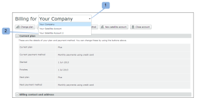
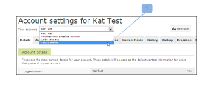

# 在[!DNL Workfront Proof]中管理附屬帳戶

>[!IMPORTANT]
>
>本文提及獨立產品[!DNL Workfront Proof]中的功能。 有關[!DNL Adobe Workfront]內部校訂的資訊，請參閱[校訂](../../../review-and-approve-work/proofing/proofing.md)。

作為[!DNL Workfront Proof]管理員，您可以管理在您組織帳戶上設定的附屬帳戶。

## 更新帳單資訊

若要檢視及管理您的衛星帳戶的帳單詳細資料：

1. 移至[!UICONTROL 帳單]頁面。
1. 開啟頁面頂端的下拉式功能表(1)，然後選擇相關的附屬帳戶。 (2)

   如需詳細資訊，請參閱[帳單]頁面(../../../workfront-proof/wp-billingsettings/manage-your-billing/wp-billing-page.md)。 [!DNL Workfront Proof] 

   

## 更新帳戶資訊

若要檢視及管理Satellite帳戶的帳戶設定：

1. 前往頁面頂端的[!UICONTROL 帳戶設定]。
1. 按一下&#x200B;**[!UICONTROL 您的帳戶]**&#x200B;下拉式功能表，然後選擇相關的Satellite帳戶。 (1)
1. 按一下相關標籤，管理Satellite帳戶的帳戶設定。

