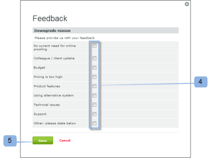

# 關閉 [!DNL Workfront Proof] 帳戶

>[!IMPORTANT]
>
>本文說明獨立產品中的功能 [!DNL Workfront Proof]. 有關內部校對的資訊 [!DNL Adobe Workfront]，請參閱 [校對](../../../review-and-approve-work/proofing/proofing.md).

完成本節中的步驟後，您的帳戶將會立即關閉。 您帳戶中的所有資料都將被刪除，且無法還原。

我們一直在努力改進我們的產品。 如果您確實希望關閉您的帳戶，請花幾分鐘時間告知我們如何改進，我們將不勝感激。

您可以聯繫我們，地址是 [!DNL support@proofhq.com] 加上您的評論；歡迎您提供所有意見。

1. 開啟 [!UICONTROL 帳單] 頁面，方法是開啟 [!UICONTROL 設定] 菜單和選擇 **[!UICONTROL 帳單]** (1)。

   如需「帳單」頁面的詳細資訊，請參閱 [此 [!DNL Workfront] 校樣帳單頁面](../../../workfront-proof/wp-billingsettings/manage-your-billing/wp-billing-page.md).

   

1. 按一下 **[!UICONTROL 關閉帳戶]** 按鈕(3)。

   

1. 選擇關閉帳戶的原因。 (4)
1. 按一下 **[!UICONTROL 儲存]**. (5)

   

1. 輸入密碼以關閉帳戶。 (6)

   
