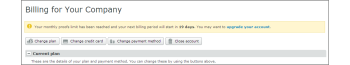

# [!DNL Workfront Proof]帳單頁面

>[!IMPORTANT]
>
>本文提及獨立產品[!DNL Workfront Proof]中的功能。 有關[!DNL Adobe Workfront]內部校訂的資訊，請參閱[校訂](../../../review-and-approve-work/proofing/proofing.md)。

## 帳單頁面

若要存取[!UICONTROL 帳單]頁面，請開啟畫面右上方的&#x200B;**[!UICONTROL 設定]**&#x200B;功能表，然後在下拉式功能表中選擇&#x200B;**[!UICONTROL 帳單]**。

[!UICONTROL 帳單]頁面包含下列專案：

* 帳戶名稱(1)
* 帳戶清單（例如，如果您有Satellite帳戶）(2)
* 變更計畫(3)
* 變更付款詳細資料(4)
* 新衛星帳戶(5)
* 關閉帳戶(6)
* 目前計畫資訊(7)
* 帳單連絡人和地址(8)
* 使用統計資料(9)
* 帳單歷史記錄(10)
* 計費活動(11)

  

## [!UICONTROL 目前的計畫]

本區段(7)顯示您目前計畫的詳細資訊，包括下列專案：

* 計畫的名稱
* 目前的付款方式
* 目前計畫的開始與完成日期
* 下一個計畫型別
* 下一個計畫付款方法

  如需詳細資訊，請參閱[在 [!DNL Workfront Proof]](../../../workfront-proof/wp-billingsettings/manage-your-billing/choose-payment-method-in-wp.md)中選擇付款方式。

## [!UICONTROL 帳單連絡人和地址]

本區段(8)顯示您帳戶的主要帳單連絡人和地址詳細資料。

帳單聯絡人只能從您帳戶上設定為帳單管理員的使用者中選取。 在Satellite帳戶上，在此欄位中只能設定來自主帳戶的計費管理員。

>[!NOTE]
>
> 您的帳戶可以有多個帳單管理員，但只有其中一個在[!UICONTROL 帳單連絡人]欄位中選取將會收到所有帳單通知和帳戶使用警報。

這包含下列通知電子郵件：

* 校訂使用情況
* 發票
* 降級
* 延遲付款/帳戶暫停警示
* 信用卡失敗

  

[!UICONTROL 帳單副本]欄位也可讓您新增要複製到所有帳單相關電子郵件的電子郵件地址。 按一下欄位以啟動傾斜編輯，然後輸入您選擇的電子郵件地址（這也可以是現有使用者的電子郵件地址）。

## [!UICONTROL 帳單地址]

此區段使用內嵌編輯，因此只需按一下欄位即可輸入/編輯文字。

>[!NOTE]
>
> 我們將此地址包含在您的訂閱發票中，以確保此資料永遠為最新狀態。

## [!UICONTROL 使用統計資料]

本區段顯示目前計費期間內您帳戶的使用統計資料，包括下列專案：

* 使用的儲存空間
* 使用的校樣
* 使用的使用者限制

### [!UICONTROL 使用警告]

 [!DNL Workfront] Proof](../../../workfront-proof/wp-acct-admin/account-settings/proof-perm-profiles-in-wp.md)中設定為帳務連絡人(1)的[[!UICONTROL 校訂許可權設定檔]，會在您的帳戶達到下列條件時透過電子郵件通知：

* 儲存容量的75%和98%
* 75%然後100%的證明限制

一旦達到校訂或儲存限制，您也會在[!UICONTROL 帳單]頁面頂端看到警示：

* 為了達到校訂限制

  

* 達到的儲存空間限制

>[!NOTE]
>
>在您的帳戶中建立校訂時，您的校訂計數會用盡，且無法透過移除校訂來還原。

刪除校樣和檔案，然後清空[!UICONTROL 垃圾桶]，即可釋放儲存空間。

請記住，如果您需要更多校樣、儲存空間或使用者，您可以隨時升級您的帳戶；這會立即生效。

## [!UICONTROL 帳單歷史記錄]

此區段顯示任何最近計費期間的活動。 您也可以從此區段下載您的發票。

如需詳細資訊，請參閱[下載您的 [!DNL Workfront Proof] 發票](../../../workfront-proof/wp-billingsettings/manage-your-billing/download-wp-invoice.md)。

## [!UICONTROL 記帳活動]

本區段顯示您計費設定的最近變更，例如[!DNL Workfront Proof]計畫的訂閱、升級、降級和續約。

如果您將計畫變更為具有較低使用者限制(1)的計畫，則超過新限制的使用者將在新計劃開始時自動停用。 此活動也會在您的帳戶記錄檔(2)中擷取。

