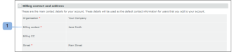

# 此 [!DNL Workfront Proof] 帳單頁面

>[!IMPORTANT]
>
>本文說明獨立產品中的功能 [!DNL Workfront Proof]. 有關內部校對的資訊 [!DNL Adobe Workfront]，請參閱 [校對](../../../review-and-approve-work/proofing/proofing.md).

## 帳單頁面

若要存取 [!UICONTROL 帳單] 頁面，開啟 **[!UICONTROL 設定]** 菜單，然後選擇 **[!UICONTROL 帳單]** 的下拉式清單。

此 [!UICONTROL 帳單] 頁面包含下列項目：

* 帳戶名稱(1)
* 帳戶清單（例如，如果您有Satellite帳戶）(2)
* 變更計畫(3)
* 更改付款詳細資訊(4)
* 新衛星賬戶(5)
* 關閉帳戶(6)
* 當前計畫資訊(7)
* 帳單聯繫人和地址(8)
* 使用情況統計資料(9)
* 帳單歷史記錄(10)
* 帳單活動(11)

   

## [!UICONTROL 當前計畫]

本節(7)顯示您當前計畫的詳細資訊，包括：

* 計畫的名稱
* 當前付款方法
* 當前計劃開始和完成日期
* 下一個計畫類型
* 下一計畫付款方法

   如需詳細資訊，請參閱 [在 [!DNL Workfront Proof]](../../../workfront-proof/wp-billingsettings/manage-your-billing/choose-payment-method-in-wp.md).

## [!UICONTROL 帳單聯繫人和地址]

本節(8)顯示您帳戶的主要帳單聯絡人和地址詳細資訊。

只能從帳戶中設定為計費管理員的用戶中選擇計費聯繫人。 在Satellite帳戶上，只能在此欄位中設定主帳戶的Billing Administrators。

>[!NOTE]
>
> 您的帳戶上可以有多個帳單管理員，但在 [!UICONTROL 帳單聯繫人] 欄位，將接收所有帳單通知和帳戶使用量警報。

這包括下列通知電子郵件：

* 校樣用途
* 發票
* 降級
* 延遲付款/帳戶暫停警報
* 信用卡故障

   

此 [!UICONTROL 帳單CC] 欄位也可讓您新增要在所有與帳單相關的電子郵件上複製的電子郵件地址。 按一下欄位以啟用傾斜編輯，並輸入您選擇的電子郵件地址（這也可以是現有使用者的電子郵件地址）。

## [!UICONTROL 帳單地址]

此區段使用內嵌編輯，因此只需按一下欄位即可輸入/編輯文字。

>[!NOTE]
>
> 我們會將此地址包含在您的訂閱發票中，以確保此資料始終是最新的。

## [!UICONTROL 使用情況統計資料]

本節顯示當前帳單期間帳戶的使用情況統計資訊，包括：

* 已使用的儲存
* 使用的校樣
* 使用的使用者限制

### [!UICONTROL 使用警告]

此 [[!UICONTROL 校樣權限設定檔] in [!DNL Workfront] 校樣](../../../workfront-proof/wp-acct-admin/account-settings/proof-perm-profiles-in-wp.md) 設為帳單連絡人(1)時，當您的帳戶達到以下狀態時，系統會透過電子郵件通知您：

* 儲存容量的75%，然後是98%
* 75%，然後100%的證明限制

一旦達到校樣或儲存限制，您也會在 [!UICONTROL 帳單] 頁面：

* 針對已達校樣限制

   

* 已達到儲存限制

>[!NOTE]
>
>在帳戶中建立校樣時，校樣計數會耗用，且無法透過移除校樣來還原。

刪除校樣和檔案並清空 [!UICONTROL 垃圾] 之後。

請記住，如果您需要更多證明、儲存空間或用戶，您可以隨時升級您的帳戶；而且會立即生效。

## [!UICONTROL 帳單歷史記錄]

此區段顯示任何最近計費期間的活動。 您也可以從本節下載發票。

如需詳細資訊，請參閱 [下載 [!DNL Workfront Proof] 發票](../../../workfront-proof/wp-billingsettings/manage-your-billing/download-wp-invoice.md).&quot;

## [!UICONTROL 帳單活動]

本節顯示您的計費設定的最新變更，例如訂閱、升級、降級和續約 [!DNL Workfront Proof] 計畫。

如果您將計畫更改為具有較低用戶限制(1)的計畫，則當新計劃開始時，超過新限制的用戶將自動被停用。 此活動也會在您的帳戶記錄(2)中擷取。

