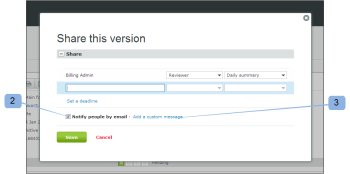

# 新校訂電子郵件

>[!IMPORTANT]
>
>本文提及獨立版產品中的功能 [!DNL Workfront Proof]. 有關內部校訂的資訊 [!DNL Adobe Workfront]，請參閱 [校訂](../../../review-and-approve-work/proofing/proofing.md).

<!--

Make this article work better for PiW.

-->

當您建立新校訂或新版本的校訂、將新人員新增到校訂，或將工作流程新增到校訂時，您可以決定是否要向檢閱者傳送電子郵件，如以下文章所述：

* [使用自動化工作流程建立進階校訂](../../../review-and-approve-work/proofing/creating-proofs-within-workfront/create-automated-proof-workflow.md)
* [產生校訂於 [!DNL Workfront Proof]](../../../workfront-proof/wp-work-proofsfiles/create-proofs-and-files/generate-proofs.md)

收件者收到的電子郵件稱為 [!UICONTROL 新校訂] 電子郵件。 只有校訂建立者和有權將檢閱者新增到校訂的使用者可以控制此電子郵件。 收件者無法將其停用。

新校樣電子郵件包含：

* 您的個人訊息（如果您選擇包含一則訊息）
* 如果您一律會傳送相同的自訂訊息給稽核者，最好將訊息儲存在 [!UICONTROL 個人設定] 在 [!UICONTROL 校訂預設值] 標籤。 如需詳細資訊，請參閱。
* 證明的個人連結
* **[!UICONTROL 檢視詳細資料]** 連結可帶您前往相關聯的 [!DNL Workfront] 物件（如專案、任務或問題）
* 校樣影像的縮圖
* 以下校訂詳細資訊：

   * 校樣名稱
   * 版本號碼
   * 稽核者清單及其在校訂上的進度
   * 與其他人共用校訂的連結

     這可讓您共用原始檔案的校訂URL和/或下載連結。 這不允許您將檢閱者明確新增到校訂，您將只會共用公開的校訂URL，收件者將獲得對校訂的唯讀存取權。

     另請參閱 [在中共用校訂 [!DNL Workfront Proof]](../../../workfront-proof/wp-work-proofsfiles/share-proofs-and-files/share-proof.md) 以取得詳細資訊。

     如果您不希望此連結出現在收件者的電子郵件中，可以停用 [!UICONTROL 公開共用] 校訂上的設定

     （下載原始檔案和公用URL）。 另請參閱 [在中管理校訂詳細資訊 [!DNL Workfront Proof]](../../../workfront-proof/wp-work-proofsfiles/manage-your-work/manage-proof-details.md) 以取得詳細資訊。

## 活動記錄

傳送 [!UICONTROL 新校訂] 傳送給檢閱者的電子郵件會登入 [!UICONTROL 活動] 部分 [!UICONTROL 校訂詳細資訊] 頁面。 另請參閱  [管理[!UICONTROL  校訂詳細資訊] 在 [!DNL Workfront Proof]](../../../workfront-proof/wp-work-proofsfiles/manage-your-work/manage-proof-details.md) 以取得詳細資訊。 您可以檢查 [!UICONTROL 新校訂] 建立校訂時已啟用電子郵件。

>[!NOTE]
>
>* 如果校訂的建立者或擁有者擁有 [!UICONTROL 已做校訂] 電子郵件預設為停用（在其個人設定中），使用者將不會收到任何郵件 [!UICONTROL 校訂已進行] 或 [!UICONTROL 新校訂] 電子郵件，即使 [!UICONTROL 透過電子郵件通知人員] 方塊已在新校樣頁面上勾選。 如需詳細資訊，請參閱。
>* 如果電子郵件通知已停用為中的預設值 [!UICONTROL 帳戶設定] 校訂的建立者/擁有者將不會收到任何 [!UICONTROL 校訂已進行] 或 [!UICONTROL 新校訂] 即使在其個人設定和 [!UICONTROL 通知] 已勾選「新校訂」頁面上的「依電子郵件列出的人員」方塊。 如需詳細資訊， [此 [!UICONTROL 已做校訂] 電子郵件](../../../workfront-proof/wp-emailsntfctns/proof-notifications-and-reminders/proof-made-email.md) 並請參閱。
>

## 啟用 [!UICONTROL 新校訂] 以電子郵件傳送並包含自訂訊息

您可以指定在建立校訂或新增某人時，是否要向校訂上的稽核者傳送電子郵件警報。

* [當您建立校訂時](#when-you-create-a-proof)
* [當您將檢閱者新增到校訂時](#when-you-add-a-reviewer-to-a-proof)

### 當您建立校訂時 {#when-you-create-a-proof}

當您在中建立新校樣時 [!UICONTROL 新校訂] 頁面，在 **[!UICONTROL 共用]** 區段，您可以選取是否要傳送電子郵件警示：

* 您可以在這裡決定是否要 [!UICONTROL 透過電子郵件通知人員] (1)。 如果您取消選取此選項，則沒有任何稽核者會收到電子郵件，告知他們校訂已準備好進行稽核。
* 您也可以在電子郵件通知(2)中加入「自訂」訊息。
* 如果您決定新增自己的自訂訊息，則可以在電子郵件內文中加入自訂主旨列(3)和訊息(4)。
* 若要捨棄自訂訊息，只要按一下連結(5)即可。

  >[!NOTE]
  >
  >如果您一律向檢閱者傳送相同的自訂訊息，最好將訊息儲存在 [!UICONTROL 校訂預設值] 標籤。 如需詳細資訊，請參閱。

### 當您將檢閱者新增到校訂時 {#when-you-add-a-reviewer-to-a-proof}

如果新增到現有校訂的新檢閱者將收到校訂的通知（與上述類似），您可以進行選擇。

* 首先，按一下 **[!UICONTROL 共用此版本]** 上的按鈕 **[!UICONTROL 校訂詳細資訊]** 第(1)頁。

* 會出現一個方塊，您可在其中新增稽核者。 然後，您可以決定是否要以電子郵件通知他們(2)，並選擇將自訂訊息新增至電子郵件(3)。

* 如果您選擇新增自訂訊息，方塊會展開，您可在電子郵件內文放入自訂主旨列(4)和自訂文字(5)。 您也可以按一下連結(6)以捨棄自訂訊息。

