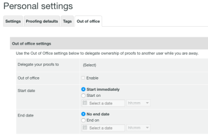

# 在中指定臨時校樣所有者 [!DNL Workfront Proof]

>[!IMPORTANT]
>
>本文說明獨立產品中的功能 [!DNL Workfront Proof]. 有關內部校對的資訊 [!DNL Adobe Workfront]，請參閱 [校對](../../../review-and-approve-work/proofing/proofing.md).

如果您打算長時間不在辦公室，您可以將校樣的所有權委派給帳戶中的其他使用者。

>[!NOTE]
>
>此函式僅適用於 [!DNL Workfront Proof].

指定校樣的臨時所有權：

1. 內 [!DNL Workfront Proof]，前往 **[!UICONTROL 個人設定]**.\
   

1. 按一下 **[!UICONTROL 離職]** 標籤。 可使用下列設定：

   * **[!UICONTROL 將校樣委派至]** 帳戶中的另一個使用者。
   * 啟用和停用 **[!UICONTROL 離職]** 函式。
   * 選取 **[!UICONTROL 開始日期]**.

      若 **[!UICONTROL 立即開始]** 選項，則在您啟用功能後，校樣的所有權會立即委派給選取的使用者。

      如果設定了特定的開始日期和時間，則會在選取的日期和選取的時間啟動功能。

   * 選取 **[!UICONTROL 結束日期]**.

      如果未選擇結束日期，則會委派校樣的所有權，直到手動停用功能為止。

      如果設定了特定的結束日期和時間，則會在選取的日期和選取的時間停用功能。

      

1. 委派校樣時，委派的擁有者會顯示在 **[!UICONTROL 詳細資料]** 校樣詳細資料頁面的區段。 所有權委派附註會顯示在 **[!UICONTROL 活動]** 校樣詳細資料頁面的區段。

   

   安 [!UICONTROL 外出] 啟用功能期間，原始校樣擁有者的帳戶也會顯示通知。 這可提醒原始擁有者，並允許他們立即結束委派或前往 [!UICONTROL 個人設定] 來調整。

   

   當原始擁有者取回校樣的所有權時，委派的擁有者會從 [!UICONTROL 詳細資料] 校樣詳細資料頁面的區段，以及 [!UICONTROL 外出] 原始校樣擁有者的帳戶中不再顯示通知。 顯示校樣所有權已還原的附註會顯示在 [!UICONTROL 活動] 校樣詳細資料頁面的區段。

   >[!NOTE]
   >
   >除非您手動移除，否則委派的擁有者仍會維持在校樣工作流程上。

   ![[!UICONTROL 活動區段取回].png](assets/activity-section-taken-back-350x99.png)
