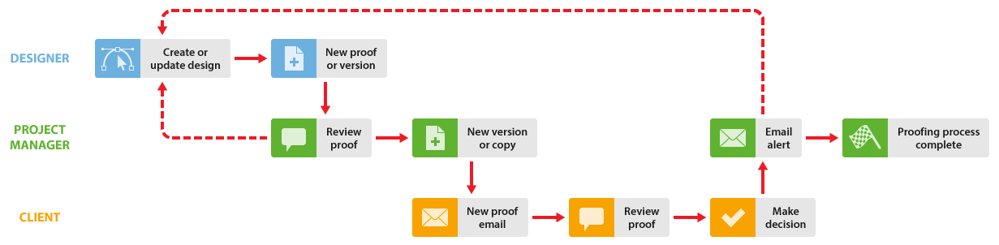

# 內部檢閱，然後再外部檢閱 [!DNL Workfront Proof]

>[!IMPORTANT]
>
>本文提及獨立版產品中的功能 [!DNL Workfront Proof]. 有關內部校訂的資訊 [!DNL Adobe Workfront]，請參閱 [校訂](../../../review-and-approve-work/proofing/proofing.md).

如果您的組織在與客戶共用校樣之前完成內部審查，我們建議您使用兩種方式 [!DNL Workfront Proof] 若要增強工作流程：

## 使用者端檢視內部註解

此選項說明使用者端可以檢視所有內部註解的工作流程。

設計人員會先與專案管理員（以及任何其他同事）共用校訂。 同事會檢閱校訂，如果核准，您可以使用共用功能與客戶共用校訂。 如需詳細資訊，請參閱 [在中共用校訂 [!DNL Workfront Proof]](../../../workfront-proof/wp-work-proofsfiles/share-proofs-and-files/share-proof.md).

1. **建立新校訂**  — 設計人員在中建立新校樣 [!DNL Workfront Proof] 並共用給內部稽核者。 設計人員會讓專案經理成為校訂的所有者。
1. **內部檢閱**  — 專案經理和其他同事檢閱證明。
1. **共用校訂**  — 專案經理與客戶共用校訂。
1. **新校訂電子郵件**  — 使用者端收到新校樣電子郵件，包含 [!UICONTROL 前往校訂] 連結。 如需詳細資訊，請參閱 [新校訂電子郵件](../../../workfront-proof/wp-emailsntfctns/proof-notifications-and-reminders/new-proof-email.md).

1. **檢閱校訂**  — 使用者端檢閱證明、新增評論並作出決定。
1. **電子郵件警示**  — 專案經理會收到電子郵件通知（視他在校樣上的設定而定）。 如需詳細資訊，請參閱 [在Workfront Proof中設定電子郵件通知設定](../../../workfront-proof/wp-emailsntfctns/email-alerts/config-email-notification-settings-wp.md).

1. **變更要求**  — 「專案管理員」可讓設計人員知道變更要求。 這可以使用列印註解功能來完成。 如需詳細資訊，請參閱 [列印和匯出註解於 [!DNL Workfront Proof]](../../../workfront-proof/wp-work-proofsfiles/organize-your-work/print-and-export-comments.md).

1. **新版本** （如有需要） — 設計人員會修正檔案並將其上傳至 [!DNL Workfront Proof] 作為新版本。 如需詳細資訊，請參閱。

您可以重複此程式，直到校訂被核准為止。

## 使用者端只看到自己的版本

此選項會說明一個工作流程，其中校樣程式由專案經理管理，該經理會建立任何新版本（視需要）並與使用者端共用校樣。 設計師不需要參與稽核程式。)

1. **建立新校訂**  — 設計人員在中建立新校樣 [!DNL Workfront Proof] 並與內部稽核者共用。 設計師讓專案經理成為校訂的擁有者，或者給予他角色 [!UICONTROL 作者] 在校訂上(請參閱 [管理校訂角色於 [!DNL Workfront Proof]](../../../workfront-proof/wp-work-proofsfiles/share-proofs-and-files/manage-proof-roles.md))。

1. **內部檢閱**  — 專案經理和其他同事檢閱證明。 如需詳細資訊，請參閱 [在網路校訂檢視器中檢閱校訂](https://support.workfront.com/hc/en-us/sections/115000275214-Reviewing-Proofs-in-the-Web-Proofing-Viewer) 和 [在案頭校訂檢視器中檢閱校訂。](https://support.workfront.com/hc/en-us/sections/360000686434-Reviewing-Proofs-in-the-Desktop-Proofing-Viewer)

1. **新版本**  — 專案管理員會建立校訂的新版本（或副本）並與使用者端共用。 另請參閱 [複製校訂於 [!DNL Workfront Proof]](../../../workfront-proof/wp-work-proofsfiles/create-proofs-and-files/copy-proofs.md) 和 [在中共用校訂 [!DNL Workfront Proof]](../../../workfront-proof/wp-work-proofsfiles/share-proofs-and-files/share-proof.md).

1. **新校訂電子郵件**  — 使用者端收到新校樣電子郵件，其中包含 [!UICONTROL 前往校訂] 連結。 如需詳細資訊，請參閱 [新校訂電子郵件](../../../workfront-proof/wp-emailsntfctns/proof-notifications-and-reminders/new-proof-email.md).

1. **[!UICONTROL 檢閱校訂]**  — 使用者端檢閱證明、新增評論並作出決定。
1. 使用者端只能檢視已明確與他們共用的校訂版本；他們將無法檢視內部版本。
1. **[!UICONTROL 電子郵件警示]**  — 專案經理會收到一封電子郵件，內含使用者端評論的摘要（視它們在校訂上的設定而定）。
1. **變更要求**  — 「專案管理員」可讓設計人員知道變更要求。 這可以使用列印註解功能來完成。 如需詳細資訊，請參閱 [列印和匯出註解於 [!DNL Workfront Proof]](../../../workfront-proof/wp-work-proofsfiles/organize-your-work/print-and-export-comments.md).

1. **新版本** （如有需要） — 設計人員會修正檔案並將其上傳至 [!DNL Workfront Proof] 作為新版本。 如需詳細資訊，請參閱。

您可以重複此程式，直到校訂被核准為止。
