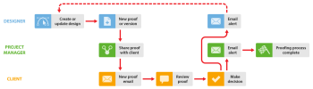

# 與設計人員和專案經理合作，於 [!DNL Workfront Proof]

>[!IMPORTANT]
>
>本文說明獨立產品中的功能 [!DNL Workfront Proof]. 有關內部校對的資訊 [!DNL Adobe Workfront]，請參閱 [校對](../../../review-and-approve-work/proofing/proofing.md).

您可以增強項目經理（管理審閱流程的人員）和設計人員的校對工作流，這些人員通過以下兩種方式共同處理項目。

這些工作流程在任何情況下都能正常運作，但如果您的設計人員建立的檔案可能太大，無法傳送電子郵件給專案管理員，這些工作流程將特別實用。

## 設計人員需要查看注釋和決策時

當設計人員需要查看對校樣所做的評論和決策時，他或她可以開始校樣過程，並在過程完成時再次接收校樣。 然後，設計人員可以再次開始該過程。 

1. 設計人員會建立新校樣，並將項目經理指派為項目的所有者(有關詳細資訊，請參閱 [在中產生校樣 [!DNL Workfront Proof]](../../../workfront-proof/wp-work-proofsfiles/create-proofs-and-files/generate-proofs.md))。 作為校樣的建立者，設計人員可以：

   * 對校樣加以註解並使用 [!UICONTROL 動作] 頁簽，以跟蹤注釋線程。
   * 為專案管理員建立新版校樣。

1. 專案經理會審核證明，然後與客戶分享。 如需詳細資訊，請參閱 [在中共用校樣 [!DNL Workfront Proof]](../../../workfront-proof/wp-work-proofsfiles/share-proofs-and-files/share-proof.md).
1. 用戶端會收到包含校樣連結的電子郵件。 如需詳細資訊，請參閱 [新校樣電子郵件](../../../workfront-proof/wp-emailsntfctns/proof-notifications-and-reminders/new-proof-email.md).
1. 用戶端會審核證明、新增註解，並決定證明。
1. 項目經理會收到一封電子郵件，匯總客戶的審核結果，而設計人員會收到一封有關所需更改的電子郵件。 如需詳細資訊，請參閱 [在中配置電子郵件通知設定 [!DNL Workfront Proof]](../../../workfront-proof/wp-emailsntfctns/email-alerts/config-email-notification-settings-wp.md).
1. 設計人員或項目經理修改檔案；如果設計人員將其作為新版本上傳， [!DNL Workfront Proof] 將證明的所有權重新指派給項目經理。

## 設計人員不需要查看證明意見和決策時

當設計人員不需要參與 [!DNL Workfront Proof] 審核過程中，項目經理可以建立校樣並添加審核者。

1. 設計人員上傳檔案並與專案管理員共用。 如需詳細資訊，請參閱 [將檔案和網頁內容上傳至 [!DNL Workfront Proof]](../../../workfront-proof/wp-work-proofsfiles/create-proofs-and-files/upload-files-web-content.md) 和 [共用檔案於 [!DNL Workfront Proof]](../../../workfront-proof/wp-work-proofsfiles/share-proofs-and-files/share-files.md).

1. 專案管理員會收到檔案，只需按一下即可從檔案建立校樣。 如需詳細資訊，請參閱 [在中產生校樣 [!DNL Workfront Proof]](../../../workfront-proof/wp-work-proofsfiles/create-proofs-and-files/generate-proofs.md) 另請參閱  [在中管理檔案 [!DNL Workfront Proof]](../../../workfront-proof/wp-work-proofsfiles/manage-your-work/manage-files.md) ，了解有關將檔案轉換為校樣的資訊。

1. 用戶端會收到包含校樣連結的電子郵件。 如需詳細資訊，請參閱 [新校樣電子郵件](../../../workfront-proof/wp-emailsntfctns/proof-notifications-and-reminders/new-proof-email.md).
1. 客戶審核校樣、添加註釋並做出決策。
1. 項目經理會收到一封電子郵件，其中包含客戶審核及其決策的摘要。 如需詳細資訊，請參閱 [在中配置電子郵件通知設定 [!DNL Workfront Proof]](../../../workfront-proof/wp-emailsntfctns/email-alerts/config-email-notification-settings-wp.md).
1. 專案管理員可讓設計人員透過 [!UICONTROL 打印注釋]. 如需詳細資訊，請參閱 [打印和導出注釋 [!DNL Workfront Proof]](../../../workfront-proof/wp-work-proofsfiles/organize-your-work/print-and-export-comments.md).
1. 如有必要，設計人員會修改檔案並將其上傳至 [!DNL Workfront Proof]，專案管理員可在此建立另一輪測試的新版本。

