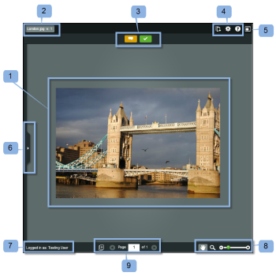

# 在中檢閱證明 [!DNL Basecamp] Classic

>[!IMPORTANT]
>
>本文說明獨立產品中的功能 [!DNL Workfront Proof]. 有關內部校對的資訊 [!DNL Adobe Workfront]，請參閱 [校對](../../../review-and-approve-work/proofing/proofing.md).

[!DNL Basecamp] 是由 [!DNL 37signals]. 如果您使用 [!DNL Basecamp] 對於項目管理，您可以使用 [!DNL Workfront Proof].

## 了解 [!DNL Basecamp Classic]

與整合時 [!DNL Workfront Proof], [!DNL Basecamp] 可讓使用者對校樣執行下列動作：

* 使用者可以在 [!DNL Basecamp Classic].
* 使用者可隨時使用審核工具。
* 專案審核團隊會在 [!DNL Basecamp] 提供微型的審核和批准證明。
* 使用者可切換至完整頁面的校樣，以進行審核和核准。
* 使用者可為小型和完整校樣新增註解和標籤。
* 評論一經回覆，便無法編輯/刪除。 如需註解的相關資訊，請參閱 [對校樣的評論](../../../review-and-approve-work/proofing/reviewing-proofs-within-workfront/comment-on-a-proof/comment-on-proof.md).
* 審核者可回應其他審核者所做的和標籤。 如需註解的相關資訊，請參閱 [對校樣的評論](../../../review-and-approve-work/proofing/reviewing-proofs-within-workfront/comment-on-a-proof/comment-on-proof.md).
* 有新版本的校樣可用時，系統會提醒使用者。
* 非 [!DNL Workfront Proof] 使用者可以在 [!DNL Basecamp].

## 透過通知電子郵件檢視校樣

如果您將校樣連結至 [!DNL Basecamp], [!DNL Workfront Proof] 向所有審核者發送校樣通知電子郵件(1)，其中包含以下資訊：

* **校樣詳細資料** (2):顯示校樣的相關資訊。 顯示的資訊取決於您的Workfront管理員配置Basecamp的方式。
* **[!UICONTROL 前往校樣] 連結** (3):在Workfront中開啟校樣。
* **[!DNL Basecamp]URL** （四）:在Basecamp開啟校樣。 如果校樣中新增了非Basecamp審核者，其電子郵件通知將不包含Basecamp連結。
* **[!UICONTROL 證明進度]** （五）:列出核准的階段並顯示「證明」進度指標。
* **[!UICONTROL 階段]** (6):列出審核者及其個人進度。

若要從電子郵件通知開啟校樣：

1. 在中開啟校樣 [!DNL Workfront Proof]，按一下 **[!UICONTROL 前往校樣]**.\
   或\
   在中開啟校樣 [!DNL Basecamp]，按一下 **[!UICONTROL [!DNL Basecamp]URL]** 欄位。\
   有關在 [!DNL Basecamp Classic]，請參閱 [在 [!DNL Basecamp]](#reviewing-a-proof-in-basecamp) 這篇文章。

## 透過檢視校樣 [!DNL Basecamp Classic] 訊息

您可以從 [!DNL Basecamp Classic] 訊息。

1. 在 [!DNL Basecamp]，前往您的專案頁面(1)。\
   

1. 按一下您要開啟的校樣的訊息。 (2)\
   校樣的訊息會開啟，顯示迷你校樣。 校樣的名稱顯示在消息窗口(3)的頂部。\
   您可以在中檢視縮圖校樣 [!DNL Basecamp Classic] 或 [!DNL Workfront Proof].\
   

1. 若要在中以全螢幕模式檢視校樣， [!DNL Workfront proof]，按一下校樣(4)上方列出的URL。
1. （條件性）如果您未登入 [!DNL Workfront Proof] 帳戶，請登入以檢閱校樣：

   1. 按一下 **[!UICONTROL 登入]** （五）證據上方。
   1. 輸入您的電子郵件地址(6)。\

      您必須使用新增至校樣時使用的相同電子郵件地址。
   1. 按一下 **[!UICONTROL 下一個]**.
   1. 輸入 [!DNL Workfront Proof] 密碼(7)。\

      或\
      如果您沒有 [!DNL Workfront Proof] 帳戶，輸入要顯示的公用名稱。\
      您可以選取「[!UICONTROL 記得我]「因此，您只需輸入一次詳細資訊。

1. 若要檢閱校樣，請繼續 [在 [!DNL Basecamp]](#reviewing-a-proof-in-basecamp).

>[!NOTE]
>
> 訊息頁面上小型校樣下方顯示的註解方塊僅適用於訊息本身。 若要提交審核意見，您必須使用迷你校樣頂端或大型校樣的「意見」圖示按鈕 [!UICONTROL 註解] 按鈕。 如需詳細資訊，請參閱檢閱 [在 [!DNL Basecamp]](#reviewing-a-proof-in-basecamp).

## 在 [!DNL Basecamp]

小型校樣 [!DNL Basecamp] 提供您新增和建立 [在校對檢視器中決定校樣](../../../review-and-approve-work/proofing/reviewing-proofs-within-workfront/make-a-decision-on-a-proof/make-decisions-on-proof.md) 證據上。 指派給專案的所有使用者都會看到您的行銷和留言，且可以即時以自己的留言回應。

當您開啟校樣時，校樣會顯示在 [!UICONTROL 打] 窗口(1)，校樣和版本號的名稱顯示在左上角(2)。

查看證明：

1. 要添加註釋，請按一下 [!UICONTROL 註解] (3)在校樣頂端，輸入您的註解。\
   不需要將回應傳送至 [!DNL Basecamp] 訊息，作為 [在校對檢視器中決定校樣](../../../review-and-approve-work/proofing/reviewing-proofs-within-workfront/make-a-decision-on-a-proof/make-decisions-on-proof.md) 儲存至校樣(類似於在中檢閱校樣 [!DNL Workfront Proof])。

1. 若要新增決策，請按一下校樣頂端的「決定」(3)，然後選取您的核准決策。\
   有關對校樣進行決策的詳細資訊，請參閱 [在校對檢視器中決定校樣](../../../review-and-approve-work/proofing/reviewing-proofs-within-workfront/make-a-decision-on-a-proof/make-decisions-on-proof.md#making-a-decision-on-a-proof).

校樣視窗上的其他功能包括：

* **[!UICONTROL 動作功能表]** （四）:可讓您選取校樣的設定。
* **[!UICONTROL 全螢幕按鈕]** （五）:可讓您在全螢幕和迷你校樣之間切換。
* **[!UICONTROL 側欄]** (6):可讓您展開或縮小校樣檢視。
* **[!UICONTROL 使用者名稱]** （七）:如果您已登入Workfront，則顯示您的使用者名稱。
* **[!UICONTROL 縮放工具]** (8):可讓您放大校樣的區域。
* **[!UICONTROL 頁面導覽工具]** (9):可讓您捲動至校樣內的其他頁面。

<!--For more information on reviewing proofs, see [Legacy proofing viewer Overview](../../../workfront-proof/wp-work-proofsfiles/review-proofs-lpv/legacy-proofing-viewer.md).-->
