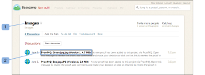

# 在中檢閱證明 [!DNL Basecamp]

>[!IMPORTANT]
>
>本文說明獨立產品中的功能 [!DNL Workfront Proof]. 有關內部校對的資訊 [!DNL Adobe Workfront]，請參閱 [校對](../../../review-and-approve-work/proofing/proofing.md).

此 [!DNL Basecamp] 整合 [!DNL Workfront Proof] 讓您輕鬆檢閱和核准校樣，不需離開 [!DNL Basecamp].

你甚至不需要 [!DNL Workfront Proof] 登入即可使用所有審核工具，對校樣進行評論和決策：

* 在 [!DNL Basecamp] 帳戶時，您會收到訊息，其中包含供您檢閱的校樣（透過miniproof）
* 您可以在Miniproof上新增意見、加上標籤並做出決策，或切換至整頁校樣以供檢閱
* 您可以查看和回復其他審核者的注釋和標籤

如需決策的相關資訊，請參閱 [在校對檢視器中決定校樣](../../../review-and-approve-work/proofing/reviewing-proofs-within-workfront/make-a-decision-on-a-proof/make-decisions-on-proof.md).

>[!NOTE]
>
> 如果您不是 [!DNL Workfront Proof]，您仍可在 [!DNL Basecamp]. 您只需輸入您的電子郵件地址和螢幕名稱即可。 您也可以選擇「[!UICONTROL 記得我]「因此您只需輸入這些詳細資訊一次。

## 透過通知電子郵件檢視校樣

如果您將新校樣或現有校樣連結至 [!DNL Basecamp], [!DNL Workfront Proof] 會傳送校樣通知電子郵件給所有審核者，其中包含：

* 校樣訊息（自訂或標準）(1)
* 證明詳細資訊(2)
* 個人URL（前往校樣連結）(3)
* 連結至 [!DNL Basecamp] 專案訊息，帶您直接去校樣 [!DNL Basecamp] (4)\
   如果非[!DNL Basecamp] 校樣中已新增審核者，其電子郵件通知將不包含 [!DNL Basecamp] 連結。
* 證明進度(5)
* 審查員及其個人進展(6)

>[!NOTE]
>
> 如果您沒有 [!DNL Basecamp] 工作階段會開啟，您必須登入 [!DNL Basecamp] 帳戶，您才能在 [!DNL Basecamp].

## 透過檢視校樣 [!DNL Basecamp] 訊息

當您收到有關新增校樣至您的 [!DNL Basecamp] 專案：

1. 前往您的專案頁面(1)。
1. 找到校樣的訊息(2)。\
   訊息頁面包含校樣的名稱（在主題中）(3)和全螢幕校樣檢視器(4)的連結。
1. 

1. 如果您已登入 [!DNL Workfront Proof] 帳戶（在其中一個瀏覽器視窗中），您可以立即開始檢閱。 如果您在小型校樣的左下角看不到您的名稱：
1. 按一下 **[!UICONTROL 登入]** (5)。
1. 輸入您的電子郵件地址（用來將您新增至校樣）(6)。
1. 按一下 **[!UICONTROL 下一個]** 然後在出現的第二個方塊中，輸入 [!DNL Workfront Proof] 密碼(7)。\
   如果你沒有 [!DNL Workfront Proof] 帳戶，輸入要顯示的公用名稱。

1. 按一下 **[!UICONTROL 記住我]** 所以你只需輸入一次細節。\
   現在，您可以繼續檢閱 [!DNL Basecamp].

## 在 [!DNL Basecamp]

在 [!DNL Basecamp] 就像這樣 [!DNL Workfront Proof]. 中的小校樣 [!DNL Basecamp] 提供您在校樣上加入註解、加上標籤並做出決策所需的所有工具。

* 您的 [!DNL Basecamp] 項目名稱(1)
* 此 [!DNL Workfront Proof] 電子郵件通知主題(2)
* 直接連結至完整校樣檢視器（開啟完整視窗檢視）(3)
* 校樣名稱和版本(4)
* 操作菜單(5)
* 全螢幕按鈕(6)
* 側欄(7)
* 用戶名(8)
* [!UICONTROL 註解] 和 [!UICONTROL 決策] 按鈕(9)
* 縮放工具(10)
* 頁面導覽工具(11)

不需要將回應傳送至 [!DNL Basecamp] 訊息，因為註解和決策會儲存在校樣上（如同在中檢閱校樣） [!DNL Workfront Proof])。

## 檢閱整頁校樣

您可以顯示包含 [!DNL Workfront Proof] 按一下訊息中緊靠miniproof的連結或miniproof右上角的全螢幕圖示，即可正常運作。

校樣影像仍為原始大小，但頁面本身比小型校樣頁面寬。

全頁校樣顯示：

* 此 [!UICONTROL 添加註釋] 和 [!UICONTROL 提交決策] 按鈕（而非miniproof上顯示的註解和決策圖示）(1)。
* 比縮制校樣(2)更多的縮放和導覽工具。
* 此 [!UICONTROL 前往 [!DNL Basecamp]] 按鈕。 按一下這個會將您帶回 [!DNL Basecamp] 賬號(3)。

