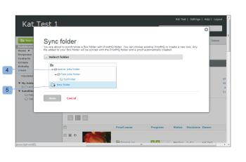

# 同步 [!DNL Box] 資料夾 [!DNL Workfront Proof]

>[!IMPORTANT]
>
>本文說明獨立產品中的功能 [!DNL Workfront Proof]. 有關內部校對的資訊 [!DNL Adobe Workfront]，請參閱 [校對](../../../review-and-approve-work/proofing/proofing.md).

您可以同步 [!DNL Box] 資料夾中 [!DNL Workfront Proof]. 您在Box資料夾中對檔案所做的每項變更都會反映在Workfront Proof中（因此，請上傳新檔案、新增版本、重新命名檔案等）。

如需資料夾的詳細資訊，請參閱 [在中管理資料夾及其內容 [!DNL Workfront Proof]](../../../workfront-proof/wp-work-proofsfiles/organize-your-work/manage-folders-and-contents.md).

>[!NOTE]
>
>僅限具有 [!UICONTROL 經理] 或更高版本能夠同步資料夾。 此 [!DNL Box] 將檔案上傳至與 [!DNL Workfront Proof]，將成為中建立之校樣的擁有者 [!DNL Workfront Proof] (如果他們是相同 [!DNL Workfront Proof] 帳戶)。 若 [!DNL Box] 使用者是 [!DNL Workfront Proof] 帳戶或沒有 [!DNL Workfront Proof]，在資料夾之間建立同步的人員將成為校樣的擁有者。 如需詳細資訊，請參閱 *&quot;編輯用戶配置檔案和權限。&quot;*

同步 [!DNL Box] 資料夾中 [!DNL Workfront Proof]:

1. 在 [!DNL Box] 帳戶，請前往 [!UICONTROL 所有檔案和資料夾] 頁面。
1. 按一下 **[!UICONTROL 更多選項]** 功能表（位於要同步的資料夾旁） [!DNL Workfront Proof] (1)。
1. 選擇 **[!UICONTROL 更多動作]** (2)。
1. 按一下 **[!UICONTROL 與同步[!DNL Workfront Proof]]** (3)。
1. 在 [!UICONTROL 同步資料夾] 框(如果您已登錄 [!DNL Workfront Proof])，執行下列其中一項操作：

   * 按一下 [!DNL Workfront Proof] 資料夾名稱，以便與Box(4)中的對應資料夾同步。
   * 按一下 **[!UICONTROL 新資料夾]** 在中建立新資料夾 [!DNL Workfront Proof] (5)。\

      如果您選擇建立新資料夾，系統會提示您提供有關新資料夾的詳細資訊。

1. 按一下&#x200B;**[!UICONTROL 儲存]**。\
   此 [!UICONTROL 資料夾詳細資訊] 同步資料夾的頁面在 [!DNL Workfront Proof]. 此頁面包含資料夾的相關資訊。\
   此頁面也可讓您暫停和停用同步。 如果您暫停同步，則資料夾將不再隨下列變更更新： [!DNL Box]，但可隨時繼續同步。 禁用同步意味著資料夾之間的連接已斷開，需要從 [!DNL Box] 帳戶。\
   此 [!UICONTROL 資料夾詳細資訊] 頁面包含與 [!DNL Box]:

   * **[!UICONTROL 暫停同步]**:此 [!DNL Workfront Proof] 資料夾將不再以Box中的變更更新。 可隨時恢復同步(1)。
   * **[!UICONTROL 禁用資料夾同步]**:資料夾之間的連線會遺失，且同步必須從 [!DNL Box] 賬號(2)。

   * 只有啟動資料夾同步的用戶才能禁用或暫停它。 如需詳細資訊，請參閱  [在中管理資料夾及其內容 [!DNL Workfront Proof]](../../../workfront-proof/wp-work-proofsfiles/organize-your-work/manage-folders-and-contents.md).
   * **前往 [!DNL Box] 資料夾**:如果您共用資料夾URL(位於 [!DNL Box] 資料夾選項)，此選項將可用，並將您直接轉到 [!DNL Box] 資料夾(3)。
   * **[!UICONTROL 資料夾同步詳細資訊]**:本節包含 [!DNL Box] 資料夾(4)。
   * **[!UICONTROL [!DNL Box]資料夾連結]**:URL [!DNL Box] 資料夾(5)。
   * **[!UICONTROL 活動]:** 顯示 [!DNL Workfront Proof] 檔案夾中，您可以在此處檢查啟動資料夾同步的人員(6)。
   * 

>[!NOTE]
>
>* 您也可以同步 [!DNL Box] 資料夾 [!UICONTROL 資料夾選項] 功能表。
>* 如果您有自己的品牌 [!DNL Workfront Proof] 登入頁面時，系統會將您帶往該頁面，而非標準頁面 [!DNL Workfront Proof] 登入頁面。 請參閱下列文章： [品牌推廣](https://support.workfront.com/hc/en-us/sections/115000921208-Branding) 如果你需要更多資訊。
>* 如果您已啟用 [!UICONTROL 單一登入(SSO)] 功能 [!DNL Workfront Proof] 帳戶時，系統會將您帶入SSO登入頁面，並要求您輸入SSO登入憑證，但唯有當您使用相同的電子郵件地址來登入 [!DNL Box] 帳戶與 [!DNL Workfront Proof]. 如果您需要更多資訊，請參閱 [[!UICONTROL 單一登入] in [!DNL Workfront Proof]](../../../workfront-proof/wp-acct-admin/managing-security/single-sign-on-overview.md).
>* 如果您的 [!DNL Box] 帳戶和 [!DNL Workfront Proof] 」，您將始終被視為 [!DNL Workfront Proof] 登入頁面。
>

