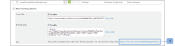

# 在方塊中檢視校訂的原始檔案

>[!IMPORTANT]
>
>本文提及獨立產品[!DNL Workfront Proof]中的功能。 有關[!DNL Adobe Workfront]內部校訂的資訊，請參閱[校訂](../../../review-and-approve-work/proofing/proofing.md)。

如果您使用[!DNL Workfront Proof] - [!DNL Box]整合，則在Box中，您可以檢視用來建立校訂的原始檔案。 您可以透過兩種方式達成此目的：

## 透過校訂電子郵件通知檢視[!DNL Box]中的檔案

從[!DNL Box]檔案建立新校訂或新版本時，建立者和檢閱者會收到電子郵件通知，其中包含您[!DNL Box]帳戶(1)中檔案的連結。\

## 透過[!UICONTROL 校訂詳細資料]頁面檢視[!DNL Box]中的檔案

您從[!DNL Box]檔案建立的校樣之[!UICONTROL 校樣詳細資料]頁面的[!UICONTROL 更多共用選項]區段包含您[!DNL Box]帳戶(1)中檔案的連結。

