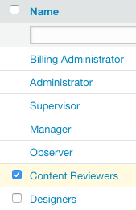
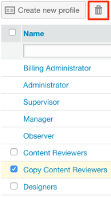

# 使用[!DNL Workfront Proof]建立和管理自訂設定檔

>[!IMPORTANT]
>
>本文提及獨立產品[!DNL Workfront Proof]中的功能。 有關[!DNL Adobe Workfront]內部校訂的資訊，請參閱[校訂](../../../review-and-approve-work/proofing/proofing.md)。

帳單管理員和管理員可以建立和管理自訂設定檔，以指定使用者可以在您組織的帳戶和帳戶設定中執行的操作。

此功能僅適用於Premium帳戶。

## 模組許可權 {#module-permissions}

模組許可權可讓您決定要讓使用者對其本身專案以及帳戶中其他使用者所擁有的專案具有哪些存取權。

基本存取區段會決定使用者是否可以在帳戶中讀取、建立、編輯和刪除自己的專案。

[!UICONTROL 資料管理]區段會決定使用者對帳戶中其他使用者所擁有之專案的許可權。

這兩個區段都允許您授予對帳戶中以下專案的許可權：

* 校樣
如需詳細資訊，請參閱[在 [!DNL Workfront Proof]](../../../workfront-proof/wp-work-proofsfiles/create-proofs-and-files/generate-proofs.md)中產生校樣。

* 檔案
如需詳細資訊，請參閱[將檔案與網頁內容上傳至 [!DNL Workfront Proof]](../../../workfront-proof/wp-work-proofsfiles/create-proofs-and-files/upload-files-web-content.md)。

* 公用資料夾
如需詳細資訊，請參閱[瞭解 [!DNL Workfront Proof]](../../../workfront-proof/wp-work-proofsfiles/organize-your-work/folder-permissions.md)中的資料夾許可權。

* 私人資料夾
如需詳細資訊，請參閱[瞭解 [!DNL Workfront Proof]](../../../workfront-proof/wp-work-proofsfiles/organize-your-work/folder-permissions.md)中的資料夾許可權。

* 連絡人
如需詳細資訊，請參閱[連絡人](https://support.workfront.com/hc/en-us/sections/115000920808-Contacts)。

* 群組
如需詳細資訊，請參閱[群組](https://support.workfront.com/hc/en-us/sections/115000920828-Groups)。

* 標籤
如需詳細資訊，請參閱[在 [!DNL Workfront Proof]](../../../workfront-proof/wp-work-proofsfiles/organize-your-work/create-and-manage-tags.md)中建立和管理標籤。

* 自訂檢視
如需詳細資訊，請參閱[在 [!DNL Workfront Proof]](../../../workfront-proof/wp-work-proofsfiles/manage-your-work/create-and-manage-custom-views.md)中建立和管理自訂檢視。

## 管理許可權 {#administrative-permissions}

在此區段中，您可以授予使用者管理許可權。 有些許可權會連結，並在選取時自動啟用執行工作所需的其他許可權。 例如，允許使用者管理許可權設定檔會自動啟用管理帳戶中的使用者。

您可以授與下列許可權：

* 管理帳戶設定
如需詳細資訊，請參閱[帳戶設定](https://support.workfront.com/hc/en-us/sections/115000912147-Account-settings)。

* 管理使用者
如需詳細資訊，請參閱[使用者](https://support.workfront.com/hc/en-us/sections/115000911887-Users)。

* 管理決定
如需詳細資訊，請參閱[在校訂檢視器中對校訂做出決定](../../../review-and-approve-work/proofing/reviewing-proofs-within-workfront/make-a-decision-on-a-proof/make-decisions-on-proof.md)。

* 管理合作夥伴
如需詳細資訊，請參閱[合作夥伴](https://support.workfront.com/hc/en-us/sections/115000912107-Partner-accounts)。

* 管理應用程式
如需詳細資訊，請參閱[整合](https://support.workfront.com/hc/en-us/categories/115000588707-Integrations)。

* 管理自訂欄位
如需詳細資訊，請參閱[在 [!DNL Workfront Proof]](../../../workfront-proof/wp-acct-admin/account-settings/create-and-manage-custom-fields.md)中建立和管理自訂欄位。

* 管理空投區
如需詳細資訊，請參閱[拖放區](../../../workfront-proof/wp-work-proofsfiles/create-proofs-and-files/dropzone.md)。

* 管理進階工作流程
如需詳細資訊，請參閱[自動化工作流程概觀](../../../review-and-approve-work/proofing/proofing-overview/automated-workflow.md)。

* 管理SSO
如需詳細資訊，請參閱[在 [!DNL Workfront Proof]](../../../workfront-proof/wp-acct-admin/managing-security/single-sign-on-overview.md)中的單一登入。

* 檢視帳戶歷史記錄
如需詳細資訊，請參閱[瞭解 [!DNL Workfront Proof] 活動稽核軌跡](../../../workfront-proof/wp-work-proofsfiles/basic-features/activity-audit-trail.md)。

* 檢視帳戶備份
如需詳細資訊，請參閱[備份您的 [!DNL Workfront Proof] 資料](../../../workfront-proof/wp-work-proofsfiles/organize-your-work/back-up-data.md)。

* 管理帳單
如需詳細資訊，請參閱[管理您的帳單](https://support.workfront.com/hc/en-us/sections/115000912187-Managing-your-billing)。

* 建立附屬帳戶
如需詳細資訊，請參閱[在 [!DNL Workfront Proof]](../../../workfront-proof/wp-acct-admin/satellite-accounts/configure-sat-acct-in-wp.md)中設定附屬帳戶。

* 清空垃圾桶
如需詳細資訊，請參閱[還原並清空垃圾桶 [!DNL Workfront Proof]](../../../workfront-proof/wp-work-proofsfiles/manage-your-work/restore-and-empty-trash.md)。

* 管理許可權設定檔
如需相關資訊，請參閱 [!DNL Workfront Proof]](../../../workfront-proof/wp-acct-admin/account-settings/proof-perm-profiles-in-wp.md)中的[校訂許可權設定檔。

* 檢視分析

## 建立新的自訂設定檔

1. 瀏覽至&#x200B;**[!UICONTROL 帳戶設定]**，然後按一下&#x200B;**[!UICONTROL 設定檔]**&#x200B;索引標籤。

1. 按一下&#x200B;**[!UICONTROL 建立新設定檔]**。

1. 在&#x200B;**[!UICONTROL 設定檔詳細資料]**&#x200B;區段中：

   1. 在&#x200B;**[!UICONTROL 名稱]**&#x200B;欄位中，指定自訂設定檔的名稱。
   1. 選取&#x200B;**[!UICONTROL 啟用設定檔]**。 

1. 在&#x200B;**[!UICONTROL 模組許可權]**&#x200B;區段中：

   1. 選取&#x200B;**基本存取許可權**。
   1. **資料管理**。 如需詳細資訊，請參閱[模組許可權](#module-permissions)

1. 在&#x200B;**[!UICONTROL 管理許可權]**&#x200B;區段中，選取管理功能的許可權。

   如需詳細資訊，請參閱[系統管理許可權](#administrative-permissions)。

1. 按一下&#x200B;**[!UICONTROL 建立]**。
新的設定檔現在可在**[!UICONTROL 使用者]**&#x200B;標籤上使用。

1. （可選）將新設定檔指派給新的和現有的使用者帳戶。
如需詳細資訊，請參閱 [!DNL Workfront Proof]](../../../workfront-proof/wp-acct-admin/account-settings/proof-perm-profiles-in-wp.md)中的[校訂許可權設定檔。

## 啟用和停用設定檔 {#enabling-and-disabling-a-profile}

1. 瀏覽至&#x200B;**[!UICONTROL 帳戶設定]**，然後按一下&#x200B;**[!UICONTROL 設定檔]**&#x200B;標籤。

1. 選取要啟用或停用的設定檔。
或
若要同時啟用或停用多個設定檔，請手動選取設定檔，或選取**[!UICONTROL 名稱]**以選取所有自訂設定檔。
   

1. 按一下&#x200B;**[!UICONTROL 更多]**&#x200B;下拉式功能表，然後按一下下列任一選項（視您是要啟用或停用設定檔而定）：

   * **啟用設定檔：**&#x200B;設定檔會變成作用中且顯示在[!DNL Workfront Proof]功能表中。
   * **停用設定檔：**&#x200B;出現確認方塊。 選取&#x200B;**[!UICONTROL 是]**&#x200B;確認。 設定檔會變成非使用中，並從[!DNL Workfront Proof]功能表中移除。

     >[!NOTE]
     >
     >已停用的設定檔無法再指派給帳戶中的使用者。 如果帳戶中已有使用該設定檔的使用者，請在停用該設定檔之前，先為其選取不同的設定檔。

     

## 複製設定檔

建立現有設定檔的副本，以設定具有類似許可權的多個設定檔。

1. 瀏覽至&#x200B;**[!UICONTROL 帳戶設定]**，然後按一下&#x200B;**[!UICONTROL 設定檔]**&#x200B;索引標籤。

1. 按一下設定檔的名稱，然後按一下&#x200B;**[!UICONTROL 複製設定檔]**&#x200B;按鈕。

   

   複製的設定檔現在會顯示在設定檔清單上。 其原始設定檔名稱前面有「Copy」這個字。

   

1. （選擇性）若要啟用複製的設定檔，請參閱[啟用和停用設定檔](#enabling-and-disabling-a-profile)。
1. （選擇性）若要編輯複製的設定檔，請參閱[編輯設定檔](#editing-a-profile)。

## 編輯設定檔 {#editing-a-profile}

如果您編輯設定檔，更新會套用至目前指派此設定檔的所有使用者。

1. 瀏覽至&#x200B;**[!UICONTROL 帳戶設定]**，然後按一下&#x200B;**[!UICONTROL 設定檔]**&#x200B;索引標籤。

1. 按一下您要編輯的設定檔名稱。
1. 對設定檔的名稱或許可權進行必要的變更。 這些變更會自動儲存和更新。
如需許可權的詳細資訊，請參閱[模組許可權](#module-permissions)和[系統管理許可權](#administrative-permissions)。

>[!NOTE]
>
>預設[!DNL Workfront Proof]設定檔會顯示在設定檔清單中，但無法修改。

## 刪除設定檔

1. 瀏覽至&#x200B;**[!UICONTROL 帳戶設定]**，然後按一下&#x200B;**[!UICONTROL 設定檔]**&#x200B;索引標籤。

1. 選取您要刪除的設定檔。
1. 按一下頁面頂端的&#x200B;**[!UICONTROL 垃圾桶]**&#x200B;圖示。

   

1. 在出現的&#x200B;**[!UICONTROL 確認對話方塊]**&#x200B;中按一下&#x200B;**[!UICONTROL 是]**。

1. 如果設定檔已指派給使用者，請使用對話方塊中的下拉式功能表，選取要指派給此使用者的其他設定檔。 按一下&#x200B;**[!UICONTROL 是]**&#x200B;確認。

   

>[!NOTE]
>
>無法從帳戶中刪除標準設定檔。 如果您不想在帳戶中使用標準設定檔，可將其停用。

如需停用設定檔的詳細資訊，請參閱[啟用和停用設定檔](#enabling-and-disabling-a-profile)。
