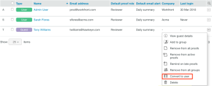

# 使用 [!DNL Workfront Proof]

>[!IMPORTANT]
>
>本文說明獨立產品中的功能 [!DNL Workfront Proof]. 有關內部校對的資訊 [!DNL Adobe Workfront]，請參閱 [校對](../../../review-and-approve-work/proofing/proofing.md).

As a [!DNL Workfront Proof] 管理員，您可以建立新使用者。

有關管理員權限的資訊，請參見 [校樣權限設定檔(位於 [!DNL Workfront Proof]](../../../workfront-proof/wp-acct-admin/account-settings/proof-perm-profiles-in-wp.md).

>[!NOTE]
>
>我們不建議將第三方新增至您自己的帳戶。

您可以從頭建立用戶，也可以將來賓轉換為授權用戶。

## 建立使用者

1. 執行下列任一操作以開始建立用戶：

   * 按一下旁邊的下拉式功能表箭頭 **[!UICONTROL 新校樣]**，然後按一下 **[!UICONTROL 新使用者]**.

   * 按一下 **[!UICONTROL 設定]** > **[!UICONTROL 帳戶設定]**，然後按一下 **[!UICONTROL +新用戶]**.

   * 按一下 **[!UICONTROL 聯繫人]** 在左側導覽功能表中，按一下 **[!UICONTROL +新增]**，然後按一下 **[!UICONTROL 新使用者]**.
*新用戶對話框隨即顯示。

1. 在 **[!UICONTROL 新用戶]** 框中，鍵入人員的資訊並設定配置選項，如 [使用 [!DNL Workfront Proof]](../../../workfront-proof/wp-mnguserscontacts/users/configure-user-info.md).

1. 按一下 **[!UICONTROL 建立]**。

## 將來賓轉換為用戶

來賓是沒有許可證的用戶 [!DNL Workfront Proof] 帳戶。 如果來賓帳戶升級為許可用戶帳戶，您需要手動將來賓帳戶轉換為許可用戶。

有關來賓和用戶的詳細資訊，請參閱 [了解中的用戶、成員和來賓 [!DNL Workfront Proof]](../../../workfront-proof/wp-mnguserscontacts/contacts/use-members-guests.md).

1. 按一下 **[!UICONTROL 聯繫人]** 的下一頁。
1. 按一下 **[!UICONTROL 更多]** 表徵圖，按一下 **[!UICONTROL 轉換為使用者]**.
   

1. 在 **[!UICONTROL 新用戶]** 對話框，按中所述設定用戶的配置選項 [使用 [!DNL Workfront Proof]](../../../workfront-proof/wp-mnguserscontacts/users/configure-user-info.md).

1. 按一下 **[!UICONTROL 轉換為用戶]**.
