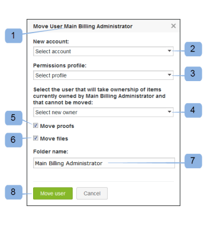

# 使用[!DNL Workfront Proof]在帳戶之間移動使用者

>[!IMPORTANT]
>
>本文提及獨立產品[!DNL Workfront Proof]中的功能。 有關[!DNL Adobe Workfront]內部校訂的資訊，請參閱[校訂](../../../review-and-approve-work/proofing/proofing.md)。

如果您是[!DNL Workfront]校訂管理員，並且您有一個或多個附屬帳戶連線到您的主帳戶，則您可以在所有這些帳戶之間移動使用者。

## 在連線的帳戶之間移動使用者

1. 按一下&#x200B;**[!UICONTROL 設定]** > **[!UICONTROL 帳戶設定]**。

1. 開啟&#x200B;**[!UICONTROL 使用者]**&#x200B;標籤。
1. 按一下&#x200B;**[!UICONTROL 移動使用者]**&#x200B;圖示(1)。 

1. 在出現的「移動」使用者方塊中，確認您要移動的使用者(1)。
1. 從連線的帳戶清單(2)中選取目的地帳戶。
1. 指派此使用者應擁有的新帳戶設定檔許可權(3)。
1. 選取應擁有不會移動之專案的使用者(4)。
這包括您決定留在舊帳戶上的專案以及無法移動的專案（請參閱下方的[無法移動的專案](https://support.workfront.com/knowledge/articles/115004087708/en-us?brand_id=662728&return_to=%2Fhc%2Fen-us%2Farticles%2F115004087708#Items-that-can&#39;t-be-moved)）。

1. 如果您想要與使用者一起移動校樣(5)和檔案(6)，請核取核取方塊。
1. 為資料夾(7)建立名稱，所有移動的專案都會置於該資料夾中的新帳戶中。
1. 按一下&#x200B;**[!UICONTROL 移動使用者]** (8)以啟動程式。
   

如果您選擇移動沒有校樣和檔案的使用者，則會立即執行此動作。 如果您選擇移動使用者及其校訂和檔案，使用者的設定檔將會立即重新指派，但校訂和檔案將逐漸出現在目的地帳戶上，因為此操作需要時間以傳輸資料。

根據檔案和校樣移動過程的數量，可能需要幾分鐘到幾小時的時間。

>[!NOTE]
>
>如果您懷疑程式花費的時間比預期長，或移動的校樣和/或檔案未出現在新帳戶中，請聯絡我們的支援團隊。

## 無法移動的專案

### 被移動的使用者所建立或擁有的資料夾

由於套用至資料夾及其內容的各種許可權性質（例如，它們可能會與其他使用者和帳戶共用），我們無法與使用者行動資料夾結構。

如果資料夾為已移動的使用者所擁有，則擁有權將會在「移動使用者」快顯視窗中轉移給選取的使用者(4)。

>[!NOTE]
>
>如果資料夾是由移動的使用者所建立，則其仍會是建立者 — 只會轉移擁有權。 被移動的使用者在其新帳戶的側邊欄中仍可看見該資料夾。 已移動的使用者對於置於這些資料夾內的專案仍具有「唯讀」存取權。

如果您不希望被移動的使用者保留此類許可權，或該被移動的使用者不希望在old&amp;帳戶上看到他們的舊資料夾，這裡的解決方案是刪除資料夾，如下所示：

1. 在舊帳戶上建立新資料夾。
1. 將所有專案從已移動使用者的資料夾移至新建立的資料夾。
1. 刪除被移動的使用者留下的所有資料夾。

### 具有不同擁有者的版本集

如果校訂只有幾個版本，且每個版本都由不同使用者擁有，則已移動使用者擁有的版本將不會移動。 根據您在「移動」使用者方塊中的選擇(4)，此類版本的所有權將轉移給其他使用者。 （如需詳細資訊，請參閱。）

>[!NOTE]
>
>已移動的使用者需要擁有集中的所有校訂版本，才能移動校訂。

### 群組

移動的使用者必須在其新帳戶上重新建立群組。 如需詳細資訊，請參閱[使用 [!DNL Workfront Proof]](../../../workfront-proof/wp-mnguserscontacts/groups/create-proofing-groups.md)建立校訂群組。

### 自訂檢視

被移動的使用者需要在其新帳戶上重新建立個人自訂檢視。 如需詳細資訊，請參閱[在 [!DNL Workfront Proof] 校訂](../../../workfront-proof/wp-work-proofsfiles/manage-your-work/create-and-manage-custom-views.md)中建立和管理自訂檢視。

### 自訂欄位

無法移動自訂欄位，且自訂欄位的資料將會遺失，因此請務必在移動前產生所需專案的報表。

### 自動化工作流程範本

在新帳戶上需要重新建立自動化工作流程範本，但階段將保留在使用範本建立的移動校訂上。

### 評論上的動作

評論上的動作將保留在校樣上，但無法再依其篩選。 解決方案是在新帳戶上建立相符的動作，並在需要時以新動作重新標幟註解。
