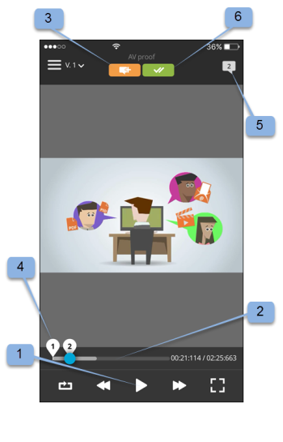

# Workfront校訂行動應用程式

>[!IMPORTANT]
>
>本文提及獨立版產品中的功能 [!DNL Workfront Proof]. 有關內部校訂的資訊 [!DNL Adobe Workfront]，請參閱 [校訂](../../../review-and-approve-work/proofing/proofing.md).

下載 [!DNL Workfront Proof] Apple App Store或Google市集的應用程式讓您隨時隨地保持生產力。 此 [!DNL Workfront Proof] 應用程式在iPhone和iPod Touch上具備下列功能：

* 檢視、稽核及核准靜態和視聽校樣
* 檢視、新增和回覆註解
* 透過您的儀表板和檢視管理您的校樣

您不需要成為下列專案的使用者： [!DNL Workfront Proof] （亦即擁有自己的登入認證）透過iOS應用程式檢閱及核准校訂。 只要您將應用程式下載到您的iOS裝置，並透過iOS電子郵件應用程式存取您的個人URL，您就可以隨時隨地檢閱和核准。

## 裝置需求

需要iOS 7.0或更新版本。 Android 4.0和更新版本。 與iPhone、iPad和iPod touch相容。

## 下載並安裝應用程式

>[!IMPORTANT]
>
>Workfront Proof行動應用程式已不再受支援，並依現狀提供。  應用程式中的任何問題將不會修正。

下載我們的 [!DNL Workfront Proof] 直接來自的行動應用程式 [Apple App Store](https://itunes.apple.com/us/app/workfront-proof/id1030372728?mt=8) 或 [Google Play商店](https://play.google.com/store/apps/details?id=com.proofhq.tabletapp).

若為iOS裝置，請務必解除安裝先前的 [!DNL Workfront Proof] 適用於iOS裝置的應用程式，然後再安裝新應用程式。

此 [!DNL Workfront Proof] 應用程式會自動偵測您使用的裝置型別。 如果您想在平板電腦上使用應用程式，請參閱 [[!DNL Workfront Proof] 平板電腦行動應用程式](../../../workfront-proof/wp-mobile/wp-mobile-apps/wp-mobile-app-tablet.md).

>[!NOTE]
>
>由於行動裝置的軟體限制，無法檢閱iOS裝置上的SWF檔案或音訊檔案（例如MP3）。 如果您想要檢閱從SWF檔案或行動裝置上的音訊檔案建立的校訂，請先將其轉換為支援的格式，然後再上傳至 [!DNL Workfront Proof].

## 應用程式快速入門

您不一定要是 [!DNL Workfront Proof] 開始使用應用程式的使用者。 只需在裝置上安裝應用程式，然後按一下 **[!UICONTROL 前往校訂]** 連結。 應用程式會自動啟動並載入校訂。

如果您是 [!DNL Workfront Proof] 使用者您可以在開啟任何校樣之前登入應用程式。 此應用程式可讓您瀏覽與您共用的所有校訂，並在這些校訂之間輕鬆切換。

1. 開啟應用程式。
1. 輸入您的電子郵件和密碼，然後點選 **[!UICONTROL 登入]**.

   或

   使用單一登入（如果已在您的電腦上設定） [!DNL Workfront Proof] 帳戶。

   您可以使用 **[!UICONTROL 忘記密碼]** 選項（如果您不記得密碼）。

## 控制面板

在您登入 [!DNL Workfront Proof] 帳戶，「儀表板」會出現。 您可以在這裡輕鬆存取校樣。 您可以開啟其中一個可用的檢視、我的校樣和所有校樣。 或者，您可以點選最近校訂的其中一個名稱，直接前往校訂檢視器。

依預設，儀表板會開啟總計校訂檢視。 此檢視會顯示您擁有或與您共用的所有校訂。 點選頁面頂端的長條圖可開啟下拉式功能表，其中包含 [!UICONTROL 準時]， [!UICONTROL 有風險]， [!UICONTROL 延遲] 和 [!UICONTROL 最近] 選項。 若要從任何檢視開啟校訂，請向下捲動清單以尋找您想要的校訂，然後點選其名稱以移至校訂檢視器。

| **準時檢視** | 顯示您帳戶中所有您有權檢視且沒有截止日期或截止日期前超過24小時的作用中校訂。 |
|---|---|
| **處於風險檢視** | 顯示截止日期少於24小時的所有校訂。 |
| **延遲檢視** | 列出並非已完成所有動作（其截止日期已錯過）的所有校訂。 |
| **最近檢視** | 包括您最近存取且擁有的校訂、根據您的設定檔許可權所擁有的可檢視許可權以及與您共用的校訂。 此檢視只顯示您自己開啟的校樣(透過 [!DNL Workfront Proof] 檢視器或透過校樣詳細資訊頁面)。 |
| **電子郵件連結** | 若要從電子郵件開啟校樣，只要在電子郵件應用程式中開啟電子郵件，按一下 [!UICONTROL 前往校訂] 電子郵件(1)中的按鈕連結，您將被帶到 [!DNL Workfront Proof] 應用程式。 |

{style="table-layout:auto"}

## 檢閱應用程式中的靜態校訂

當您在行動應用程式中開啟校訂時，可以執行以下操作：

* 閱讀並回覆其他檢閱者留下的評論（1 — 圖示中顯示的數字表示校訂上留下的評論數量，如果校訂上沒有任何評論，此按鈕將顯示0並將呈現灰色）。
* 新增註解與標示(2)。
* 評論和決定按鈕的可見性取決於您的校訂角色。
* 做出決定(3)。
* 前往功能表(4)。
* 捏住畫面以縮放校樣。
  

## 新增評論和回覆

1. 當您開啟校訂時，點選 **[!UICONTROL 新增註解]** 按鈕(1)。

   

1. 輸入您的註解(2)。

   

1. 按一下&#x200B;**[!UICONTROL 儲存]**。

## 閱讀並回覆註解

1. 開啟校訂，然後點選右上角的圖說文字圖示以檢視註解清單(1)並選擇要檢閱的註解。
1. 點選圖釘以開啟與其相關聯的註解(2)。

   

1. 執行下列任一項作業：

   * 若要回複評論，請點選 **[!UICONTROL 回覆]** 按鈕(3)。
   * 若要返回校樣影像，請點選 [!UICONTROL 圖說文字] 圖示。
   * 若要檢視完整評論及其回覆，請點選評論本身。

     

   * 若要在註解上套用動作：

      1. 開啟註解。
      1. 點選 **[!UICONTROL 回覆]**.
      1. 開啟 [!UICONTROL 動作] 選單(1)。
      1. 點選 **[!UICONTROL 新增動作]** (2)。

         

         如需動作的詳細資訊，請參閱 [對校訂評論使用動作](../../../review-and-approve-work/proofing/reviewing-proofs-within-workfront/comment-on-a-proof/use-actions-on-comments-in-viewer.md).

## 新增標籤

您可以新增標示（例如反白標示校樣區域的方塊）並鍵入附加至標示的註解。 您也可以在不新增標示的情況下建立註解。 而且您可以將多個標籤新增至單一註解。

1. 在您開啟的校訂上，點選 **新增註解** (1)。

   

1. 選擇 [!UICONTROL 平移模式] (2)， [!UICONTROL 矩形工具] (3)， [!UICONTROL 手繪繪圖] (4)或 [!UICONTROL 箭頭] 工具(5)。

   您也可以變更標示(6)的線條顏色。

1. 若要在校樣上繪製標籤，請觸控熒幕，然後將您的手指移到校樣上。

   您不需要新增文字即可儲存標示(7)。

1. 點選 **[!UICONTROL 取消]** (8)如果要捨棄標示。

   

   標示校樣上的區域會自動開啟評論欄位。 您可以點選標示形狀(9)旁的十字形，移除已建立的標示。

   

## 對校訂進行決策

1. 在校樣檢視器中開啟校樣，然後點選 [!UICONTROL 決定] 按鈕(1)。

   

1. 點選您要提交的決定(2)。
1. 點選 **[!UICONTROL 儲存]** 以提交您的決定。

   

   >[!NOTE]
   >
   >* 如果在建立校訂的帳戶上設定依決策顯示快顯訊息，則當對校訂做出決策時，該訊息也會出現在iOS應用程式中。
   >* 如果您設定決策原因，原因會顯示在 [!UICONTROL 提交您的決定] 熒幕供您選擇。

   如果您已經提交決定，並且想要變更或移除它，您可以輕鬆進行。 提出決定後，會新增一個選項 **[!UICONTROL 移除我的決定]** (6)，出現在 [!UICONTROL 提交您的決定] 畫面。

   

## 在應用程式中檢閱音訊或視訊校訂

檢閱iOS應用程式中的音訊和視訊校訂就像檢閱靜態檔案一樣簡單：

1. 點選 [!UICONTROL 播放/暫停] 按鈕以播放或暫停視訊(1)。
1. 若要導覽視訊，請點選 [!UICONTROL 導覽] 列(2)。
1. 若要留下註解，請點選 **[!UICONTROL 註解]** 按鈕(3)，然後遵循上述指示。

   在導覽列(4)上留下任何註解或標示都會以圖釘標示。

1. 如果您想檢閱校樣上剩餘的註解，請點選 **[!UICONTROL 註解]** 按鈕(5)，然後遵循上述指示。
1. 若要做出決定，請點選 **[!UICONTROL 決定]** 按鈕(6)，然後遵循上述指示。

   
