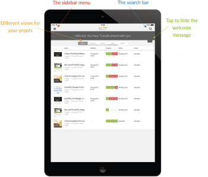
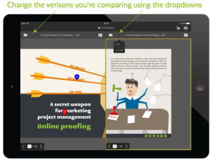

# [!DNL Workfront Proof]平板電腦行動應用程式

>[!IMPORTANT]
>
>本文提及獨立產品[!DNL Workfront Proof]中的功能。 有關[!DNL Adobe Workfront]內部校訂的資訊，請參閱[校訂](../../../review-and-approve-work/proofing/proofing.md)。

[!DNL Workfront Proof]平板電腦應用程式可讓您在旅途中方便地檢閱及核准您的校樣。 應用程式可供所有人下載，您不必是[!DNL Workfront Proof]使用者就能檢閱平板電腦或手機上的校樣。

來賓只需按一下他們收到的電子郵件通知中的[!UICONTROL 前往校訂]按鈕，即可開啟應用程式中的校訂。

[!DNL Workfront Proof]使用者可登入應用程式，並使用儀表板方便管理他們的工作。

## 裝置需求

* iOS裝置： iPad 3、iPad air、iPad mini
* Android裝置：Android作業系統4.4+、5+版；Samsung Galaxy Tab 3+ （10.1英吋）

這是專為平板電腦建置的應用程式。 如果您想在iPhone上使用[!DNL Workfront Proof]，請從iTunes市集下載iOS應用程式。

## 下載應用程式

>[!IMPORTANT]
>
>Workfront Proof行動應用程式已不受支援，並依現狀提供。  應用程式中的任何問題將不會修正。

[!DNL Workfront Proof]平板電腦應用程式可在Apple App Store和Google Play市集使用。

1. 按一下下列連結，下載應用程式並將其安裝在您的裝置上。

   

   

## 登入

[!DNL Workfront Proof]平板電腦應用程式可讓您存取儀表板，其中包含需要您注意的校樣。 若要存取控制面板：

1. 執行下列其中一項：

   * 使用您的[!DNL Workfront Proof]認證登入。

     如果您收到校訂邀請電子郵件，並在行動裝置上開啟，連結會帶您前往應用程式中的校訂。 您不必是使用者才能檢視校樣；不過，您必須在裝置上安裝應用程式才能檢視校樣。

   * 如果您的帳戶已啟用單一登入，請點選登入畫面上的選項。

     系統會帶您前往登入頁面，詢問您的電子郵件地址。 輸入您的電子郵件地址後，您將會被重新導向至您的身分提供者頁面，您可以在此頁面使用您的密碼登入。

     

## 控制面板

如果您想要保持登入您的[!DNL Workfront Proof]帳戶：

1. 在&#x200B;**[!UICONTROL 設定]**&#x200B;底下的側邊欄功能表中啟用&#x200B;**[!UICONTROL 讓我保持登入]**：

*[!UICONTROL 儀表板]*&#x200B;連結會帶您從應用程式中的任何檢視返回儀表板。 您也可以用它來重新載入儀表板。

控制面板的其他元素是搜尋列，可讓您按照校訂名稱和有助於您有效管理工作量的不同檢視來搜尋帳戶。

## 使用儀表板檢視管理您的工作負載

如同網頁應用程式中的儀表板圖表，在行動應用程式中，我們會顯示與您共用的校訂清單。 此頁面頂端的歡迎訊息會提供我們將其劃分為&#x200B;*準時*、*有風險*&#x200B;和&#x200B;*延遲校訂*&#x200B;的校訂總數及以下的校訂總數。

* **準時校訂**&#x200B;是未設定截止日期或截止日期已超過24小時的校訂。
* **存在風險的校訂**&#x200B;是截止日期在未來24小時內的校訂 — 這些校訂的進度列是橘色的。
* **延遲校訂**&#x200B;是已超過截止日期的校訂 — 這些校訂的進度列是紅色的。 在到達截止日期後，[!DNL Workfront Proof]會傳送一封自動提醒電子郵件給延遲的決策者和校訂擁有者。

這些校訂會分組到不同的檢視中，讓您從已超過截止日期的校訂開始，方便您安排工作的優先順序。

另一個您可能會覺得實用的檢視是「最近」檢視，它會顯示您最近在應用程式中存取的校訂，因此，如果您想再次看到相同的校訂，可以在該清單中輕鬆找到。

## 在應用程式中檢閱校樣

1. 按一下校訂的名稱，以在[!DNL Workfront Proof]檢視器中開啟。

   或

   若要從電子郵件通知開啟校訂，檢閱者可以按一下通知中的&#x200B;**[!UICONTROL 前往校訂]**連結。
如果您有[!DNL Workfront Proof]帳戶，您可以登入並從儀表板存取您的校訂。

   >[!NOTE]
   >
   >您必須在裝置上安裝應用程式，才能在[!DNL Workfront Proof]中檢閱校訂，即使您沒有[!DNL Workfront Proof]帳戶亦然。

   第一次開啟校訂時，我們將會為您顯示導覽，協助您開始檢閱應用程式中的校訂。

   

1. 在您的校訂中導覽：

   * 若要跳至校訂的特定頁面，請橫向滑動或使用[!UICONTROL 縮圖]清單。

     您也可以使用頁面底部的箭頭，或輸入特定的頁碼。

   * 若要移至其他版本的校訂，請使用頁面頂端的版本下拉式功能表。
   * 若要放大顯示，請捏住熒幕。
   * 若要平移，請按住並移動影像，直到找到正確的位置為止。

     檢閱行動應用程式中的校訂就像使用[!DNL Workfront Proof]檢視器檢閱校訂一樣簡單。 在下方，我們將更進一步瞭解新增評論和加價、管理意見反應及決策。 我們也會在應用程式的側邊欄中討論不同的可用選項。

## 應用程式中的註解

以下影片說明在行動應用程式中發表評論的基本知識。 它會顯示如何建立註解、如何張貼註解的回覆、如何使用不同的標示和刪除註解，以及如何編輯和刪除註解。

您只能編輯和刪除未張貼回覆的評論。 如果您沒有看到[!UICONTROL 垃圾桶]圖示，可能是因為您的[!DNL Workfront Proof]系統管理員已停用此選項。

應用程式中有三個評論檢視選項。 按一下註解按鈕，即可在兩者之間切換。

* **[!UICONTROL 清單檢視]**&#x200B;會顯示所有註解的清單。 您可以點選每個註解或點選向上和向下箭頭來瀏覽它們。
* **[!UICONTROL 單一註解檢視]**&#x200B;一次顯示一個註解。 若要移至下一個註解，請點選頁面頂端的箭頭。
* **[!UICONTROL 隱藏評論檢視]**&#x200B;會隱藏所有評論。

校樣上剩餘的每個標籤都會在影像上掉一個圖釘。 若要檢視與圖釘相關聯的註解和標示，只要點選圖釘即可。 只有在註解編輯方塊關閉時，才能執行此操作。 若要關閉註解方塊，請點選方塊左上角註解中的[!UICONTROL x]。

## 文字註釋工具

外出時的校訂文字確實在[!DNL Workfront Proof]平板電腦應用程式中。 按一下橘色的&#x200B;**[!UICONTROL 新增註解]**&#x200B;按鈕後，標籤工具列中即會顯示文字註解工具。

1. 選取工具，然後點選要反白顯示的文字。
1. 在文字上按住手指直到可使用反白顯示，並使用滑桿反白標示整個文字或片語。

   文字工具有四個選項可供選擇：

   | **[!UICONTROL 醒目提示]** | 反白文字並複製到註解方塊中。 |
   |---|---|
   | **[!UICONTROL 取代]** | 將[[!UICONTROL REPLACE]]和[[!UICONTROL WITH]]與文字一起新增至註解方塊，讓您更輕鬆地建議取代文字。 |
   | **[!UICONTROL 刪除]** | 刪除文字並將[DELETE]新增至註解方塊。 |
   | **[!UICONTROL 插入到]**&#x200B;之後 | 將[INSERT AFTER]加入註解方塊。 |

   {style="table-layout:auto"}

1. （選擇性）若要貼上您儲存於平板電腦上之其他檔案的文字，請在註解方塊上點選並按住您的手指，直到您看到貼上從檔案複製之文字的選項為止。

## 在行動應用程式中管理評論

在每個人在校樣上留下他們的評論和標籤後，校樣管理員通常需要檢視意見並決定應將哪些變更套用到下一個版本的校樣。 在[!DNL Workfront Proof]中，您可以在註解上使用動作來標示每個個別註解，並標示應該動作的註解。

評論上的動作必須由[!DNL Workfront Proof]管理員在您的帳戶中設定，且只能由擁有編輯許可權的人用於校訂。

當您正在準備下一個版本的校訂時，您可以隨時檢視評論。 註解會以綠色勾號標示為已解決。 如果您需要重新開啟註解，可以按一下註解方塊底部的箭頭。

如果您要防止其他稽核者回應註解對話串，您可以鎖定它。 若要這麼做，您需要擁有校訂的編輯許可權。 鎖定註解對話串非常簡單，您只需點選註解方塊底部的掛鎖圖示即可。

## 檢閱視訊校樣

透過[!DNL Workfront Proof]平板電腦應用程式，隨時隨地輕鬆檢閱視訊。 以下影片說明如何在應用程式中進行評論、標示和決定。

## 比較模式

平板電腦應用程式中的比較模式可讓您輕鬆比較兩個不同版本的校樣或相同資料夾中的兩個校樣。

>[!NOTE]
>
>由於iOS的限制，無法在iPad上比較兩個影片。 它適用於搭載Android作業系統的平板電腦。

比較模式位於畫面的右上角。

比較工具會顯示校訂的兩個最新版本。

1. 若要變更您要比較的版本，請使用頁面頂端的版本下拉式清單。
1. 若要從相同資料夾中選取不同的校訂，請使用資料夾瀏覽器（可在頁面頂端的資料夾圖示）。

   
   
比較工具可讓您並排比較版本，以檢查是否已進行要求的變更。 如果您解除鎖定導覽，您將能夠比較兩個版本的不同頁面。

   

   現在您可以比較正在檢視之校訂的不同頁面。 您也可以比較相同校訂的不同頁面，這在檢查校訂的訊息和品牌一致性時會很有幫助。

   

## 在應用程式中做出決策

1. 點選頁面頂端的綠色決定按鈕。

   

   如果您沒有看到綠色的&#x200B;**[!UICONTROL 完成檢閱]**&#x200B;按鈕，而您認為您應該對校訂做出決定，則您的[!DNL Workfront Proof]管理員可以更新您的校訂角色，如[在 [!DNL Workfront Proof]](../../../workfront-proof/wp-work-proofsfiles/share-proofs-and-files/manage-proof-roles.md)中管理校訂角色。

## 校訂檢視器側欄

側邊欄包含許多實用的特色和功能。 根據您對校訂的許可權，您可能無法看到所有校訂。 下面將更詳細地討論所有這些主題。

| 儀表板 | 帶您返回行動應用程式儀表板。 |
|---|---|
| **[!UICONTROL 工作流程]** | 顯示稽核階段的詳細資訊，以及稽核者清單、其截止日期、進度列、決定以及評論和回覆的數目。 |
| **[!UICONTROL 詳細資料]** | 顯示校樣、其他共用選項和活動稽核軌跡的相關資訊。 |
| **[!UICONTROL 共用]** | 顯示校訂URL和內嵌程式碼。 |
| **[!UICONTROL 通知]** | 可讓您更新目前檢閱之校訂上的電子郵件警示。 這不會變更您的預設設定。 |
| **[!UICONTROL 鎖定]** | 可讓您鎖定校訂。 您需要具有校訂的編輯許可權才能看到此選項。 |
| **[!UICONTROL 刪除]** | 將校訂移至垃圾桶資料夾。 您必須有校訂的編輯許可權才能將其刪除。 |
| **[!UICONTROL 設定]** | 您可以決定在校訂上顯示釘選和/或標籤，也可以啟用[!UICONTROL 讓我保持登入]，以防止您登出應用程式。 |
| **[!UICONTROL 說明]** | 可讓您再次開啟應用程式導覽。 |
| **[!UICONTROL 登出]** | 將您從應用程式和帳戶登出。 |
