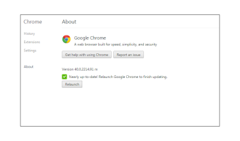

# 疑難排解 —  [!DNL Workfront Proof] 校訂檢視器

>[!IMPORTANT]
>
>本文提及獨立版產品中的功能 [!DNL Workfront Proof]. 有關內部校訂的資訊 [!DNL Adobe Workfront]，請參閱 [校訂](../../../review-and-approve-work/proofing/proofing.md).

如果您的校訂內容未載入，而您只能看到空白的校訂檢視器，則很可能是因為有某些專案在本機阻止了此動作。 嘗試下列可能的解決方案。

## 確認您的瀏覽器和 [!DNL Flash Player] 版本為最新版本

所有開發人員都會持續開發應用程式，並定期發佈產品的新功能和修正專案。 這是為了改善使用者體驗並維持安全性等級，所以最佳實務是隻使用最新版本。 這也有助於避免應用程式之間的衝突。

<!--
### [!DNL Flash Player] Plugin Version

To check your current [!DNL Flash Player] version visit the [[!DNL Adobe] website](http://www.adobe.com/software/flash/about/).

If your version number differs from the one listed for your platform go to the [[!DNL Flash Player] download page](http://get.adobe.com/flashplayer/otherversions/) and get the latest version.

Please note: we do recommend using the original [!DNL Adobe] plugin, so if your browser uses a built-in solution deactivate it and install the [!DNL Adobe] solution.
-->

### 瀏覽器版本

現今大部分的瀏覽器都會自動更新，但如果您遇到任何問題，建議您檢視所使用的版本，並視需要執行更新。

在您的瀏覽器中，前往 [!UICONTROL 選單] 並找到 [!UICONTROL 關於] 選項(在某些情況下，這可能會顯示在 [!UICONTROL 說明] 功能表)。 在 [!UICONTROL 關於] 快顯視窗會提供您目前瀏覽器版本的相關資訊，以及更新/檢查更新的選項。

請在Chrome中檢視：

一旦您擁有最新的 [!DNL Flash Player] 已安裝的外掛程式和瀏覽器版本請嘗試重新開啟您的校樣，並檢視問題是否已解決。

## 確定您的本機 [!DNL Flash] 儲存空間可供使用

我們的 [!DNL Workfront Proof] 檢視器以Flash為基礎，且我們儲存了一些關於校訂的資料(即評論、校訂圖磚、 [!DNL Workfront Proof] 檢視器設定) [!DNL Flash Player]. 如果 [!DNL Workfront Proof] 檢視器會開啟，但其中沒有任何內容，您會想要確定Flash儲存體在您的電腦上可供使用，並且 [!DNL Workfront Proof] 允許使用它。

如果配置了一些儲存空間，但您使用具有多個頁面的較大校樣，且評論會嘗試增加 [!DNL Flash] 儲存並重新載入您的校訂。

請參閱我們的 [檢視校訂的問題 —  [!DNL Flash] 說明共用物件](../../../workfront-proof/wp-tech-corner/troubleshooting/view-proof-flash-shared-object.md) 以取得詳細指示。

## 找出問題所在

* 校樣會在不同的瀏覽器中開啟嗎？
* 如果您每天使用一個瀏覽器，且無法檢視校訂，請嘗試在電腦上的不同瀏覽器中開啟相同的校訂。 若要這麼做，只要從主要瀏覽器的URL列複製校樣連結，然後貼到其他瀏覽器中即可。 如果校訂在此正常開啟，請檢閱您的主要瀏覽器設定、外掛程式和擴充功能，因為這些可能會造成干擾。
* 我們沒有任何較適合的瀏覽器，但如果您目前瀏覽器發生任何效能問題，建議您切換至其他瀏覽器。
* 校樣會在您所在位置的不同電腦上開啟嗎？
如果您的校樣未在您電腦上的任何瀏覽器中開啟，請嘗試在您所在位置和/或您所在位置之外的其他電腦上開啟校樣。 這可讓您判斷問題是否由您的特定電腦所造成，或是否由您的本機網路所造成。
如果您的安全性等級較高，您的連線將會連線至 [!DNL Workfront Proof] 封鎖者可能為：

   * 您的本機AV軟體
   * 您的網路安全性解決方案
   * DNS、防火牆或Proxy設定
   * 這些設定超出我們的控制範圍。 有多種安全性解決方案可供使用，我們無法分辨哪些解決方案已在您的網路中實作，哪些解決方案可能會封鎖連線至 [!DNL Workfront Proof]. 也不適用於 [!DNL Workfront Proof] 以決定您的內部安全性組態。 如果在您位置/網路的多部電腦上開啟校訂時發生問題，建議您連絡您的IT團隊，讓他們檢查網路設定並授權或新增 [!DNL Workfront Proof] 至允許清單（如有需要）。

* 連線到 [!DNL Workfront Proof] 您的網路是否允許？
在校訂檢視器內，我們載入圖磚 — 頁面片段。 若此內容在您的結尾未正常載入，可能是某些連線至 [!DNL Workfront Proof] 在您的網路中遭到封鎖。 請確定所有連線和來自*.proofhq.com的內容均已新增至允許清單。 您的IT團隊應能協助確認此事項。

## 檢閱外掛程式

如果您的瀏覽器和 [!DNL Flash Player] 外掛程式為最新狀態，您的網路未封鎖與的連線 [!DNL Workfront Proof] 您的瀏覽器中可能有會影響檢視校樣的問題。 現在您的瀏覽器中有多個外掛程式和擴充功能可供使用，其中有些會干擾或與其他外掛程式和擴充功能發生衝突。

最佳實務是移除所有未知的附加元件，僅保留您使用且您信任的附加元件。 每個瀏覽器都應提供選項，讓您檢查/修改/刪除外掛程式和擴充功能。 我們的 [!DNL Workfront Proof] 檢視器的基礎為 [!DNL Flash] 而且我們使用JavaScript來載入檢視器，因此您特別想要檢閱可能影響這些專案的外掛程式。

如果有任何附加元件干擾載入校樣，您可以嘗試在瀏覽器主控台中檢視詳細資訊。

在大多數較新的瀏覽器中，有一些其他可用的開發人員工具，可用於更進階的疑難排解。

如果您無法檢視校樣：

* 開啟瀏覽器的主控台，然後重新載入校訂。
* 檢查主控台中是否有任何警示或訊息。 這些詳細資訊有助於確定問題的根本原因。
* 請您的IT團隊分析結果。 他們應該能夠提出建議並幫助解決本機問題。
* 請與我們的支援團隊分享結果。 我們很樂意提供協助。

## 檢查混合內容設定

所有與的連線 [!DNL Workfront Proof] 透過HTTPS傳輸。 不過，在 [!DNL Workfront Proof] 檢視器會透過HTTP載入圖磚，並以權杖保護資料。 這會建立某些瀏覽器或安全性解決方案可能封鎖的混合內容（根據預設或根據手動設定）。

如果這就是電腦上未開啟校訂的原因（您應該可以在瀏覽器的主控台中看到相關警示），則授權此類連線 [!DNL Workfront Proof] 或是修改您的設定，以便在您的電腦上允許被動混合式內容。 您的瀏覽器、AV軟體、網路設定等可能會封鎖混合式內容 — 若要判斷確切原因，請連絡您的IT團隊/網路管理員。 他們應該還能協助在您的電腦上啟用混合式內容。

