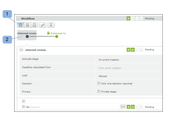

# 在 [!DNL Workfront Proof]

>[!IMPORTANT]
>
>本文說明獨立產品中的功能 [!DNL Workfront Proof]. 有關內部校對的資訊 [!DNL Adobe Workfront]，請參閱 [校對](../../../review-and-approve-work/proofing/proofing.md).

您可以在 [!UICONTROL 校樣詳細資料] 頁面。 您可以查看在每個階段上完成的工作，並修改、添加、啟動和鎖定校樣上的階段。

## 檢視自動化工作流程

您可以透過三種主要方式來檢視自動化工作流程：

* [詳細檢視階段](#view-a-stage-in-detail)
* [查看所有階段](#view-all-stages)
* [查看所有階段的詳細資訊](#view-all-stages-in-detail)

### 詳細檢視階段 {#view-a-stage-in-detail}

1. 按一下區段(1)頂端的按鈕。

   您可以使用圖表在各階段之間切換。 正在查看的舞台以灰色(2)突出顯示。

1. 要查看不同的階段，請在圖表上選擇它。

### 查看所有階段 {#view-all-stages}

要查看自動化工作流中的所有階段，請執行以下操作：

1. 按一下頁面(3)頂端的按鈕。

   「自動化工作流」的所有階段都列在區段中，但是詳細資訊會隱藏。

1. 要查看階段的詳細資訊，請按一下每個階段(4)名稱旁的加號表徵圖。

### 查看所有階段的詳細資訊 {#view-all-stages-in-detail}

要詳細查看自動化工作流的所有階段，請執行以下操作：

1. 按一下頁面(5)頂端的按鈕。

   這將顯示自動化工作流的所有階段，並展開每個階段的詳細資訊。

   您可以按一下減號圖示(6)來隱藏每個階段的詳細資訊。

## 使用自動化工作流圖

自動化的 [!UICONTROL 工作流程] 會顯示在「工作流程」區段的頂端。

要隱藏圖

1. 按一下 **[!UICONTROL 隱藏]** 按鈕(1)。

圖中的各個階段標籤如下：

 — 活動階段

 — 非活動階段\
   — 私人舞台

   — 鎖定的舞台

各級之間的線表示各級之間的依賴關係。 導向非活動階段的線段將呈虛線，直到舞台激活為止。

將滑鼠游標暫留在圖表中的某個階段上，將顯示該階段的進度。 如果舞台未處於活動狀態，並且您在舞台上具有編輯權限，則您將能夠使用 [!UICONTROL 開始階段] 按鈕。 同樣，將顯示「鎖定活動階段」選項。

若要進一步了解進度列，請參閱  [在中檢視校樣的進度和狀態 [!DNL Workfront] 校樣](../../../workfront-proof/wp-work-proofsfiles/manage-your-work/view-progress-and-status-of-proof.md).

## 新增階段

您可以從 [!UICONTROL 校樣詳細資料] 頁面。

1. 按一下 **[!UICONTROL 新階段]** 按鈕(1)。

在 **新階段** 框中，可以填入舞台詳細資訊和設定。

## 管理階段設定

在頁面詳細資訊中，您可以修改每個階段的設定（如果您有編輯權限）:

* 更改、添加或刪除階段(1)的截止時間
* 鎖定階段(2) — 如果階段處於活動狀態，將出現此選項；對於非活動階段，您將看到「開始階段」選項
* 通過行內編輯修改設定(3)
* 啟用或禁用在階段(4)上僅需要一個決策
* 更改階段的隱私(5)

您也可以將審核者從一個階段拖放到另一個階段，即可在各個階段之間移動。 可用階段將以藍色突出顯示，每個階段的拖放區域都標籤明確。

## 階段選項

此 [!UICONTROL 動作] 每個階段的菜單(1)具有以下選項：

* 全部留言(2) — 您可以向舞台上的所有審閱者發送提醒電子郵件
* 共用(3) — 您可以向舞台添加新的審閱者
* 刪除階段(4) — 如果校樣所有者位於該階段，則會要求您為其選擇新階段
