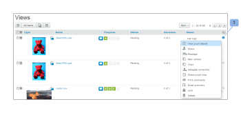

# [!DNL Workfront Proof]中檢視表索引標籤上的頁面配置

>[!IMPORTANT]
>
>本文提及獨立產品[!DNL Workfront Proof]中的功能。 有關[!DNL Adobe Workfront]內部校訂的資訊，請參閱[校訂](../../../review-and-approve-work/proofing/proofing.md)。

您可以在[!UICONTROL 檢視]標籤上調整頁面配置。 下列配置選項可供使用：

## 清單

* 顯示校樣或檔案名稱加上標準檢視欄
* [!UICONTROL 校訂動作]功能表位於行(1)的右側

  

## 縮略圖清單

* 顯示校訂影像/檔案圖示、校訂或檔案名稱加上標準檢視欄
* [!UICONTROL 校訂動作]功能表位於行(1)的右側
* 請注意，這是預設的標準檢視。

  

## 縮圖

* 僅顯示校訂影像/檔案圖示和校訂/檔案名稱
* [!UICONTROL 校訂動作]功能表位於每個校訂的右上角(1)

  

## 變更您的頁面配置

若要變更儀表板或垃圾桶頁面上的頁面配置，請按一下頁面頂端的其中一個檢視按鈕，選擇您偏好的檢視：

若要變更帳戶中其他所有檢視頁面的頁面配置，請展開頁面頂端的下拉式功能表，然後按一下您偏好的頁面配置：

