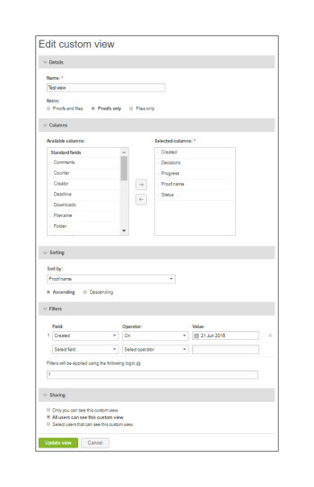

# 在中建立和管理自訂檢視 [!DNL Workfront Proof]

>[!IMPORTANT]
>
>本文說明獨立產品中的功能 [!DNL Workfront Proof]. 有關內部校對的資訊 [!DNL Adobe Workfront]，請參閱 [校對](../../../review-and-approve-work/proofing/proofing.md).

您可以建立檔案和校樣的自訂檢視，以列出您要的項目，並以您想要的顯示方式列出。 您也可以將自訂檢視中的資訊匯出為報表（以CSV、逗號分隔值、檔案格式）。

>[!NOTE]
>
>自訂檢視僅適用於Select和Premium計畫。 請聯繫我們的銷售團隊以獲取報價。

## 建立自訂檢視

建立自訂檢視時，您可以選擇：

* 是包含校樣、檔案還是兩者
* 顯示的欄
* 排序依據的欄
* 列的排序順序（升序或降序）
* 用於確定檢視中包含哪些資訊的篩選器類型

建立自訂檢視後，即可立即使用。 新視圖的名稱也包含在標題「我的自定義視圖」(My custom views)下的下拉菜單中(在「標準視圖」(Standard views)下)。

若要建立自訂檢視：

1. 前往 **[!UICONTROL 檢視]** 頁面。
1. 如需檢視的詳細資訊，請參閱 [管理中檢視頁面上的項目 [!DNL Workfront Proof]](../../../workfront-proof/wp-work-proofsfiles/manage-your-work/manage-items-on-views-page.md).
1. 根據您是否要從頭建立新的自定義視圖，或者根據現有的標準視圖建立新的自定義視圖，執行下列任一操作：

   * 要根據現有標準視圖建立新的自定義視圖，請執行以下操作：從下拉式功能表中，選取您要作為新自訂檢視基礎的現有標準檢視。 按一下 **[!UICONTROL 檢視設定]** 圖示，然後按一下 **[!UICONTROL 複製]** 新自訂檢視。

   * 

   * 要從頭建立新的自定義視圖：按一下 **[!UICONTROL 新建視圖]** 表徵圖。
   * 

1. 在 **[!UICONTROL 詳細資料]** 區段，指定下列資訊：

   * **[!UICONTROL 名稱]** （必要）:新檢視的名稱。 使用唯一名稱，讓使用者可以輕鬆在「檢視」的下拉式功能表中找到自訂檢視。
   * **[!UICONTROL 項目]**:選擇是否要將校樣和檔案、僅校樣或僅檔案都包含在視圖中。 預設會同時包含校樣和檔案。

1. 在 **[!UICONTROL 欄]** 區段中，決定要在自訂檢視中納入哪些欄。

   1. 按一下右箭頭圖示。
   1. 

   1. 按兩下所選列的名稱。
   1. 您必須至少選取一欄，且只能新增一欄。
   1. 從 **[!UICONTROL 可用欄]** 要包含在新視圖中的區域。
   1. 欄會從 **[!UICONTROL 可用欄]** 清單 **[!UICONTROL 所選列]** 清單。

   1. 您可以從標準欄中選取，或選擇「自訂」欄位和「決策原因」作為自訂檢視的欄。 （如果您的帳戶中已設定這些欄位，這些欄位會顯示在「可用」欄區的標準清單下。）
   1. 您可以包括的標準欄

      <table style="table-layout:auto">
      <thead>

      </thead>
      <tbody>  
      <tr>   
      <td><strong>活動階段名稱</strong></td>   
      <td>自動化工作流中活動階段的名稱。</td>  
      </tr>  
      <tr>   
      <td><strong>註解</strong></td>   
      <td>收到的評論數。</td>
      </tr>  
      <tr>   
      <td><strong>計數器</strong></td>
      <td>顯示已上傳至您帳戶的校樣數（您必須在「帳戶設定」中啟用校樣計數器選項）。</td>
      </tr>
      <tr>
      <td><strong>已建立</strong></td>
      <td>建立項目的日期和時間。</td>
      </tr>
      <tr>
      <td><strong>建立者</strong></td>
      <td>建立項目的使用者。</td>
      </tr>
      <tr>
      <td><strong>[!UICONTROL日期已添加到校樣]</strong></td>
      <td>將您新增至校樣的日期。 </td>
      </tr>
      <tr>
      <td><strong>期限</strong></td>
      <td>整個證明的最後期限。</td>
      </tr>
      <tr>
      <td><strong>決策</strong></td>
      <td>根據預期數量（如1的0、1的1等）作出的決定數</td>
      </tr>
      <tr>
      <td><strong>[!UICONTROL下載]</strong></td>
      <td>下載原始檔案的次數。</td>
      </tr>
      <tr>
      <td><strong>檔案名</strong></td>
      <td>檔案或校樣的名稱。</td>
      </tr>
      <tr>
      <td><strong>資料夾</strong></td>
      <td>包含項的資料夾。</td>
      </tr>
      <tr>
      <td><strong>上次活動</strong></td>
      <td>項目上最後一個活動的日期和時間。</td>
      </tr>
      <tr>
      <td><strong>最新決定</strong></td>
      <td>上次決定的日期和時間。</td>
      </tr>
      <tr>
      <td><strong>我的截止日期</strong></td>
      <td>明確新增為審核者/核准者（若已套用）的校樣，為您自己的截止日期。</td>
      </tr>
      <tr>
      <td><strong>所有者</strong></td>
      <td>項目的所有者。</td>
      </tr>
      <tr>
      <td><strong>所有者國家/地區</strong></td>
      <td>在系統中註冊的證明所有者的國家。 </td>
      </tr>
      <tr>
      <td><strong>父校樣</strong></td>
      <td>父校樣的名稱。</td>
      </tr>
      <tr>
      <td><strong>進度</strong></td>
      <td>
進度欄。 顯示尚未開始、開啟、留言或決定的校樣。

此資訊未排序。
</td>
      </tr>
      <tr>
      <td><strong>校訂名稱</strong></td>
      <td>校樣的名稱。</td>
      </tr>
      <tr>
      <td><strong>校樣類型</strong></td>
      <td>
校樣類型：靜態檔案、靜態網頁、互動式網頁（.zip上傳）、互動式網頁(https)、視訊、音訊等。 

組合校樣識別為「組合校樣類型」。 校樣的檔案類型。
</td>
      </tr>
      <tr>
      <td><strong>檔案大小(MB)</strong></td>
      <td>
校樣的檔案大小，因為它與磁碟使用配額有關。

為目前版本的校樣提供此資訊。 如果沒有最新版本，則為最新版本。
</td>
      </tr>
      <tr>
      <td>
 

<strong>活動階段截止期</strong>
</td>
      <td>自動化工作流中各階段的截止時間。</td>
      </tr>
      <tr>
      <td><strong>階段名稱</strong></td>
      <td>自動化工作流中每個階段的名稱。 這包括過去的階段、活動的階段和未來的階段。</td>
      </tr>
      <tr>
      <td><strong>狀況</strong></td>
      <td>作用中、鎖定、草稿或已提交。</td>
      </tr>
      <tr>
      <td><strong>狀態</strong></td>
      <td>「待定」、「需要更改」、「已批准且已更改」、「已批准」或「不相關」。</td>
      </tr>
      <tr>
      <td><strong>標記</strong></td>
      <td>附加至項目的任何標籤。</td>
      </tr>
      <tr>
      <td><strong>即將推出的階段名稱</strong></td>
      <td> 尚未在自動化工作流中啟動的每個階段的名稱。 </td>
      </tr>
      <tr>
      <td><strong>版本計數器</strong></td>
      <td> 項目的版本數。 </td>
      </tr>
      <tr>
      <td><strong>校樣版本號</strong></td>
      <td><i>校樣的版本號。</i></td>
      </tr> 
      </tbody>
      </table>

   1. （選用）執行下列任一操作，將欄移至 **[!UICONTROL 所選列]** 區域，以將其納入新檢視中：

      * 重新排序 **[!UICONTROL 所選列]** 清單。
      * 在 **[!UICONTROL 所選列]** 清單決定欄在自訂檢視中的顯示順序。
      * 欄會顯示在 **[!UICONTROL 所選列]** 清單，依您從 **[!UICONTROL 可用欄]** 清單。

      * 若要重新排序 **[!UICONTROL 所選列]** 清單中，選擇列的名稱，並將其拖動到清單中上下。

      * 從 **[!UICONTROL 所選列]** 清單，按一下所選欄的名稱，然後按一下 **[!UICONTROL Left]** 箭頭。 或者，您也可以連按兩下所選欄的名稱(欄會移回 **[!UICONTROL 可用欄]** 清單)。

      * 欄只能新增一次。 例如，如果您將「注釋」欄從 [!UICONTROL 可用] to [!UICONTROL 所選列] 清單中，此列的名稱將從 [!UICONTROL 可用欄] 清單。

1. 在 **[!UICONTROL 排序]** 區段，指定下列資訊：

   * **排序依據：** 使用 [!UICONTROL 排序] 頁簽。 如果不選擇排序列，預設值為「無列」，即不選擇特殊排序列或順序。
   * 僅限您在 [!UICONTROL 欄] 標籤 [!UICONTROL 按列排序] 下拉式清單。
   * **遞增或遞減：** 選取您要依預設遞增或遞減排序欄。

1. 使用 **[!UICONTROL 篩選器]** 區段來定義一或多個條件，以選取要包含在自訂檢視中的項目。 如果您想要使用自訂檢視作為報表，篩選器特別實用。
1. 若要在自訂檢視中包含所有項目，請略過 **[!UICONTROL 篩選器]** 區段。
1. 可用篩選器：

   * **欄位：** 選擇此篩選器的欄位（預設欄位為「注釋」）。 欄位清單包含所有標準欄位(如 [!UICONTROL 欄] 標籤)。 清單不限於您為顯示而選擇的列。
   * **運算子：** 篩選器可用的運算子取決於所選欄位的類型。 選擇一個運算子，該運算子顯示欄位和值欄位之間的關係。 您稍後會填寫此資訊。
   * **值：** 根據您選取的欄位和運算子，在此欄位中選取或輸入您選取的值。 視您選擇的運算子而定，可能會有一個值欄位、兩個或無。 請參閱下列範例。
   * **篩選器會使用下列邏輯套用：** 在不同欄位之間篩選條件將使用AND運算子。 使用相同欄位的多個篩選條件將對相同欄位使用OR運算子。

      如果您只想查看帶有零注釋的校樣，請選取下列值：

      * 欄位：註解
      * 運算子：等於
      * 值欄位：0

      如果只想查看包含兩個或多個注釋的校樣，請選取以下值：

      * 欄位：註解
      * 運算子：大於或等於
      * 值欄位：2

      如果您只想查看包含1到4個註解的校樣，請選取下列值：

      * 欄位：註解
      * 運算子：介於
      * 值欄位（第一個欄位）:1
      * 值欄位（第二個欄位）:4

         您可以變更已新增至自訂檢視的篩選器，而不會有任何問題，或按一下 [!UICONTROL 設定] 視需要篩選。

         因為欄位清單不限於您在 [!UICONTROL 欄] 標籤，請謹慎建立篩選器，其中包含您未選取要在自訂檢視中顯示的欄。 例如，檢視的下列篩選器將選取版本計數值為2或以上的所有校樣：

         * 欄位=版本計數器
         * 運算子=大於或等於
         * 值欄位= 2

            >[!NOTE]
            >
            >您可以變更已新增至自訂檢視的篩選器，而不會有任何問題，或按一下 [!UICONTROL 設定] 視需要篩選。

1. 在 **[!UICONTROL 共用]** 區段中，選取您帳戶中哪些使用者將能看到您的自訂檢視。
1. 自訂檢視是建立檢視的使用者專屬。 依預設，新的「自訂」檢視只會對其建立者顯示；不過，您可以選擇下列其中一個選項，以共用自訂檢視：

   * **只有您可以看到此自訂檢視** （預設）:如果您希望自訂檢視僅供您使用，請選取此選項。
   * **所有使用者都可以看到此自訂檢視**:選取此選項，讓帳戶上的所有使用者都能使用自訂檢視。
   * **選擇可查看此自定義視圖的用戶**:選取此選項，使自訂檢視僅供特定使用者使用。
   * 開始輸入您要存取自訂檢視之使用者的名稱或電子郵件地址，然後在下拉式清單中出現時按一下名稱。
   * 如果您選擇此時不與其他使用者共用檢視，您稍後可以編輯自訂檢視來共用。

1. 按一下 **[!UICONTROL 建立]**。
1. 「自訂」檢視隨即顯示，可在 [!DNL Views] 頁面。 如需檢視的詳細資訊，請參閱 [管理 [!DNL Views] 頁面 [!DNL Workfront Proof]](../../../workfront-proof/wp-work-proofsfiles/manage-your-work/manage-items-on-views-page.md).

## 編輯自訂檢視

您可以輕鬆編輯自訂檢視。 若要編輯自訂檢視：

1. 前往 **[!UICONTROL 檢視]** 頁面。\
   如需檢視的詳細資訊，請參閱 [管理中檢視頁面上的項目 [!DNL Workfront Proof]](../../../workfront-proof/wp-work-proofsfiles/manage-your-work/manage-items-on-views-page.md).

1. 按一下 [!UICONTROL 檢視] 按鈕(1)
1. 從下拉式選單中選取您要編輯的檢視。\
   

1. 按一下 **[!UICONTROL 檢視選項]** 按鈕，然後按一下 **[!UICONTROL 編輯檢視]**.\
   \
   此時將顯示「編輯自定義視圖」頁。

1. 按一下 [!UICONTROL 動作] 功能表。 (3)\
   只有在檢視中包含「校樣名稱」欄時，此按鈕才可用。
1. 選擇 [!UICONTROL 編輯檢視] 的上界。 (4) \
   

1. 此時將顯示「編輯自定義視圖」頁。

>[!NOTE]
>
>如果您編輯「自訂」檢視，「選取的欄」清單中的欄會自動以字母順序排列。 在更新檢視之前，您需要視需要重新排列它們。

## 複製自訂檢視

「複製」檢視功能可讓您輕鬆製作現有自訂檢視的復本。 例如，如果您想要為所有設計人員設定單獨的視圖，每個視圖都是相同的，但校樣所有者（設計人員）除外。

若要複製自訂檢視：

1. 前往 **[!UICONTROL 檢視]** 頁面。\
   如需檢視的詳細資訊，請參閱 [管理中檢視頁面上的項目 [!DNL Workfront Proof]](../../../workfront-proof/wp-work-proofsfiles/manage-your-work/manage-items-on-views-page.md).

1. 按一下 **[!UICONTROL 檢視]** 按鈕。 (1)
1. 從清單中選取您的自訂檢視。 (2)
1. 按一下 **[!UICONTROL 動作]** 功能表。 (3)\
   只有在檢視中包含「校樣名稱」欄時，此按鈕才可用。

1. 選擇 [!UICONTROL 複製] 的上界。 (4)\
   

1. 在「複製自訂檢視」頁面中，會填入所有原始設定。 根據您的選擇修改自訂檢視，然後按一下 **[!UICONTROL 複製視圖]** 按鈕。 系統會立即帶您查看新視圖。\
   

## 共用自訂檢視

如果您尚未在「共用」區段上為檢視選取檢視，則「共用」檢視功能可讓您與帳戶中的其他使用者共用檢視。 當您與其他使用者共用自訂檢視時，該檢視會顯示在其中 [!UICONTROL 我的自訂檢視] 區段。

要與其他用戶共用自定義視圖：

1. 前往 **[!UICONTROL 檢視]** 頁面。\
   如需檢視的詳細資訊，請參閱 [管理中檢視頁面上的項目 [!DNL Workfront Proof]](../../../workfront-proof/wp-work-proofsfiles/manage-your-work/manage-items-on-views-page.md).

1. 按一下 **[!UICONTROL 檢視]** 按鈕(1)
1. 從清單中選取自訂檢視(2)
1. 按一下 **[!UICONTROL 動作]** 功能表。 (3)\
   只有在檢視中包含「校樣名稱」欄時，此按鈕才可用。

1. 選擇 [!UICONTROL 共用檢視] 從菜單(4)
1. 將出現「編輯自訂檢視」頁面。
1. 在 [!UICONTROL 共用] 選取您要與共用檢視的使用者，然後按一下 **[!UICONTROL 更新視圖]**.

   

## 將自訂檢視匯出為CSV檔案

若要將資料從自訂檢視匯出為CSV檔案：

1. 前往 **[!UICONTROL 檢視]** 頁面。\
   如需檢視的詳細資訊，請參閱 [管理中檢視頁面上的項目 [!DNL Workfront Proof]](../../../workfront-proof/wp-work-proofsfiles/manage-your-work/manage-items-on-views-page.md).

1. 按一下 **[!UICONTROL 檢視]** 按鈕。 (1)
1. 從清單中選取您的自訂檢視。 (2)
1. 按一下 **[!UICONTROL 動作]** 功能表。 (3)\
   只有在檢視中包含「校樣名稱」欄時，此按鈕才可用。

1. 選擇 [!UICONTROL 匯出至CSV] 的上界。 (4)\
   \
   在單獨的瀏覽器窗口中，「生成報表：「100%」加上記錄數（自訂檢視中報表包含的項目數）

1. （條件性）如果出現安全性訊息，指出報表下載目前遭到封鎖，請按一下「 」以允許下載繼續。
1. 按一下 **[!UICONTROL 儲存]** 當出現「File Download（檔案下載）」窗口時，詢問您是否要開啟或保存該檔案。
1. 在電腦上選取位置並儲存檔案。

## 刪除自訂檢視

您可以輕鬆刪除自訂檢視。 要執行此操作：

1. 前往 **[!UICONTROL 檢視]** 頁面。\
   如需檢視的詳細資訊，請參閱 [管理中檢視頁面上的項目 [!DNL Workfront Proof]](../../../workfront-proof/wp-work-proofsfiles/manage-your-work/manage-items-on-views-page.md).

1. 按一下 **[!UICONTROL 檢視]** 按鈕。
1. 從清單中選取自訂檢視
1. 按一下 **[!UICONTROL 動作]** 功能表。 (3)\
   只有在檢視中包含「校樣名稱」欄時，此按鈕才可用。

1. 選擇 [!UICONTROL 刪除] 的上界。 (4)\
   

1. 按一下 **[!UICONTROL 刪除]** (5)確認您要刪除目前的自訂檢視\
   

1. 預設的「所有項目」檢視隨即顯示，而您刪除的自訂檢視不再顯示於 **[!UICONTROL 檢視]** 下拉式功能表。
