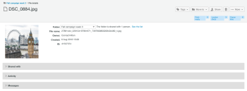

# 管理[!DNL Workfront Proof]中的檔案

>[!IMPORTANT]
>
>本文提及獨立產品[!DNL Workfront Proof]中的功能。 有關[!DNL Adobe Workfront]內部校訂的資訊，請參閱[校訂](../../../review-and-approve-work/proofing/proofing.md)。

您可以管理、共用和檢視有關已上傳至Workfront Proof的檔案（非校樣）的資訊（請參閱[將檔案和網頁內容上傳至 [!DNL Workfront Proof]](../../../workfront-proof/wp-work-proofsfiles/create-proofs-and-files/upload-files-web-content.md)）。

1. 按一下左側導覽面板中&#x200B;**[!UICONTROL 檢視]**&#x200B;右側的向下箭頭，然後在下拉式功能表中按一下&#x200B;**[!UICONTROL 檔案]**。

1. 按一下檔案的&#x200B;**[!UICONTROL 更多]**&#x200B;按鈕，然後在出現的功能表中按一下&#x200B;**[!UICONTROL 檢視檔案詳細資料]**。\
   \
   您可以在出現的視窗中檢視和編輯檔案的詳細資訊。 例如，您可以變更視窗頂端的檔案名稱、儲存檔案的[!DNL Workfront Proof] **資料夾**，以及檔案的&#x200B;**所有者**。\
   

1. （可選）如果您擁有檔案的編輯許可權，請使用右上角的動作按鈕來管理和共用檔案：

* **[!UICONTROL 標籤]**。 管理套用至檔案的標籤。\
   \
   在動作按鈕下方，您可以檢視套用至檔案的任何標籤。 您可以按一下標籤旁邊的x來移除不想要的標籤。\
   

* **[!UICONTROL 移至]**。 將您的檔案組織到資料夾中。 您可以在現有的資料夾之間移動檔案，或將檔案放在新的資料夾中。\
   

* **[!UICONTROL 共用]**。 與其他人共用檔案。 [!DNL Workfront Proof]傳送包含自訂訊息和下載連結的電子郵件通知給收件者。\
   

* **[!UICONTROL 垃圾桶]**。 您可以將檔案移至垃圾桶來刪除檔案。 請注意，在清空垃圾桶之前，檔案將會計入您的儲存空間限制中（請參閱[還原並清空垃圾桶 [!DNL Workfront Proof]](../../../workfront-proof/wp-work-proofsfiles/manage-your-work/restore-and-empty-trash.md)）。\
   

* **[!UICONTROL 更多]**。 在此下拉式清單中，您可以按一下&#x200B;**[!UICONTROL 轉換為校訂]**&#x200B;以建立檔案的校訂（請參閱[在 [!DNL Workfront Proof]](../../../workfront-proof/wp-work-proofsfiles/create-proofs-and-files/generate-proofs.md)中產生校訂）。 檔案必須符合我們校訂的檔案型別要求（請參閱[支援的校訂檔案型別和大小限制概觀](../../../review-and-approve-work/proofing/proofing-overview/supported-proofing-file-types.md)）。 如果檔案的名稱符合現有校訂的名稱，[!DNL Workfront Proof]將顯示一則訊息，其中包含可讓您將檔案轉換為該校訂的&#x200B;**[!UICONTROL 新版本]**&#x200B;的連結（請參閱）。\
   

  >[!TIP]
  >
  >針對從其他[!DNL Workfront Proof]帳戶共用（且未上傳至您自己的帳戶）的檔案，僅可在企業計畫上轉換。

  您也可以按一下[下載&#x200B;****]，將原始檔案下載到您的電腦。

1. （選擇性）開啟&#x200B;**[!UICONTROL 共用給]**&#x200B;區段以列出共用該檔案的使用者。

   您可以使用右側的&#x200B;**[!UICONTROL 更多]**&#x200B;圖示，來&#x200B;**[!UICONTROL 訊息]**&#x200B;或&#x200B;**[!UICONTROL 移除]**&#x200B;使用者。

   

   如果您選擇傳送訊息給其中一個使用者，就會顯示&#x200B;**[!DNL Message all]**&#x200B;頁面，您可以在此同時傳送多則訊息。

1. 開啟&#x200B;**[!UICONTROL 活動]**&#x200B;區段以列出檔案上的所有活動，包括時間、日期和執行動作的人員。 活動包括：

   * 檔案已上傳
   * 新增人員
   * 人員已移除
   * 檔案已下載

1. 開啟&#x200B;**[!UICONTROL 訊息]**&#x200B;區段，以追蹤使用者與檔案關聯傳送的訊息。 您可以按一下右側的「i」圖示來檢視訊息內容。
