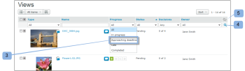

# 管理 [!UICONTROL 檢視] 頁面 [!DNL Workfront Proof]

>[!IMPORTANT]
>
>本文說明獨立產品中的功能 [!DNL Workfront Proof]. 有關內部校對的資訊 [!DNL Adobe Workfront]，請參閱 [校對](../../../review-and-approve-work/proofing/proofing.md).

此 [!UICONTROL 檢視] 頁面可讓您在同一處查看和使用所有校樣、檔案和資料夾。

## 顯示 [!UICONTROL 檢視] 頁面

1. 按一下 **[!UICONTROL 檢視]** 在左側邊欄。
1. 從下拉式功能表(2)中，按一下您要檢視的檢視(3)。

## 變更 [!UICONTROL 檢視] 頁面配置

預設 [!UICONTROL 檢視] 頁面版面是「縮圖」清單。 在此版面中，您可以看到每個校樣、檔案（如果可能）和資料夾（如果已設定）的縮微影像，其他詳細資訊會包含在個別欄中。

1. 按一下 **[!UICONTROL 頁面配置]** 圖示(1)，然後選擇想要的版面。

## 變更 [!UICONTROL 檢視] 清單

若要變更您在 [!UICONTROL 檢視] 清單：

1. 按一下 **[!UICONTROL 更改視圖]** 按鈕。\
   此按鈕上顯示的名稱取決於您上次使用時選取的檢視。\
   

1. 在下拉式功能表中按一下不同的檢視：

   * **[!UICONTROL 所有項目]**:包含您有權查看的所有校樣、檔案和資料夾。 這是您開啟 [!UICONTROL 檢視] 頁面。 您可以選擇在此檢視中包含/排除已封存的校樣。
   * **[!UICONTROL 作用中項目]**:所有活動校樣、檔案和資料夾。
   * **[!UICONTROL 作用中校樣]**:您有權查看的所有使用中（未封存）校樣。
   * **[!UICONTROL 鎖定的校樣]**:僅鎖定校樣。
   * **[!UICONTROL 封存的校樣]**:僅封存校樣(請參閱 [封存於 [!DNL Workfront Proof]](../../../workfront-proof/wp-work-proofsfiles/organize-your-work/archive.md))。

   * **[!UICONTROL 我的校樣]**:僅顯示您是擁有者且委派給您的校樣。 如需詳細資訊，請參閱 [在中指定臨時校樣所有者 [!DNL Workfront Proof]](../../../workfront-proof/wp-getstarted/personal-settings/designate-temp-proof-owners.md).

   * **[!UICONTROL 等待決策的證明]**:只顯示必須做出決定的證明
   * **[!UICONTROL 延遲校樣]**:僅顯示截止日期已過的證明
   * **[!UICONTROL 檔案]**:僅顯示檔案
   在這些檢視中，會包含下列欄

   * **類型**:項的表徵圖，帶有校樣、檔案或資料夾表徵圖
   * **名稱**:校樣、檔案或資料夾的名稱
   * **進度**:S=Sent, O=Opend, C=Comment, D=Decision（請參閱進度列）
   * **狀態**: [!UICONTROL 待定，需要更改，已批准]
   * **決策**:作出的決定數和所需數量
   * **擁有者**:擁有校樣的人的姓名\

      我的校樣、等待決策的校樣和延遲校樣檢視有另一欄，稱為「我的截止日期」。 此欄會針對明確新增為審核者/核准者的校樣顯示您自己的截止日期。

      >[!NOTE]
      >
      >如果您離開「檢視」頁面，並在稍後的同一工作階段返回，則會顯示您最後選取的檢視。

      您也可以建立自己的檢視。 請參閱 [在中建立和管理自訂檢視 [!DNL Workfront Proof]](../../../workfront-proof/wp-work-proofsfiles/manage-your-work/create-and-manage-custom-views.md) 以取得更多資訊。

## 篩選項目

您可以篩選檢視中列出的資訊。

1. 按一下 **顯示篩選器** 圖示(1)。\
   

1. 篩選條(2)隨即出現，且每個類別都有篩選下拉式選單(3)，以選取您的偏好值。 每個類別的預設值為「全部」。
1. 篩選條不會顯示在您建立的自訂檢視中。 對於這些檢視，您可以在 [!UICONTROL 篩選器] 標籤。 如需詳細資訊，請參閱 [在中建立和管理自訂檢視 [!DNL Workfront Proof]](../../../workfront-proof/wp-work-proofsfiles/manage-your-work/create-and-manage-custom-views.md).
1. 若要套用所有選取的篩選，請按一下 [!UICONTROL 篩選] 表徵圖(4)。\
   

您選取的篩選值會保持有效，直到您變更為止。 如果您想再次查看並存取項目的完整清單，您必須將所有篩選值變回預設值，即 **[!UICONTROL 全部]**.

>[!NOTE]
>
>如果您設定了篩選選項，然後按一下 [!UICONTROL 隱藏篩選器] 表徵圖(5)，如果更改視圖，則欄會自動再次顯示。 如果您在所有篩選器都設為預設的全部選項時隱藏篩選條，則在變更檢視時，篩選條會保持隱藏狀態。

## 排序項目

建立新校樣（或版本）或上傳新檔案時，檔案會顯示在您的 [!UICONTROL 所有項目] 清單。 最舊的項目會顯示在清單底部。

要按不同的排序順序查看清單，請執行以下操作：

1. 執行下列任一項作業：

   * 按一下清單中的其中一個欄標題：類型、名稱、狀態、決策或擁有者。\

      例如，如果您想要以字母順序查看校樣/檔案，請按一下「名稱」標題一次(1)，以遞增順序(A - Z)依名稱排序清單。\
      您可以再按一下校樣名稱標題(2)來反轉順序，並以遞減順序(Z - A)顯示校樣。

   * 按一下 [!UICONTROL 檢視] 頁面，按建立日期（最新或最舊）或類型、名稱、狀態、決策或擁有者排序。\

      \
      如果欄的升序排序，欄標題在欄名稱旁會顯示向上箭頭。 若要反轉順序（以降序），請按一下相關欄標題（這會在欄名稱旁顯示向下箭頭）。

   * 您只會在保留在「所有項目」頁面上時，才對項目的排序順序所進行的變更。 如果您從「所有項目」頁面導覽離開，稍後返回，則項目會以預設的反向時間順序再次列出。

## 查看校樣摘要

若要檢視有關校樣的更詳細資訊：

1. 按一下校樣影像左側的箭頭。\
   箭頭向下指向，「校樣」摘要會顯示在校樣的基本資訊下方。 校樣摘要顯示：

   * **校樣摘要**:校樣的總體狀態
   * **階段**:指明證明的截止日期和作出和要求的決定數
   * **審核者**:將列出每個審閱者的名稱、角色和進度
   * **版本**:正在檢視的校樣版本和可用的版本總數
   * **資料夾**:校樣所在的資料夾
   * **狀態**:作用中、鎖定、草稿或已提交

1. （選用）如果您對校樣具有編輯權限，而校樣具有階段，請按一下 **[!UICONTROL 更多]** （三個圓點）功能表，以存取下列選項：

   * **[!UICONTROL 全部消息]**:向舞台上的所有審核者發送電子郵件。
   * **[!UICONTROL 共用]**:新增審核者
   * **[!UICONTROL 刪除階段]**

1. （可選）按一下審核者的 **[!UICONTROL 更多]** （三個圓點）功能表，以執行下列任一操作：

   * 向審核者發送提醒消息。
   * 編輯校樣上的審核者設定。\

      出現的「編輯審閱者」框，您不僅可以更改角色和電子郵件警報，還可以更改審閱者的「顯示名稱」。 請注意，「顯示名稱」只能在特定校樣上更改，不能在「聯繫人」頁中審閱者的詳細資訊中更改。 請參閱 [聯繫人](https://support.workfront.com/hc/en-us/sections/115000920808-Contacts) 以取得更多資訊。

   * 選擇要作為校樣主要決策者的審核者。
   * 從校樣中刪除審核者。
   * 您也可以變更新增至校樣之審核者的角色和電子郵件警報。

## 包含和排除封存的校樣

此 [!UICONTROL 所有項目] 依預設，檢視會顯示所有使用中和鎖定的校樣、檔案和資料夾。 也提供在檢視中包含或排除已封存校樣的選項。\
若要包含封存的校樣：

1. 選擇視圖時，按一下 **[!UICONTROL 包含封存的校樣]**.\
   \
   封存的校樣會以封存圖示顯示，以便與其他校樣區分。\
   

## 從清單檢視開啟項目

1. 執行下列任一項作業：

   * 要查看校樣、檔案或資料夾的詳細資訊，請按一下其名稱。
   * 若要在校對檢視器中開啟校樣，請按一下 **[!UICONTROL 前往校樣]**.\

      如需校對檢視器的相關資訊，請參閱 [檢閱證明](../../../review-and-approve-work/proofing/reviewing-proofs-within-workfront/review-a-proof/review-a-proof.md).

## 對多個項目執行動作

要選擇多個項目：

1. 按一下清單上方的核取方塊。\
   

1. 在「視圖」(Views)清單上方顯示的額外選項中，對您選擇的檔案執行以下任一操作：

   * 按一下 **[!UICONTROL 標籤]** 來為這些項目新增標籤。
   * 按一下 **[!UICONTROL 移至]** 要將選定項移動到其他資料夾(或者，如果選擇「（未選擇資料夾）」，則將項移出資料夾。
   * 按一下 **[!UICONTROL 共用所選項目]** 與其他審閱者共用這些項目。

      

   * 按一下 **[!UICONTROL 刪除]** 將所選項目移至垃圾桶。

      

   * 按一下 **[!UICONTROL 更多]** 功能表取得其他可用動作。

   * 這些動作只會套用至具有特定選項的所選項目。 例如，如果您選取檔案和校樣，然後選擇 [!UICONTROL 鎖定]，則只會鎖定校樣（因為您無法鎖定檔案）

## 將項目移至資料夾

如果您有編輯權限，可以將校樣、檔案和資料夾移至 [!UICONTROL 檢視] 頁面。

1. 按一下最上方資料夾左側的箭頭，開啟側欄中的資料夾樹狀結構。
1. 執行下列任一項作業：

   * 要移動一個項目，請按一下並按住它，將其拖放到要放置的資料夾中。
   * 若要同時移動多個項目，您可以選取項目左側的核取方塊，然後按一下**[!UICONTROL 移至]**在清單上方，然後選取要放置它們的資料夾，或為它們建立新資料夾。
