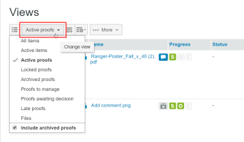

# 在[!DNL Workfront Proof]中管理[!UICONTROL 檢視]頁面上的專案

>[!IMPORTANT]
>
>本文提及獨立產品[!DNL Workfront Proof]中的功能。 有關[!DNL Adobe Workfront]內部校訂的資訊，請參閱[校訂](../../../review-and-approve-work/proofing/proofing.md)。

[!UICONTROL 檢視]頁面可讓您在一個位置檢視和使用所有校樣、檔案和資料夾。

## 顯示[!UICONTROL 檢視]頁面

1. 按一下左側邊欄中的&#x200B;**[!UICONTROL 檢視]**。
1. 從下拉式功能表(2)中，按一下您要檢視的檢視(3)。

## 變更[!UICONTROL 檢視]頁面配置

預設的[!UICONTROL 檢視]頁面配置為「縮圖」清單。 在此版面中，您可以看到每個校樣、檔案（如果可能產生）和資料夾（如果設定）的縮圖影像，其他詳細資訊包含在單獨的欄中。

1. 按一下&#x200B;**[!UICONTROL 頁面配置]**&#x200B;圖示(1)，然後選擇您想要的配置。

## 正在變更[!UICONTROL 檢視]清單

若要變更您在[!UICONTROL 檢視]清單中看到的內容：

1. 按一下&#x200B;**[!UICONTROL 變更檢視]**&#x200B;按鈕。\
   此按鈕上顯示的名稱取決於您上次使用它時選取的檢視。\
   

1. 在下拉式功能表中按一下其他檢視：

   * **[!UICONTROL 所有專案]**：包含您有權檢視的所有校樣、檔案和資料夾。 這是您開啟[!UICONTROL 檢視]頁面的預設值。 您可以選擇在此檢視中包含/排除封存的校樣。
   * **[!UICONTROL 使用中的專案]**：所有使用中的校樣、檔案和資料夾。
   * **[!UICONTROL 使用中的校訂]**：您有權檢視的所有使用中（未封存）校訂。
   * **[!UICONTROL 鎖定的校訂]**：僅鎖定的校訂。
   * **[!UICONTROL 封存的校訂]**：僅封存的校訂（請參閱[封存於 [!DNL Workfront Proof]](../../../workfront-proof/wp-work-proofsfiles/organize-your-work/archive.md)）。

   * **[!UICONTROL 我的校訂]**：僅顯示您是擁有者且委派給您的校訂。 如需詳細資訊，請參閱[在 [!DNL Workfront Proof]](../../../workfront-proof/wp-getstarted/personal-settings/designate-temp-proof-owners.md)中指定暫存校訂擁有者。

   * **[!UICONTROL 等待決定的校訂]**：僅顯示您必須決策的校訂
   * **[!UICONTROL 延遲校訂]**：僅顯示截止日期已過的校訂
   * **[!UICONTROL 檔案]**：僅顯示檔案

   這些檢視中都包含下列欄

   * **型別**：專案圖示及校樣、檔案或資料夾圖示
   * **名稱**：校訂、檔案或資料夾的名稱
   * **進度**： S=已傳送，O=已開啟，C=註解，D=決定（請參閱進度列）
   * **狀態**： [!UICONTROL 擱置中，需要變更，已核准]
   * **決定**：已作出的決定數目和所需的數目
   * **擁有者**：擁有證明的人員姓名\

     我的校訂、等待決策的校訂和延遲校訂檢視還有一個稱為我的截止日期的欄。 此欄會在您明確新增為檢閱者/核准者的校樣上顯示您自己的截止日期。

     >[!NOTE]
     >
     >如果您離開「檢視」頁面，並於稍後在相同作業階段中返回該頁面，則會顯示您最後選取的檢視。

     您也可以建立自己的檢視。 如需詳細資訊，請參閱[在 [!DNL Workfront Proof]](../../../workfront-proof/wp-work-proofsfiles/manage-your-work/create-and-manage-custom-views.md)中建立及管理自訂檢視。

## 篩選專案

您可以篩選檢視中列出的資訊。

1. 按一下頁面右上方的&#x200B;**顯示篩選器**&#x200B;圖示(1)。\
   

1. 篩選列(2)隨即出現，每個類別都有一個篩選下拉式功能表(3)，可選取您偏好的值。 每個類別的預設值為「全部」。
1. 篩選列不會顯示在您建立的自訂檢視中。 對於這些檢視，您可以在[!UICONTROL 篩選器]索引標籤中套用及編輯篩選器。 如需詳細資訊，請參閱[在 [!DNL Workfront Proof]](../../../workfront-proof/wp-work-proofsfiles/manage-your-work/create-and-manage-custom-views.md)中建立和管理自訂檢視。
1. 若要套用所有選取的篩選器，請按一下篩選列結尾的[!UICONTROL 篩選器]圖示(4)。\
   

您選取的「篩選」值會維持有效，直到您變更它們為止。 如果您想要再次檢視並存取完整的專案清單，您必須將所有篩選值變更回預設值&#x200B;**[!UICONTROL 全部]**。

>[!NOTE]
>
>如果您設定篩選選項，然後按一下[!UICONTROL 隱藏篩選器]圖示(5)來隱藏篩選列，如果您變更檢視，該列會自動再次顯示。 如果您在所有篩選都設定為預設的「全部」選項時隱藏篩選列，則變更檢視時篩選列會保持隱藏狀態。

## 排序專案

當您建立新校訂（或版本）或上傳新檔案時，它會出現在[!UICONTROL 所有專案]清單的頂端。 最舊的專案會出現在清單底部。

若要以不同的排序順序檢視清單：

1. 執行下列其中一項：

   * 按一下清單中的其中一個欄標題：「型別」、「名稱」、「狀態」、「決定」或「擁有者」。\

     例如，如果您想要依字母順序檢視校樣/檔案，請按一下「名稱」標題一次(1)，以依名稱遞增順序排序清單(A - Z)。\
      您可以再次按一下校樣名稱標題(2)來反轉順序並按降序顯示校樣(Z - A)。

   * 按一下[!UICONTROL 檢視]頁面右上角的向下箭頭，可依建立日期（最新或最舊）或型別、名稱、狀態、決定或擁有者來排序。\

     \
      如果欄以升序排序，欄標題會在欄名稱旁邊顯示向上箭頭。 若要反轉順序（降序），請按一下相關的欄標題（這會在欄名稱旁邊顯示向下箭頭）。

   * 您對專案排序順序所做的變更，只有在您留在「所有專案」頁面時才會生效。 如果您離開「所有專案」頁面並在稍後返回，這些專案會以預設的反向時間順序列出。

## 檢視校訂摘要

若要檢視校訂的詳細資訊：

1. 按一下校樣影像左側的箭頭。\
   箭頭向下指向，校樣摘要顯示在有關校樣的基本資訊下方。 證明摘要顯示：

   * **校訂摘要**：校訂的整體狀態
   * **階段**：表示證明截止日期以及已做出和需要決定的數量
   * **檢閱者**：將列出每個檢閱者的名稱、角色和進度
   * **版本**：正在檢視的校訂版本和可用的版本總數
   * **資料夾**：校訂所在的資料夾
   * **狀態**：作用中、已鎖定、草稿或已提交

1. （選擇性）如果您擁有校訂的編輯許可權且校訂有階段，請按一下階段右側的&#x200B;**[!UICONTROL 更多]** （三點）功能表以存取下列選項：

   * **[!UICONTROL 傳送訊息給所有人]**：傳送電子郵件給舞台上的所有檢閱者。
   * **[!UICONTROL 共用]**：新增檢閱者
   * **[!UICONTROL 刪除階段]**

1. （選擇性）按一下檢閱者名稱右側的&#x200B;**[!UICONTROL 更多]** （三個點）功能表，以執行下列任一動作：

   * 傳送提醒訊息給檢閱者。
   * 編輯校樣上檢閱者的設定。\

     顯示的「編輯稽核者」方塊不僅可變更角色和電子郵件警示，還可變更稽核者的「顯示名稱」。 請注意，顯示名稱只能在特定校訂上變更，不能在聯絡人頁面的檢閱者詳細資訊中變更。 如需詳細資訊，請參閱[連絡人](https://support.workfront.com/hc/en-us/sections/115000920808-Contacts)。

   * 選取校訂上要作為主要決策者的檢閱者。
   * 從校訂中刪除檢閱者。
   * 您也可以為新增到校訂的檢閱者變更角色和電子郵件警示。

## 包含和排除封存的校樣

依預設，[!UICONTROL 所有專案]檢視會顯示所有使用中和鎖定的校樣、檔案和資料夾。 它還提供在檢視中包含或排除已封存校樣的選項。\
若要包含封存的校樣：

1. 當您選擇檢視時，請按一下&#x200B;**[!UICONTROL 包含封存的校樣]**。\
   \
   封存的校訂將以封存的圖示顯示，以與其他校訂區分開來。\
   

## 從清單檢視開啟專案

1. 執行下列其中一項：

   * 若要檢視校樣、檔案或資料夾的詳細資訊，請按一下其名稱。
   * 若要在校訂檢視器中開啟校訂，請按一下&#x200B;**[!UICONTROL 前往校訂]**。\

     如需校訂檢視器的相關資訊，請參閱[檢閱校訂](../../../review-and-approve-work/proofing/reviewing-proofs-within-workfront/review-a-proof/review-a-proof.md)。

## 對多個專案執行動作

若要選取多個專案：

1. 按一下清單上方的核取方塊。\
   

1. 在「檢視」清單上方顯示的額外選項中，對您選取的檔案執行下列任一動作：

   * 按一下&#x200B;**[!UICONTROL 標籤]**&#x200B;以新增標籤至這些專案。
   * 按一下&#x200B;**[!UICONTROL 移至]**，將選取的專案移至其他資料夾(或若您選取（未選取資料夾），將專案移出資料夾。
   * 按一下「共用選取的專案」**&#x200B;**&#x200B;以與其他檢閱者共用所有這些專案。\

     

   * 按一下&#x200B;**[!UICONTROL 刪除]**&#x200B;將選取的專案移至垃圾桶。\

     

   * 按一下&#x200B;**[!UICONTROL 更多]**&#x200B;功能表以取得其他可用的動作。

   * 動作只會套用至具有特定可用選項的選取專案。 例如，如果您選取檔案和校樣，並選擇[!UICONTROL 鎖定]，則只會鎖定校樣（因為您無法鎖定檔案）

## 將專案移至資料夾

如果您有編輯許可權，可以將校樣、檔案和資料夾移動到[!UICONTROL 檢視]頁面上的特定資料夾。

1. 按一下最上方資料夾左側的箭頭，在側欄中開啟資料夾樹狀結構。
1. 執行下列其中一項：

   * 若要移動一個專案，請按住該專案，將其拖放到您要放置它的資料夾。
   * 若要同時移動多個專案，您可以選取專案左邊的核取方塊，然後按一下清單上方的&#x200B;**[!UICONTROL 移至]**，然後選取您要放置專案的資料夾，或為其建立新資料夾。
