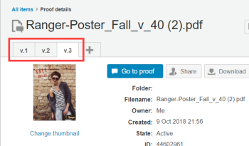

# 在中管理校樣版本 [!DNL Workfront Proof]

>[!IMPORTANT]
>
>本文說明獨立產品中的功能 [!DNL Workfront Proof]. 有關內部校對的資訊 [!DNL Adobe Workfront]，請參閱 [校對](../../../review-and-approve-work/proofing/proofing.md).

管理作品的多個版本或修訂版本之間的意見反應可能是一項巨大的挑戰。 [!DNL Workfront Proof] 可讓您建立和比較多個校樣版本，簡化此程式。

您可以建立的校樣版本數量沒有限制。 因此，如果您需要與用戶端進行許多修訂以取得最終核准，則所有建立的版本都可在內檢視及輕鬆管理 [!DNL Workfront Proof].

權限是特定版本，因此您可以授予人員一個權限，讓他人可以查看某個版本，但不能查看其他版本。 反之，如果您與人共用較新版本，除非您返回並明確將其新增至舊版，否則使用者將看不到較舊版本。

若要建立校樣的新版本，您必須對校樣具有編輯權限。

請參閱 [在中管理校樣角色 [!DNL Workfront Proof]](../../../workfront-proof/wp-work-proofsfiles/share-proofs-and-files/manage-proof-roles.md) 以取得關於誰對校樣具有編輯權限的詳細資訊。 請參閱，了解有關建立版本的詳細資訊。

## 在校對檢視器中檢視校樣版本

您正在檢視的版本的完整名稱會顯示在校對檢視器的左上方。 校樣的任何其他版本只會顯示為版本號碼。

1. 在校對檢視器中開啟校樣，如 [在中開啟校樣 [!DNL Workfront Proof]](../../../workfront-proof/wp-work-proofsfiles/review-proofs-wpv/open-proof.md).
1. 在校樣檢視器中，按一下校樣名稱右側的版本號碼。
1. 若要檢視其他版本，請在按一下版本編號時顯示的功能表中按一下其名稱。
1. 若要比較兩個版本，請按一下 **[!UICONTROL 比較校樣]** 表徵圖。\
   \
   如果校樣有多個版本，您可以按一下比較模式分割畫面兩側的相關版本號碼，以選取要比較的兩個版本。

如需在校對檢視器中檢閱校樣的相關資訊，請參閱 [檢閱證明](../../../review-and-approve-work/proofing/reviewing-proofs-within-workfront/review-a-proof/review-a-proof.md).

## 透過「校樣詳細資料」頁面存取校樣版本

您可以透過「校樣詳細資訊」頁面存取校樣的所有版本。

1. 開啟校樣的「校樣詳細資訊」頁面，如 [在中管理校樣詳細資料 [!DNL Workfront Proof]](../../../workfront-proof/wp-work-proofsfiles/manage-your-work/manage-proof-details.md).
1. 按一下頁面頂端「版本」標籤的標籤，然後按一下 **[!UICONTROL 前往校樣]** 以在校對檢視器中開啟您想要的版本。\
   

## 連結校樣版本

如果您的校樣有多個版本，舊版校樣通常稱為父校樣。

如果您想要將父校樣（舊版）變更為帳戶中的其他校樣，或將單一校樣連結至帳戶中的其他校樣（作為其他校樣的新版本），您可以依照下列步驟輕鬆完成：

1. 開啟校樣的「校樣詳細資訊」頁面，如 [在中管理校樣詳細資料 [!DNL Workfront Proof]](../../../workfront-proof/wp-work-proofsfiles/manage-your-work/manage-proof-details.md).
1. 按一下 **[!UICONTROL 更多]** > **[!UICONTROL 變更舊版]**.

1. 在 **[!UICONTROL 變更舊版]** 框中，選擇要設定為父校樣的校樣（上一版）。\
   如果您需要在清單上尋找校樣的協助，可以按一下欄標題來排序欄。

1. 按一下 **[!UICONTROL 變更舊版]** 在方塊底部以連接版本。

>[!NOTE]
>
>將校樣連結至帳戶中的其他校樣（以新版本形式）時， [!DNL Workfront Proof] 鎖定現在為舊版的校樣。

## 取消連結校樣版本

您可以取消連結目前從其父校樣（舊版）檢視的校樣，而無須將其連結至帳戶中的其他校樣：

1. 開啟校樣的「校樣詳細資訊」頁面，如 [在中管理校樣詳細資料 [!DNL Workfront Proof]](../../../workfront-proof/wp-work-proofsfiles/manage-your-work/manage-proof-details.md).
1. 按一下 **[!UICONTROL 更多]** > **[!UICONTROL 移除舊版的連結]**.

   * 只有最後一個版本才能與整組版本取消連結（斷開連接）。 然後，它就會變成單一證據。
   * 如果需要在兩個現有版本之間插入版本，您可以取消連結相同校樣的所有版本，並以正確的順序重新連結它們。

## 關於版本集和校樣限制

五個版本的每組都會計為一次校樣，而您的校樣總數限制為一次。

例如，如果您上傳五個版本的設計（包括原始版本），則計為一個校樣。 如果您上傳6個版本的設計，則會計為兩個校樣。 11個版本會計為3個校樣，以此類推。

對於音訊視覺檔案，每個新版本都會計為新校樣。
