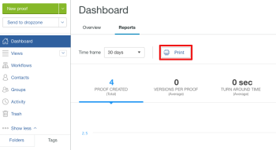

# 在[!DNL Workfront Proof]中執行報告

>[!IMPORTANT]
>
>* [!DNL Workfront Proof]中不再提供報告功能。 報表標籤仍會顯示，但資料不準確。
> 
>* 本文提及獨立產品[!DNL Workfront Proof]中的功能。 有關[!DNL Adobe Workfront]內部校訂的資訊，請參閱[校訂](../../../review-and-approve-work/proofing/proofing.md)。

Workfront Proof可讓您檢視報表，以便追蹤團隊的工作進度和效率。

您可以輕鬆檢視在[!DNL Workfront Proof]帳戶中建立的校訂數目、每個校訂關聯的版本數目、週轉時間等等。

## 先決條件

報表是否可用取決於您的[!DNL Workfront Proof]帳戶型別和使用者許可權層級。

* [帳戶必要條件](#account-prerequisites)
* [使用者必要條件](#user-prerequisites)

### 帳戶必要條件 {#account-prerequisites}

報表資訊僅適用於Premium計畫。

### 使用者必要條件 {#user-prerequisites}

報告資訊僅適用於擁有您帳戶中所有校訂完整存取權的使用者（亦即 [!DNL Workfront Proof]](../../../workfront-proof/wp-acct-admin/account-settings/proof-perm-profiles-in-wp.md)中至少有[個校訂許可權設定檔的使用者）。

在此面板中，您可以

* 控制所顯示資料的時間範圍
* 分析一段時間內的量度變更
* 將滑鼠懸停在所選時間點的上方，檢查該時間點的詳細資訊
* 檢查在選定時間範圍內建立的校樣總數
* 檢查完成的校訂集合中包含的平均版本數

## 檢視報表 {#viewing-reports}

1. 前往&#x200B;**[!UICONTROL 儀表板]**&#x200B;頁面。
1. 按一下「**[!UICONTROL 報表]**」標籤。\
   

1. 在&#x200B;**[!UICONTROL 時間範圍]**&#x200B;下拉式功能表中，選取您要顯示過去24小時、7天、30天、90天或自訂時段內所建立校樣的相關資訊。\
   如果您選取自訂時段，請選取開始和結束日期，然後按一下[套用]。****\
   系統會顯示所選時段的下列資訊：\
   **建立的校訂：**&#x200B;在選取的時段內建立的校訂數目。\
   **每個校訂的版本：**&#x200B;所選時段內所有已完成校訂（已核准或已核准變更）的每個校訂平均版本數。\
   **週轉時間：**&#x200B;從建立第一個版本到對最終版本做出決定的平均時間。\
   **首次活動時間：**&#x200B;從校訂建立到校訂上首次活動的平均時間。\
   **延遲的校訂：**&#x200B;在選取的時段內至少有一個延遲版本的已完成校訂（已核准或已核准變更）的平均百分比。\
   **評論與回覆：**&#x200B;在選取的時段內對所有校訂所做的平均評論與回複數。

1. （選擇性）選取或取消選取&#x200B;**[!UICONTROL 顯示最小最大範圍]**&#x200B;選項，以判斷圖形中是否顯示最小值和最大值。\
   選取此選項時，藍色陰影會顯示在最小和最大記錄值之間。

1. （選擇性）您可以篩選顯示的資料，如[篩選報表](#filtering-reports)中所述。

## 篩選報表 {#filtering-reports}

依預設，報表中顯示的資料包含來自[!DNL Workfront Proof]系統的所有資訊。 您可以使用篩選器只顯示與您需求相關的資訊。

若要篩選報表資訊，請執行下列動作：

1. 前往&#x200B;**[!UICONTROL 儀表板]**&#x200B;頁面。
1. 按一下「**[!UICONTROL 報表]**」標籤。\
   

1. 執行報告，如[檢視報告](#viewing-reports)中所述。
1. 按一下&#x200B;**[!UICONTROL 篩選器]**。

1. 在頁面左側，從下列篩選選項中選取：\
   **[!UICONTROL 校訂型別]：**&#x200B;選取您要包含在報告中的校訂型別。\
   **[!UICONTROL 決定]：**&#x200B;選取選項，以判斷是否只做出包含特定決定的校樣。\
   **[!UICONTROL 收件者]：**&#x200B;選取個別使用者，以檢視與所選使用者共用的校樣相關資訊。\
   **[!UICONTROL 校訂擁有者]：**&#x200B;選取個別使用者，以檢視與所選使用者所擁有校訂相關的資訊。\
   **[!UICONTROL 校訂建立者]：**&#x200B;選取個別使用者，以檢視與所選使用者建立的校訂相關的資訊。\
   **[!UICONTROL 帳戶]：**&#x200B;選取您要納入報表的帳戶。

1. 按一下&#x200B;**[!UICONTROL 套用]**。
1. （選擇性）選取或取消選取&#x200B;**[!UICONTROL 顯示最小最大範圍]**&#x200B;選項，以判斷圖形中是否顯示最小值和最大值。\
   選取此選項時，藍色陰影會顯示在最小和最大記錄值之間。

## 列印報表

1. 前往&#x200B;**[!UICONTROL 儀表板]**&#x200B;頁面。
1. 按一下&#x200B;**[!UICONTROL 報表]**&#x200B;標籤，然後按一下&#x200B;**[!UICONTROL 列印]**。\
   

1. 從可用的各種列印選項中選取。\
   列印選項會依您使用的瀏覽器和瀏覽器版本而有所不同。
