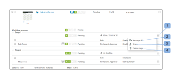

# 在[!DNL Workfront Proof]中檢視校訂的進度和狀態

>[!IMPORTANT]
>
>本文提及獨立產品[!DNL Workfront Proof]中的功能。 有關[!DNL Adobe Workfront]內部校訂的資訊，請參閱[校訂](../../../review-and-approve-work/proofing/proofing.md)。

## 瞭解校訂進度

校訂進度會指出對校訂完成的工作，從您傳送校訂給檢閱者到他們對校訂做出決定為止。

* [進度圖示](#progress-icons)
* [校訂進度等級](#levels-of-proof-progress)

### 進度圖示 {#progress-icons}

進度圖示S、O、C和D出現在進度列中，表示校訂進度。

它們會指示以下有關校訂的資訊：

<table style="table-layout:auto"> 
 <col> 
 <col> 
 <thead> 
  <tr> 
   <td> 
<strong>進度圖示</strong> 
 </td> 
   <td> 
<strong>說明</strong> 
 </td> 
  </tr> 
 </thead> 
 <tbody> 
  <tr> 
   <td> 
  
 </td> 
   <td> 
<strong>已傳送</strong>。 校樣已傳送給檢閱者。
 </td> 
  </tr> 
  <tr> 
   <td> 
  
 
 
 </td> 
   <td> 
<strong>已開啟</strong>。 稽核者已開啟校訂詳細資訊頁面或在校訂檢視器中開啟校訂本身。
 </td> 
  </tr> 
  <tr> 
   <td> 
  
 </td> 
   <td> 
<strong>個註解</strong>。 已經對校樣做出評論的稽核者（可以發表評論的使用者）已經做出評論。
 
如果未指定校訂的稽核者，則此圖示不會顯示。
 </td> 
  </tr> 
  <tr> 
   <td> 
  
 </td> 
   <td> 
<strong>決定</strong>。 檢閱者已針對校訂做出決定。
 
如果未指定校訂的核准者（決策者），則不會顯示此圖示。 
 </td> 
  </tr> 
 </tbody> 
</table>

這些圖示可以以下列顏色顯示，以指示有關校樣進度的特定資訊：

* **綠色**。 完成。
* **白色**。 未完成。
* **橙色**。 未完成且離期限不到24小時。
* **紅色**。 未完成且已超過期限。

### 校訂進度等級 {#levels-of-proof-progress}

Workfront Proof使用進度圖示來追蹤校訂在下列每個層級的進度：

* 對於每個檢閱者，根據其在校樣上的活動。
* 根據每個階段的進度，在校訂流程中最落後的階段上的檢閱者。 如需詳細資訊，請參閱[自動化工作流程階段總覽](../../../review-and-approve-work/proofing/proofing-overview/stages.md)。
* 校訂方面，根據在校訂程式中落後的階段（稽核者群組）的進度而定。

例如，[!DNL Workfront Proof]如何使用最落後的稽核者或階段來判斷進度，假設校樣上的三位稽核者需要做出決定。 如果其中兩個已作出決定，但第三個尚未作出決定，則校訂的進度列不會因為未決決定而以綠色顯示D。

如果在校訂上選取了[!UICONTROL 主要決策者]設定，且主要決策者提交了決定，則由於不需要其他決定，因此校訂進度列中的D將變為綠色，以供所有檢閱者使用。

同樣地，如果在校訂上選取了[!UICONTROL 僅需要一個決定]設定，並且任何檢閱者提交了決定，則所有檢閱者之校訂進度列中的D都會變成綠色，因為不需要其他決定。

## 瞭解校訂狀態

校訂狀態顯示校訂所需的決定狀態。

\
標準狀態選項包括：

* 未決
* 已核准
* 已核准 (附帶變更)
* 需要變更
* 不相關

如果您已在帳戶中設定自訂決策，則狀態選項會反映您的自訂決策設定。

證明的狀態是由「最壞情況」參與者所驅動。 例如，假設證明上有三個決定：兩個決定的狀態為&#x200B;**已接受**，另一個決定的狀態為&#x200B;**已拒絕**。 「已拒絕」的「最壞情況」決定會超過其他決定和證明的整體狀態顯示為&#x200B;**已拒絕**。

## 檢視進度和狀態 {#viewing-progress-and-status}

您可以檢視每個階段中校樣、階段和稽核者的進度和狀態。

* [校訂摘要](#proof-summary)
* [階段動作功能表](#stage-actions-menu)
* [在[!UICONTROL 摘要]區段中，如果對校訂具有編輯許可權，您也可以存取檢閱者動作功能表。 如需詳細資訊，請參閱Workfront Proof中的校訂許可權設定檔和Workfront Proof中的管理校訂角色。 當您將滑鼠停留在檢閱者的詳細資訊上時，[!UICONTROL 檢閱者動作]功能表(1)會出現，並可讓您：](#in-the-summary-section-you-can-also-access-the-reviewer-actions-menus-provided-you-have-edit-rights-on-the-proof-for-more-information-see-proof-permissions-profiles-in-workfront-proof-and-manage-proof-roles-in-workfront-proof-the-reviewer-actions-menu-1-appears-when-you-hover-over-the-reviewer-s-details-and-allows-you-to)
* [校訂動作功能表](#proof-actions-menu)

### 校訂摘要 {#proof-summary}

資料夾中的每個校樣都有一個可擴展的摘要，可讓您快速檢視和編輯校樣的詳細資訊。

若要展開或收合摘要：

1. 按一下控制面板或任何清單檢視中校樣左側的箭頭。

此摘要包含下列內容：

* 工作流程(2)
* 版本(3)
* 資料夾(4)
* 狀態(5)\
   

在摘要中，您可以檢視和編輯校訂的以下詳細資訊：

* 校訂進度(1)
* 每個階段的進度(2)
* 為階段設定的截止日期(3)
* 檢閱者詳細資料：

   * 每個檢閱者的評論和回複數目(4)
   * 每個檢閱者的進度(5)
   * 決定（如果決定包含電子簽章，則會在決定旁邊顯示一個圖示，指示此內容）。 (6)
   * 校訂上的角色(7)
   * 電子郵件警示設定(8)

>[!NOTE]
>
>您編輯校訂詳細資訊的能力取決於您對校訂的許可權（請參閱 [!DNL Workfront Proof]](../../../workfront-proof/wp-acct-admin/account-settings/proof-perm-profiles-in-wp.md)中的[校訂許可權設定檔和 [!DNL Workfront Proof]](../../../workfront-proof/wp-work-proofsfiles/share-proofs-and-files/manage-proof-roles.md)中的[管理校訂角色）。

### [!UICONTROL 階段動作]功能表  {#stage-actions-menu}

工作流程的每個階段都有個別的功能表，可讓您執行與該階段中的稽核者相關的批次動作。

當您將滑鼠游標停留在「階段」區段(1)上時，[!UICONTROL 階段動作]功能表會出現，並可讓您

* [!UICONTROL 訊息全部] (2)
* [!UICONTROL 共用] (3)
* [!UICONTROL 刪除階段] (4)

>[!NOTE]
>
>這些選項的可用性取決於您對校訂的許可權（請參閱 [!DNL Workfront Proof]](../../../workfront-proof/wp-acct-admin/account-settings/proof-perm-profiles-in-wp.md)中的[校訂許可權設定檔和 [!DNL Workfront Proof]](../../../workfront-proof/wp-work-proofsfiles/share-proofs-and-files/manage-proof-roles.md)中的[管理校訂角色）。

在「摘要」區段中，只要您擁有校訂的編輯許可權，即可存取檢閱者動作功能表。 如需詳細資訊，請參閱 [!DNL Workfront Proof]](../../../workfront-proof/wp-acct-admin/account-settings/proof-perm-profiles-in-wp.md)中的[校訂許可權設定檔和 [!DNL Workfront Proof]](../../../workfront-proof/wp-work-proofsfiles/share-proofs-and-files/manage-proof-roles.md)中的[管理校訂角色。 當您將滑鼠停留在複查者的詳細資訊上時，複查者動作功能表(1)會出現，並可讓您：

* 傳送訊息給稽核者(2)
* 編輯稽核者的詳細資訊(3) — 可讓您編輯該稽核者的顯示名稱、校樣角色和電子郵件警報
* 讓他們成為校訂的所有者(4)
* 讓他們成為主要決策者(5)
* 從校訂中移除(6)

>[!NOTE]
>
>這些選項的可見性取決於您在校訂上的許可權（請參閱 [!DNL Workfront Proof]](../../../workfront-proof/wp-acct-admin/account-settings/proof-perm-profiles-in-wp.md)中的[校訂許可權設定檔和 [!DNL Workfront Proof]](../../../workfront-proof/wp-work-proofsfiles/share-proofs-and-files/manage-proof-roles.md)中的[管理校訂角色）。

### 校訂動作功能表 {#proof-actions-menu}

每個校樣也有一個功能表(1)，可讓您執行下列動作：

* 您可以存取校樣詳細資訊頁面(2)
* 與其他人共用校訂(3)
* 傳送訊息給稽核者(4)
* 建立新版本的校訂(5)
* 複製證明(6)
* 下載原始檔案(7)
* 共用校訂連結(8)
* 列印註解(9)
* 請求證明的Excel摘要(10)
* 鎖定校訂(11)
* 刪除校訂(12)

>[!NOTE]
>
>這些選項的可用性取決於您對校訂的許可權（請參閱 [!DNL Workfront Proof]](../../../workfront-proof/wp-acct-admin/account-settings/proof-perm-profiles-in-wp.md)中的[校訂許可權設定檔和 [!DNL Workfront Proof]](../../../workfront-proof/wp-work-proofsfiles/share-proofs-and-files/manage-proof-roles.md)中的[管理校訂角色）。

如需有關在[!DNL Workfront]內檢視校訂進度和狀態的資訊，請參閱[檢視進度與狀態](#viewing-progress-and-status)。

如需有關在案頭校訂檢視器中檢視進度和狀態的資訊，請參閱[在校訂檢視器中檢閱工作流程](../../../workfront-proof/wp-work-proofsfiles/review-proofs-wpv/review-workflow.md)。
