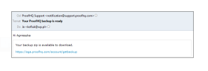

# 備份您的 [!DNL Workfront Proof] 資料

>[!IMPORTANT]
>
>本文說明獨立產品中的功能 [!DNL Workfront Proof]. 有關內部校對的資訊 [!DNL Adobe Workfront]，請參閱 [校對](../../../review-and-approve-work/proofing/proofing.md).

## 備份簡介

您可以在 [!DNL Workfront Proof] 使用備份函式。

備份會以.zip檔案的形式傳送給您。 包含所有資料的XML匯出（包括所有校樣版本的註解和回應）;但是，它不包含您上傳為校樣的原始檔案。

為您下載而建立的每個備份.zip檔案都有一個唯一的檔案名，例如：

9789_05_05_2011_61703.zip

此範例中的檔案名稱提供下列資訊：

* 9789是你的 [!DNL Workfront Proof] 帳戶識別碼
* 05_05_2011是2011年5月5日
* 61703是隨機系統分配的數字

此命名慣例可讓您輕鬆將所有備份.zip檔案儲存在電腦上的單一位置，並清楚知道每個備份的建立時間。

此 [!UICONTROL 備份] 函式可讓您決定如何使用資源：

* 可讓您釋放儲存空間，而不會遺失使用中或封存的校樣。 您可以請求備份、刪除校樣，然後清空 [還原並清空 [!DNL Workfront Proof]](../../../workfront-proof/wp-work-proofsfiles/manage-your-work/restore-and-empty-trash.md).
* 可讓您存取原本上傳至的任何檔案 [!DNL Workfront] 證明。 您可以使用 [!UICONTROL 下載原始檔案] 函式。

>[!NOTE]
>
>使用備份時，請考慮以下事項：
>
>* 企業計畫和無限制計畫均提供備份。 請聯繫我們的 [銷售團隊](mailto:sales@proofhq.com) 報價。
>* 資料編碼類型預設為UTF-8，我們建議使用此設定。 這是Internet應用程式最常使用的編碼類型。
>* 您只能要求一個 [!DNL backup] 一次。 處理備份.zip檔案時，「備份」頁簽上的「請求新備份」連結將不會出現，顯示的消息將保持不變。 有關請求備份的資訊，請參見 [在 [!DNL Workfront Proof]](../../../workfront-proof/wp-acct-admin/account-settings/request-new-data-backup-in-wp.md).
>

## 備份資料

1. 按一下 **[!UICONTROL 帳戶設定]** 在 [!DNL Workfront Proof] 介面。 (1)
1. 按一下 **[!UICONTROL 備份]** 標籤。 (2)
1. 按一下 **[!UICONTROL 請求新備份]** 連結(3)

備份就緒後，將發生以下情況：

* 您會收到來自 [!DNL Workfront Proof] 通知您此事(「 [!DNL Workfront Proof] 備份已就緒」)。 電子郵件包含備份資料的下載連結。
* 此 [帳戶設定](https://support.workfront.com/hc/en-us/sections/115000912147-Account-settings) 備份頁簽顯示備份資料的下載連結。
* 「請求新備份」連結(3)將重新顯示在「備份」頁簽上

您的資料將可以以zip檔案的形式下載。 您可以從通知電子郵件或 [!UICONTROL 帳戶設定]，如下列章節所述：

* [從電子郵件通知下載備份.zip檔案](#downloading-your-backup-zip-file-from-your-email-notification)
* [從帳戶設定下載備份的.zip檔案](#downloading-your-backup-zip-file-from-the-account-settings)

## 從電子郵件通知下載備份.zip檔案 {#downloading-your-backup-zip-file-from-your-email-notification}

當備份.zip檔案準備好下載時，您會收到來自的電子郵件 [!DNL Workfront Proof] 主題是 [!DNL Workfront Proof] 備份已就緒。

若要從電子郵件下載備用.zip檔案：

1. 按一下電子郵件中的下載連結。\
   \
   如果您目前未登入 [!DNL Workfront Proof]，則會開啟新的瀏覽器視窗並顯示登入頁面。

## 從帳戶設定下載備份的.zip檔案 {#downloading-your-backup-zip-file-from-the-account-settings}

當備份的.zip檔案準備好下載時， [!UICONTROL 備份] 索引標籤會顯示下載連結來指出這點。 此外， [!UICONTROL 請求新備份] 連結。

1. 按一下 **[!UICONTROL 帳戶設定]** 在 [!DNL Workfront Proof] 介面。 (1)
1. 按一下 **[!UICONTROL 備份]** 標籤。 (2)\
   如果帳戶中沒有用戶請求任何備份，則 [!UICONTROL 備份] 標籤表示您沒有備份。 如果用戶已請求備份，則頁簽將顯示上次備份的建立日期和下載連結。

1. 按一下 **[!UICONTROL 下載備份]** 連結。 (3)\
    出現「File Download（檔案下載）」螢幕，詢問您要開啟或儲存下載檔案。

1. 按一下 **[!UICONTROL 儲存]**，然後選取您電腦上要儲存備份.zip檔案的位置。\
   標識最近備份日期的消息仍顯示在 [!UICONTROL 備份] 頁面，直到下次請求備份。 下載備份連結將應用於上次備份。 每當 [!UICONTROL 請求新備份] 連結即會顯示，您可以按一下該連結以請求其他備份。

## 了解備份.zip檔案中的檔案

您的備份.zip檔案包含7個CSV（逗號分隔值或逗號分隔）檔案，其中包含您使用中和封存校樣的資訊，直到您備份資料為止：

* comments.csv — 包含校樣的註解
* comment_replies.csv — 包含校樣organization.csv的註解回應 — 包含數值識別碼和您的組織（您的帳戶）名稱
* contacts.csv — 包含每個連絡人的數值識別碼、名稱和組織
* files.csv — 包含「校樣詳細資料」頁面或「檔案詳細資料」頁面中上傳至之校樣或檔案的相關資訊 [!DNL Workfront Proof]
* recipients.csv — 包含每個人員的數值識別碼、角色和決策，當上傳校樣以供審核時，這些人員指定為審核者、審核者和核准者等 [!DNL Workfront Proof]
* users.csv — 包含數值識別碼和帳戶中所有使用者的名稱

您可以使用任何zip公用程式，從備份.zip檔案中解壓縮這些檔案，然後儲存在您選擇的電腦位置。 儲存zip檔案並解壓縮個別CSV檔案後，您就可以視需要操控資訊以保留內部記錄。

您請求建立的每個備份.zip檔案都有獨特的名稱，其中包含備份建立日期，但每個備份.zip檔案中包含的CSV檔案名稱一律相同。 您可能希望使用以下方法之一來確保備份檔案彼此不同：

* 為每個備份.zip檔案和您從中擷取的CSV檔案建立新資料夾。
* 重新命名每個CSV檔案，以在您從zip檔案解壓縮檔案時納入備份日期。

>[!NOTE]
>
>若 [!DNL Microsoft Excel] 安裝在電腦上，您的解壓縮公用程式可能會將個別CSV檔案的檔案類型列為 [!DNL Microsoft Office Excel] 逗號分隔值檔案。 您可以使用 [!DNL Excel] 並將檔案儲存為 [!DNL Excel] 活頁簿(&#42;.xlsx)或其他檔案類型。
