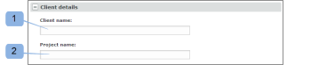

# 在中建立資料夾 [!DNL Workfront Proof]

>[!IMPORTANT]
>
>本文說明獨立產品中的功能 [!DNL Workfront Proof]. 有關內部校對的資訊 [!DNL Adobe Workfront]，請參閱 [校對](../../../review-and-approve-work/proofing/proofing.md).

## 建立新的頂層資料夾 {#creating-a-new-top-level-folder}

1. 在側欄中，按一下綠色旁的下拉式箭頭(1) **[!UICONTROL 新校樣]** 按鈕。
1. 選擇 **[!UICONTROL 新資料夾]**. (2)\
   此 [!UICONTROL 新資料夾] 頁面。

1. 繼續 [配置新資料夾](#configuring-the-new-folder).\
   

## 建立新子資料夾 {#creating-a-new-sub-folder}

您可以透過下列其中一種方式建立子資料夾：

* [從「資料夾詳細資訊」頁建立子資料夾](#creating-a-sub-folder-from-the-folder-details-page)
* [從「帳戶資料夾」頁建立子資料夾](#creating-a-sub-folder-from-the-account-folders-page)

>[!NOTE]
>
>建立新子資料夾時，共用清單繼承自父資料夾。

### 從 [!UICONTROL 資料夾詳細資訊] 頁面 {#creating-a-sub-folder-from-the-folder-details-page}

如需 [!UICONTROL 資料夾詳細資訊] 頁面，請參閱 [在Workfront校樣中管理資料夾及其內容](../../../workfront-proof/wp-work-proofsfiles/organize-your-work/manage-folders-and-contents.md).

若要從 [!UICONTROL 資料夾詳細資訊] 頁面：

1. 在側欄中，按一下 [!UICONTROL 我的資料夾] 清單(1)：訪問資料夾詳細資訊頁

1. 按一下頁面頂端的新子資料夾按鈕(2)。\
   新資料夾會出現在資料夾中的項目清單中。
1. 鍵入新子資料夾的名稱。 (3)
1. Press **[!UICONTROL 輸入]**.\
   或\
   按一下資料夾名稱欄位外部的。

1. （可選）在「資料夾詳細資訊」頁上編輯新子資料夾的詳細資訊。
1. 繼續 [配置新資料夾](#configuring-the-new-folder).

### 從「帳戶資料夾」頁建立子資料夾 {#creating-a-sub-folder-from-the-account-folders-page}

1. 按一下 [您的帳戶名稱] 資料夾（在側欄中）以訪問「帳戶資料夾」頁(1)\
   

1. 查找要向中添加子資料夾的資料夾並開啟 [!UICONTROL 動作] 菜單(2)
1. 選擇 [!UICONTROL 新增子資料夾] 從菜單(3)\
   此 [!UICONTROL 新資料夾] 頁面。
1. 繼續 [配置新資料夾](#configuring-the-new-folder).

## 配置新資料夾 {#configuring-the-new-folder}

開始建立新資料夾後(如 [建立新的頂層資料夾](#creating-a-new-top-level-folder) 或 [建立新子資料夾](#creating-a-new-sub-folder))，您可以依照本節所述來設定設定選項。

* [階層連結導覽](#breadcrumb-navigation) (1)
* [資料夾詳細資訊](#folder-details) (2)
* [客戶端詳細資訊](#client-details) (3)
* [共用](#share) (4)

### 階層連結導覽 {#breadcrumb-navigation}

階層連結導覽會顯示您要建立頂層資料夾或子資料夾)(1)

### 資料夾詳細資訊 {#folder-details}

在本節中，您可以新增（並檢查）下列資訊至您建立的資料夾：

* 資料夾名稱 — 此欄位是必填欄位(1)
* 按一下 [!UICONTROL 查看清單] 連結(2)將顯示一個彈出式清單，其中列出與其共用此資料夾的人員 — 當您建立子資料夾時，此資訊特別有用，因為子資料夾將自動與與父資料夾相同的人員共用
* 說明(3) — 您可以在此處新增資料夾的簡短說明，這將顯示在「資料夾詳細資訊」頁面上
* 將資料夾設為私人(4) — 按一下方塊會將此資料夾設為私人（只有您明確共用資料夾的人員，以及帳戶中具有以下設定檔的使用者才能看到） [校樣權限設定檔(位於 [!DNL Workfront Proof]](../../../workfront-proof/wp-acct-admin/account-settings/proof-perm-profiles-in-wp.md), [校樣權限設定檔(位於 [!DNL Workfront Proof]](../../../workfront-proof/wp-acct-admin/account-settings/proof-perm-profiles-in-wp.md) 或 [校樣權限設定檔(位於 [!DNL Workfront Proof]](../../../workfront-proof/wp-acct-admin/account-settings/proof-perm-profiles-in-wp.md) )。 請參閱 [了解 [!DNL Workfront Proof]](../../../workfront-proof/wp-work-proofsfiles/organize-your-work/folder-permissions.md) 以進一步了解Workfront Proof中的私人和公用資料夾。

### 客戶端詳細資訊 {#client-details}

在此部分，您可以填寫客戶端的詳細資訊 — 這允許您按客戶端/項目名稱對「我的資料夾」頁進行排序：

* 客戶端名稱(1)
* 項目名稱(2)

### 共用 {#share}

在 [!UICONTROL 共用] 區段：

* 指派資料夾的新擁有者(1) — 資料夾的建立者將保留在資料夾中，且無法移除，但您可以讓帳戶中的其他使用者成為擁有者，賦予他們在資料夾中的編輯權限。
* 與其他人共用資料夾 [!DNL Workfront Proof] 使用者在電子郵件地址中輸入內容(2) — 請注意，資料夾只能與擁有自己的使用者共用 [!DNL Workfront Proof] 登入。
* 為您共用資料夾的人員設定權限(3)。 這對於與帳戶中的使用者共用私人資料夾非常有用 — 您可以決定使用 [校樣權限設定檔(位於 [!DNL Workfront Proof]](../../../workfront-proof/wp-acct-admin/account-settings/proof-perm-profiles-in-wp.md) 設定檔應可以建立、編輯和刪除資料夾中的項目。
* 按一下使用者名稱右側的垃圾桶圖示(4)，從資料夾共用清單中移除使用者。
* 按一下最頂端的垃圾桶圖示(5)，從資料夾共用清單中移除所有人 — 請注意，您將無法移除資料夾的建立者或擁有者。

另請參閱 [在中共用資料夾 [!DNL Workfront Proof]](../../../workfront-proof/wp-work-proofsfiles/organize-your-work/share-folders.md).

