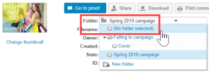
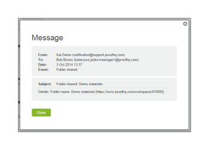

# 在中管理資料夾及其內容 [!DNL Workfront Proof]

>[!IMPORTANT]
>
>本文說明獨立產品中的功能 [!DNL Workfront Proof]. 有關內部校對的資訊 [!DNL Adobe Workfront]，請參閱 [校對](../../../review-and-approve-work/proofing/proofing.md).

將專案和校樣組織到資料夾中的其中一項好處，就是能在 [!UICONTROL 資料夾詳細資訊] 頁面。 此頁面是專案的控制中心，從這裡，您可以方便地管理個別校樣和檔案，並執行大量動作。

## 將項目分組，以便審核者可以一起處理這些項目

您可以使用資料夾將校樣分組，讓審核者一起處理。 審核者開啟資料夾中的校樣以啟動校樣檢視器時，資料夾中的所有其他校樣皆可使用，審核者無需離開校樣檢視器即可處理資料夾中的任何校樣。 如需詳細資訊，請參閱 [在校對檢視器中使用多個校樣](../../../workfront-proof/wp-work-proofsfiles/review-proofs-wpv/work-with-multiple-proofs.md).

## 將新項目新增至資料夾

當您建立校樣或上傳檔案時，可以選取要儲存在 [!UICONTROL 組織] 區段 [!UICONTROL 新校樣] 頁面或 [!UICONTROL 新檔案] 頁面。

如需詳細資訊，請參閱 [在中產生校樣 [!DNL Workfront Proof]](../../../workfront-proof/wp-work-proofsfiles/create-proofs-and-files/generate-proofs.md) 或 [將檔案和網頁內容上傳至 [!DNL Workfront Proof]](../../../workfront-proof/wp-work-proofsfiles/create-proofs-and-files/upload-files-web-content.md).

>[!NOTE]
>
>如果您目前正在檢視要新增項目的資料夾，該資料夾會自動顯示在 [!UICONTROL 組織] 區段，或 [!UICONTROL 新檔案] 頁面。

## 將現有項目新增至資料夾

您可以將現有檔案或校樣新增至資料夾。

如需詳細資訊，請參閱 [在中管理檔案 [!DNL Workfront Proof]](../../../workfront-proof/wp-work-proofsfiles/manage-your-work/manage-files.md) 或 [在Workfront校樣中管理校樣詳細資料](../../../workfront-proof/wp-work-proofsfiles/manage-your-work/manage-proof-details.md).

1. （條件性）執行下列其中一項作業：

   * 如果要將校樣新增至資料夾，請前往 [!UICONTROL 校樣詳細資料] 頁面，如 [[!UICONTROL 管理校樣詳細資訊] in [!DNL Workfront Proof]](../../../workfront-proof/wp-work-proofsfiles/manage-your-work/manage-proof-details.md)
   * 如果要將檔案添加到資料夾，請轉至「檔案詳細資訊」頁，如 [在中管理檔案 [!DNL Workfront Proof]](../../../workfront-proof/wp-work-proofsfiles/manage-your-work/manage-files.md).&quot;

1. 按一下 **資料夾** 檔案或校樣的位置，然後按一下要移動該檔案或校樣的資料夾的名稱。\
   

## 將項目移出資料夾

1. （條件性）執行下列其中一項作業：

   * 如果要將校樣移出資料夾，請移至 [!UICONTROL 校樣詳細資料] 頁面，如 [[!UICONTROL 管理校樣詳細資訊] in [!DNL Workfront Proof]](../../../workfront-proof/wp-work-proofsfiles/manage-your-work/manage-proof-details.md)\

      或\
      如果要將檔案移出資料夾，請轉至「檔案詳細資訊」頁，如 [在中管理檔案 [!DNL Workfront Proof]](../../../workfront-proof/wp-work-proofsfiles/manage-your-work/manage-files.md).&quot;

1. 按一下 **資料夾** 檔案或校樣的位置，然後按一下 **[!UICONTROL 移至]** > **[!UICONTROL （未選擇任何資料夾）]**.\
   

## 管理資料夾及其項目 [!UICONTROL 資料夾詳細資訊] 頁面

您可以從 [!UICONTROL 資料夾詳細資訊] 頁面。

>[!NOTE]
>
>如果您不是檔案的建立者或擁有者，可用的選項將取決於您的使用者 [校樣權限設定檔(位於 [!DNL Workfront Proof]](../../../workfront-proof/wp-acct-admin/account-settings/proof-perm-profiles-in-wp.md).

1. 在 **[!UICONTROL 資料夾]** 標籤，按一下任何資料夾以開啟 [!UICONTROL 資料夾詳細資訊] 頁面。
1. 如果資料夾只包含已封存的校樣，頁面頂端會以黃色顯示訊息。 如果按一下訊息中的連結，資料夾檢視會變更為 [!UICONTROL 封存的校樣] 檢視。
1. 按一下 **[!UICONTROL 資料夾詳細資訊]**，然後使用顯示的選項對資料夾執行下列任一操作：

   * 新增或變更資料夾的縮圖影像。
   * 檢視或編輯 **說明**, **父資料夾**, **擁有者**, **用戶端**，或 **專案** 與資料夾相關聯。

   * 建立資料夾 **私人**.
   * 查看資料夾是 **已建立**.
   * 查看資料夾的名稱 **建立者**.

1. （可選）若要變更與資料夾中項目相關的資訊，請按一下 **[!UICONTROL 更多]** 表徵圖，然後使用顯示的任何選項。\
   \
   顯示的選項取決於項目是校樣還是檔案。

   * **[!UICONTROL 查看校樣詳細資訊]** 或 **[!UICONTROL 查看檔案詳細資訊]**:開啟校樣詳細資訊或檔案詳細資訊頁面。 如需詳細資訊，請參閱 [在中管理檔案 [!DNL Workfront Proof]](../../../workfront-proof/wp-work-proofsfiles/manage-your-work/manage-files.md) 或 [在中管理校樣詳細資料 [!DNL Workfront Proof]](../../../workfront-proof/wp-work-proofsfiles/manage-your-work/manage-proof-details.md).

   * **[!UICONTROL 共用]**:可讓您與其他人共用檔案。 如需詳細資訊，請參閱 [共用檔案於 [!UICONTROL Workfront校樣]](../../../workfront-proof/wp-work-proofsfiles/share-proofs-and-files/share-files.md).

   * **[!UICONTROL 訊息]**:傳送電子郵件給已共用校樣的人員。
   * **[!UICONTROL 新版本]**:建立校樣的新版本。
   * **[!UICONTROL 複製]**:將含有任何校對註解的校樣複製為現有校樣的新版本，或為新校樣。
   * **[!UICONTROL 下載原始]**:可讓您下載原始檔案。 如需詳細資訊，請參閱 [下載儲存在 [!DNL Workfront Proof]](../../../workfront-proof/wp-work-proofsfiles/manage-your-work/download-files-stored.md).

   * **[!UICONTROL 委派所有權]**:將校樣的所有權委派給其他使用者。
   * **[!UICONTROL 共用校樣連結]**:傳送包含校樣連結的電子郵件。
   * **[!UICONTROL 打印注釋]**:打印審閱者對校樣的評論。
   * **[!UICONTROL Excel摘要]**:建立包含校樣的列印摘要的Excel檔案。
   * **[!UICONTROL 鎖定]**:鎖定校樣，讓其他使用者都無法開啟。
   * **[!UICONTROL 刪除]**:從 [!DNL Workfront] 證明。

1. （選用）在 **[!UICONTROL 共用給]** 區段中，若要向校樣的審核者傳送提醒，請按一下 **[!UICONTROL 更多]** 表徵圖，然後按一下 **[!UICONTROL 訊息]**.\
   您可以按一下 **[!UICONTROL 移除]** 取消與人員共用資料夾。\
   資料夾的所有者和建立者始終顯示在此清單上，並且不是可移動的。 如果使用者接管資料夾的所有權，資料夾會自動顯示，且不可移除。\
   您可以與個別使用者和合作夥伴公司共用資料夾。 如果資料夾已與合作夥伴公司共用，您可以按一下 [!UICONTROL 資訊] 表徵圖。 如需詳細資訊，請參閱 [合作夥伴帳戶。](https://support.workfront.com/hc/en-us/sections/115000912107-Partner-accounts)

1. （可選）按一下私人資料夾下方該人員的行，編輯該人員的權限 **[!UICONTROL 允許資料夾]**，然後指定您是否希望人員能夠從該資料夾建立、編輯和刪除項目。 **注意** 此選項僅適用於添加到專用資料夾的資料夾所有者來自同一帳戶的經理。 主管、管理員和帳單管理員對帳戶中的所有資料夾都擁有編輯權限，而觀察者無法建立任何項目。 如需權限的相關資訊，請參閱 [校樣權限設定檔(位於 [!DNL Workfront Proof]](../../../workfront-proof/wp-acct-admin/account-settings/proof-perm-profiles-in-wp.md).

1. （選用）按一下 **[!UICONTROL 活動]** 按時間順序查看資料夾中執行的所有操作。
1. （選用）按一下 **[!UICONTROL 訊息]** 區段，檢視已傳送給資料夾使用者的訊息。\
   將游標暫留在訊息上時，您可以按一下 **i** 圖示來檢視完整訊息。\
   \
   隨即顯示包含完整電子郵件的快顯視窗：\
   

## 管理子資料夾

您可以從「資料夾」詳細資訊頁管理子資料夾。

1. 在 **[!UICONTROL 資料夾]** 頁簽，按一下包含子資料夾的父資料夾的名稱以開啟 **[!UICONTROL 資料夾詳細資訊]** 頁面。

1. 按一下 **[!UICONTROL 更多]** 菜單。\
   

1. 按一下下列任一項：

   * **[!UICONTROL 查看資料夾詳細資訊]**:開啟 [!UICONTROL 資料夾詳細資訊] 頁面。
   * **[!UICONTROL 新校樣]**:可讓您將校樣新增至子資料夾。
   * **[!UICONTROL 上傳檔案]**:可讓您上傳檔案至子資料夾。
   * **[!UICONTROL 新增子資料夾]**:在子資料夾內建立新的子資料夾。
   * **[!UICONTROL 共用]**:可讓您與其他使用者共用子資料夾。
   * **[!UICONTROL Excel摘要]**:可讓您請求子資料夾的Excel摘要。
   * **[!UICONTROL 刪除]**:可讓您刪除子資料夾。
