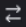
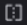

# 在校訂檢視器中比較校訂

>[!IMPORTANT]
>
>本文提及獨立產品[!DNL Workfront Proof]中的功能。 有關[!DNL Adobe Workfront]內部校訂的資訊，請參閱[校訂](../../../review-and-approve-work/proofing/proofing.md)。

您可以檢視兩個校訂的並排比較。 這些可以是相同校訂的兩個版本，或兩個完全不同的校訂。

## 比較校訂版本 {#compare-proof-versions}

1. 開啟具有多個要比較版本的校訂。
1. 在顯示的校樣檢視器左上角，按一下校樣名稱。 然後，在顯示的版本清單中，按一下您要開啟和比較的版本旁的&#x200B;**比較**&#x200B;圖示。

   

   校樣會並排顯示，較新版本會位於左側。

   <!--
   
Separate breadcrumbs above each proof allow you to view and go to the work item associated with the proof:

   -->

   <!--
   
  

   -->

1. 繼續[使用比較工具](#use-the-compare-tools)。

## 比較個別的校訂 {#compare-separate-proofs}

您可以比較兩個不同的校樣。

* [在 [!DNL Workfront]中比較個別的校訂](#compare-separate-proofs-in-workfront)
* [在 [!DNL Workfront Proof]中比較個別的校訂](#compare-separate-proofs-in-workfront-proof)

### 在[!DNL Workfront]中比較個別的校訂 {#compare-separate-proofs-in-workfront}

如需有關在[!DNL Workfront]內比較檔案清單中不同校訂的資訊，請參閱[比較校訂](../../../review-and-approve-work/proofing/reviewing-proofs-within-workfront/review-a-proof/compare-proofs.md)文章中的[比較兩個不同校訂](../../../review-and-approve-work/proofing/reviewing-proofs-within-workfront/review-a-proof/compare-proofs.md#comparing-two-proofs-from-a-document-list)區段。

### 在[!DNL Workfront Proof]中比較個別的校訂 {#compare-separate-proofs-in-workfront-proof}

>[!NOTE]
>
>您比較的校樣必須位於相同的資料夾中，且位於資料夾結構內的相同階層層級。 如需使用資料夾將您要比較的校訂群組化的詳細資訊，請參閱[在校訂檢視器中使用多個校訂](../../../workfront-proof/wp-work-proofsfiles/review-proofs-wpv/work-with-multiple-proofs.md)

1. 在校訂檢視器中開啟您要比較的其中一個校訂。
1. 按一下&#x200B;**[!UICONTROL 比較模式]**&#x200B;圖示。

   \
   檢視區域會分割成一半，而校樣會同時顯示在校樣檢視器的左側和右側。

   

1. 按一下校樣上方左側或右側的[!UICONTROL 資料夾]圖示，以列出相同資料夾中的其他校樣。

   

1. 在清單中，按一下您要與校訂檢視器中目前開啟的校訂進行比較的校訂名稱。

   

   兩個校訂都會出現。

1. 繼續[使用比較工具](#use-the-compare-tools)。

## 使用比較工具 {#use-the-compare-tools}

校訂檢視器提供各種工具，讓您有效率地比較校訂。

* [自動比較校樣](#auto-compare-proofs)
* [在覆蓋圖中比較校樣](#compare-proofs-in-an-overlay)
* [同時導覽比較](#simultaneous-navigation-comparison)

### 自動比較校樣 {#auto-compare-proofs}

自動比較會逐個畫素比較兩個靜態或視訊校樣。 偵測到的任何差異會在左側的校樣中以紅色醒目提示。

比較互動式校樣時，無法使用自動比較。

若要自動比較兩個校樣：

1. 開始以下列其中一種方式比較校樣：

   * 比較相同校訂的兩個版本（請參閱本文中的[比較校訂版本](#compare-proof-versions)）。
   * 比較兩個個別的校訂（請參閱本文中的[比較個別的校訂](#compare-separate-proofs)）。

1. 按一下&#x200B;**[!UICONTROL 自動比較]**&#x200B;圖示。

   

   兩個校訂之間的任何差異會在左側的校訂中以紅色醒目提示。

1. （選擇性）按一下&#x200B;**[!UICONTROL 切換]**&#x200B;圖示以變更作用中側，以便在右側校訂中顯示差異。 依預設，差異會顯示在左側的校樣中。

   

1. （選擇性）按一下&#x200B;**[!UICONTROL 色彩]**&#x200B;圖示，以變更醒目提示差異時所使用的色彩和不透明度。

   

### 在覆蓋圖中比較校樣 {#compare-proofs-in-an-overlay}

覆蓋圖比較可讓您將兩個靜態校訂視為單一校訂，同時在校訂中心向下提供垂直分隔線，以檢視這兩個校訂之間的差異。 將校樣平移過垂直分隔線時，會顯示差異。

>[!NOTE]
>
>比較視訊或互動式校樣時，無法使用覆蓋圖比較。

若要啟用覆蓋圖比較：

1. 開始以下列其中一種方式比較校樣：

   * 比較相同校訂的兩個版本（請參閱本文中的[比較校訂版本](#compare-proof-versions)）。
   * 比較兩個個別的校訂（請參閱本文中的[比較個別的校訂](#compare-separate-proofs)）。

1. 按一下&#x200B;**[!UICONTROL 覆蓋]**&#x200B;圖示。

   

   這兩個校訂會顯示為單一校訂，在校訂中心以垂直分隔線向下。

1. 執行下列任一項作業：

   * 將校樣平移過垂直分隔線。 平移時，您可以在垂直分隔線的左側看到校樣，而右側的校樣則會顯示在右側。
   * 將垂直分隔線左右移動。 當您移動分隔線時，會在垂直分隔線的左側看到校樣，而在右側的校樣則會顯示。

### 同時導覽比較 {#simultaneous-navigation-comparison}

比較校樣時，預設會啟用同時導覽。 比較靜態校樣和靜態校樣，或比較視訊校樣和視訊校樣時，都可使用它。 比較靜態校樣和視訊校樣時無法使用。

**靜態校樣：**&#x200B;在靜態校樣上啟用時，同時導覽會在移動或捲動時鎖定兩個校樣的縮放等級和位置。 當校訂包含多個頁面並啟用同時導覽時，變更一個校訂中的頁面會導致另一個校訂中的頁面變更。

**視訊校訂：**&#x200B;在視訊校訂上啟用時，同時導覽會記住兩個校訂時間軸上的時間差異。

若要啟用同時導覽（若尚未啟用），請執行下列動作：

1. 開始以下列其中一種方式比較校樣：

   * 比較相同校訂的兩個版本（請參閱本文中的[比較校訂版本](#compare-proof-versions)）。
   * 比較兩個個別的校訂（請參閱本文中的[比較個別的校訂](#compare-separate-proofs)）。

1. 按一下&#x200B;**[!UICONTROL 同時導覽]**&#x200B;圖示。

   

1. （選用）隨時按一下&#x200B;**[!UICONTROL 重設]**&#x200B;圖示以重設縮放等級和位置（適用於靜態校樣）或時間軸（適用於視訊校樣）。

   

## 退出比較模式

1. 按一下校樣左上角的(x)圖示，關閉您不再想要檢視的校樣。

   

   未關閉的校樣會在校樣檢視器中保持開啟狀態。
