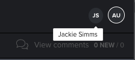

# 與多位審核者同時檢閱校樣

>[!IMPORTANT]
>
>本文說明獨立產品中的功能 [!DNL Workfront Proof]. 有關內部校對的資訊 [!DNL Adobe Workfront]，請參閱 [校對](../../../review-and-approve-work/proofing/proofing.md).

多位審核者可同時檢閱校樣。 當您檢閱校樣時，您可以看到目前還有誰在檢閱相同的校樣。

當其他審核者開啟相同的校樣時，您會看到呈現指標，無論他們是否在校樣中新增註解。 如果他們確實添加了注釋，則在您審閱校樣時，注釋會出現；您不必重新整理校對檢視器即可檢視。

1. 在校對檢視器的右上角檢視顯示指示器。

   如果您使用 [!DNL Workfront Proof] (不是與 [!DNL Workfront])，狀態指標包含使用者的 [!DNL Workfront Proof] 設定檔圖片；如果沒有設定檔圖片，則為使用者的第一個和最後一個初始。

   配置檔案圖片 [!DNL Workfront] 請勿出現在校對檢視器中。

1. （可選）將滑鼠移到存在指示器上以查看用戶的名稱。

   
