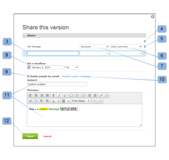

# 在中共用校樣 [!DNL Workfront Proof]

>[!IMPORTANT]
>
>本文說明獨立產品中的功能 [!DNL Workfront Proof]. 有關內部校對的資訊 [!DNL Adobe Workfront]，請參閱 [校對](../../../review-and-approve-work/proofing/proofing.md).

如果您對校樣有編輯權限，便可輕鬆與其他審核者共用校樣。 任何人都可以新增至校樣，因為您不需要 [!DNL Workfront Proof] 帳戶以檢閱校樣。

如需編輯權限的詳細資訊，請參閱 [校樣權限設定檔(位於 [!DNL Workfront Proof]](../../../workfront-proof/wp-acct-admin/account-settings/proof-perm-profiles-in-wp.md).

如果您借由新增審核者來共用校樣：

* 您與共用校樣的人將出現在 [!UICONTROL 工作流程] 「校樣詳細資料」頁面的區段。 如需此頁面的詳細資訊，請參閱[在中管理校樣詳細資料 [!DNL Workfront Proof]](../../../workfront-proof/wp-work-proofsfiles/manage-your-work/manage-proof-details.md).
* 你將能在校樣上設定他們的角色。 如需詳細資訊，請參閱 [在中管理校樣角色 [!DNL Workfront Proof]](../../../workfront-proof/wp-work-proofsfiles/share-proofs-and-files/manage-proof-roles.md).
* 您將能設定其電子郵件警報。 如需詳細資訊，請參閱 [在中配置電子郵件通知設定 [!DNL Workfront Proof]](../../../workfront-proof/wp-emailsntfctns/email-alerts/config-email-notification-settings-wp.md).

>[!NOTE]
>
>* 當您將某人新增至校樣時，您會決定是否要通知他們校樣。 請參閱 [新校樣電子郵件](../../../workfront-proof/wp-emailsntfctns/proof-notifications-and-reminders/new-proof-email.md) 以取得更多資訊。
>* 您可以將任何人新增至校樣（只要他們有有效的電子郵件地址）。 他們不需要 [!DNL Workfront Proof] 賬號！
>* 審核者不會計入您的使用者限制。 您可以免費將盡可能多的人加入校樣。
>

## 將審核者添加到新校樣或新校樣版本

建立新校樣或上傳新版校樣時，您可以將審核者新增至校樣：

1. 建立校樣或新版本，如 [在中產生校樣 [!DNL Workfront Proof]](../../../workfront-proof/wp-work-proofsfiles/create-proofs-and-files/generate-proofs.md) 和。
1. 在 **[!UICONTROL 新校樣]** 頁面或 **[!UICONTROL 新校樣版本]** 頁面，在 **[!UICONTROL 工作流程]** 節，鍵入要添加的審閱者的電子郵件地址。\
   如需與群組共用校樣的相關資訊，請參閱 [新增群組至校樣](../../../workfront-proof/wp-mnguserscontacts/groups/add-groups.md).\
   如果您之前與此人共用校樣，其電子郵件地址會顯示在自動完成下拉式清單中。\
   如果您改變主意，可以按一下垃圾桶圖示，從共用清單中移除審核者。 按一下頂端的垃圾桶圖示，即可輕鬆移除所有審核者。

1. 完成建立校樣或新校樣版本。

## 將審核者添加到現有校樣

1. 在控制面板或任何清單檢視上，按一下 **[!UICONTROL 更多]** 按鈕下拉式清單（位於校樣右側）。\
   

1. 按一下 **[!UICONTROL 共用]** 的下拉式清單。
1. 在 **[!UICONTROL 共用此版本]** 顯示的頁面中，新增審核者的電子郵件地址。\
   您也可以執行下列任一操作：

   * 按一下(4)刪除所有審閱者。
   * 逐一刪除每個審閱者(5)。
   * 為每個審核者(6)設定電子郵件警報。
   * 為每個審閱者(7)設定校樣角色。
   * 為審核者設定最後期限(8)。
   * 決定是否要讓審核者收到新校樣電子郵件(9)。
   * 包含或捨棄自訂訊息(10)。
   * 將文字新增至自訂訊息(11)的內文和主旨行。

1. 按一下 **[!UICONTROL 共用]**.
1. 

